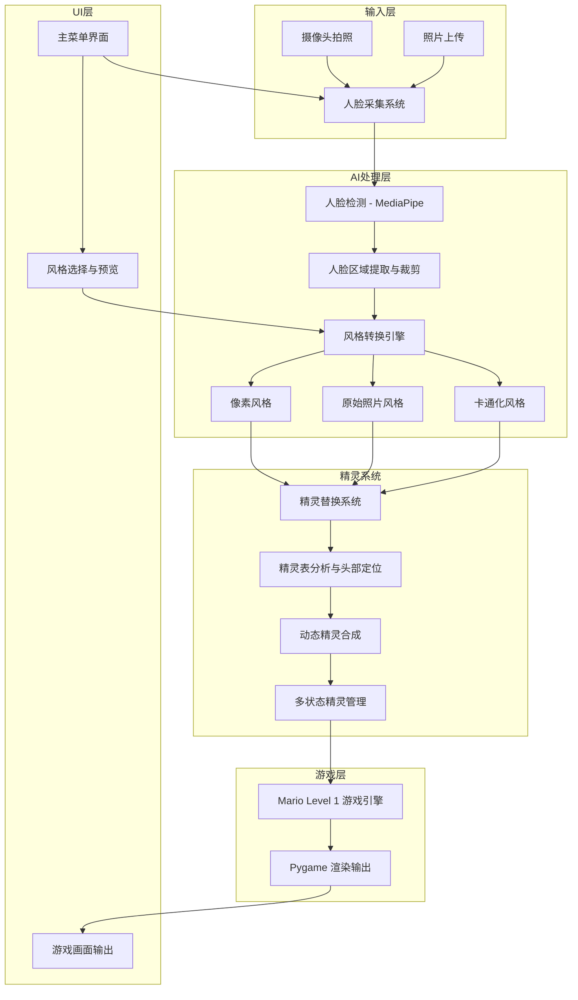
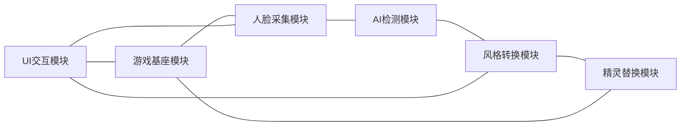
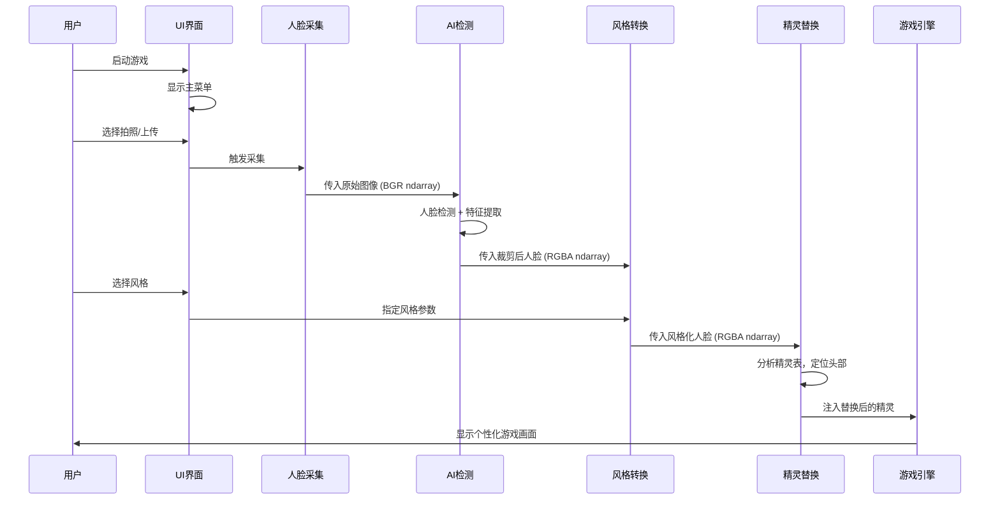

# Plan 01 - 总体计划

## 1. 项目概述

**项目名称：** Mario Face - 基于人脸替换的马里奥游戏

**项目目标：** 在经典的 Super Mario Level 1 游戏基础上，实现玩家人脸采集、AI 风格转换，并将处理后的人脸动态替换到马里奥精灵上，打造个性化游戏体验。

**项目版本：** v1.0

**技术栈：**

| 技术 | 版本 | 用途 |
|------|------|------|
| Python | 3.10+ | 主开发语言 |
| Pygame | 2.x | 游戏引擎与渲染 |
| MediaPipe | 0.10+ | AI 人脸检测与特征提取 |
| OpenCV | 4.x | 图像处理与摄像头接口 |
| NumPy | latest | 数值计算与矩阵操作 |
| Pillow | latest | 图像格式转换与处理 |
| tkinter | 内置 | 文件对话框与辅助 UI |
| PyInstaller | latest | 打包发布 |

**游戏基座：** [justinmeister/Mario-Level-1](https://github.com/justinmeister/Mario-Level-1)

---

## 2. 系统架构图



---

## 3. 模块关系



### 模块清单

| 模块编号 | 模块名称 | 对应计划 | 职责 |
|----------|----------|----------|------|
| M1 | 游戏基座 | plan_02 ~ plan_04 | 克隆、分析、适配原始游戏代码 |
| M2 | 人脸采集 | plan_05 ~ plan_07 | 摄像头拍照 / 文件上传获取人脸照片 |
| M3 | AI 检测 | plan_08 ~ plan_10 | 人脸检测、特征点提取、区域裁剪 |
| M4 | 风格转换 | plan_11 ~ plan_14 | 像素化 / 原始 / 卡通化三种风格管线 |
| M5 | 精灵替换 | plan_15 ~ plan_18 | 精灵表分析、头部替换、多状态管理 |
| M6 | UI 交互 | plan_19 ~ plan_21 | 主菜单、拍照界面、风格选择预览 |
| M7 | 集成测试 | plan_22 ~ plan_24 | 全流程测试、性能优化、打包发布 |

---

## 4. 数据流



### 关键数据格式

| 数据节点 | 格式 | 尺寸 | 说明 |
|----------|------|------|------|
| 原始照片 | BGR ndarray | 640x480+ | 摄像头或上传图片 |
| 检测结果 | MediaPipe Detection | - | 包含边界框和置信度 |
| 特征点 | 468个 landmarks | - | MediaPipe FaceMesh 输出 |
| 裁剪人脸 | RGBA ndarray | 可变 | 含透明通道的人脸区域 |
| 风格化人脸 | RGBA ndarray | 16x16 ~ 32x32 | 适配精灵尺寸 |
| 替换精灵 | Pygame Surface | 16x16 / 16x32 | 最终游戏渲染精灵 |

---

## 5. 项目里程碑

| 阶段 | 对应计划 | 交付物 | 预计工期 |
|------|----------|--------|----------|
| Phase 1: 游戏基座 | plan_02 ~ plan_04 | 可运行的原始游戏 + 分析文档 | 2天 |
| Phase 2: 人脸采集 | plan_05 ~ plan_07 | 摄像头/上传采集功能 | 2天 |
| Phase 3: AI 处理 | plan_08 ~ plan_10 | 人脸检测与提取管线 | 3天 |
| Phase 4: 风格转换 | plan_11 ~ plan_14 | 三种风格转换引擎 | 3天 |
| Phase 5: 精灵替换 | plan_15 ~ plan_18 | 动态精灵合成系统 | 4天 |
| Phase 6: UI 界面 | plan_19 ~ plan_21 | 完整交互界面 | 3天 |
| Phase 7: 集成发布 | plan_22 ~ plan_24 | 测试通过 + 可执行文件 | 3天 |

---

## 6. 目录结构规划

```
Mario/
├── plan/                    # 计划文档（本目录）
├── mario_level_1/           # 克隆的游戏基座代码
│   ├── data/
│   │   ├── components/
│   │   ├── states/
│   │   └── tools.py
│   └── resources/
│       └── graphics/
├── face_system/             # 人脸采集与处理
│   ├── __init__.py
│   ├── capture.py           # 摄像头拍照
│   ├── upload.py            # 照片上传
│   ├── detector.py          # 人脸检测
│   └── extractor.py         # 人脸提取
├── style_engine/            # 风格转换引擎
│   ├── __init__.py
│   ├── base.py              # 统一接口
│   ├── pixel_style.py       # 像素风格
│   ├── original_style.py    # 原始照片风格
│   └── cartoon_style.py     # 卡通化风格
├── sprite_system/           # 精灵替换系统
│   ├── __init__.py
│   ├── analyzer.py          # 精灵表分析
│   ├── compositor.py        # 动态合成
│   └── manager.py           # 多状态管理
├── ui/                      # UI 界面
│   ├── __init__.py
│   ├── main_menu.py         # 主菜单
│   ├── capture_ui.py        # 拍照界面
│   └── style_select.py      # 风格选择
├── tests/                   # 测试用例
├── main.py                  # 程序入口
├── config.py                # 全局配置
└── requirements.txt         # 依赖清单
```

---

## 7. 验收标准

### 功能验收

- [ ] 游戏基座可正常运行 Mario Level 1 关卡
- [ ] 支持摄像头拍照和文件上传两种人脸采集方式
- [ ] AI 人脸检测准确率 > 95%（正面照片）
- [ ] 三种风格转换（像素、原始、卡通）均可正常工作
- [ ] 精灵替换在所有马里奥状态（小/大/火焰）下正常显示
- [ ] 精灵在行走、跳跃、转向时动画流畅
- [ ] UI 界面交互流畅，无卡顿
- [ ] 端到端流程可在 5 秒内完成（不含用户操作时间）

### 性能验收

- [ ] 游戏帧率保持 60 FPS
- [ ] 风格转换处理时间 < 500ms
- [ ] 内存占用 < 500MB
- [ ] 程序启动时间 < 3 秒

### 质量验收

- [ ] 所有模块单元测试通过
- [ ] 集成测试覆盖核心流程
- [ ] 无内存泄漏
- [ ] PyInstaller 打包后可在无 Python 环境的 Windows 机器上运行

---

## 8. 风险与应对

| 风险 | 概率 | 影响 | 应对策略 |
|------|------|------|----------|
| 游戏基座代码兼容性 | 中 | 高 | 提前分析代码，做好适配层 |
| 人脸检测在低光照下失败 | 中 | 中 | 提供上传替代方案，增加预处理 |
| 精灵替换导致视觉违和 | 高 | 中 | 多种风格可选，可调整参数 |
| 性能瓶颈 | 中 | 高 | 精灵缓存、异步处理、预计算 |
| PyInstaller 打包问题 | 中 | 中 | 提前测试打包流程，准备 spec 文件 |
