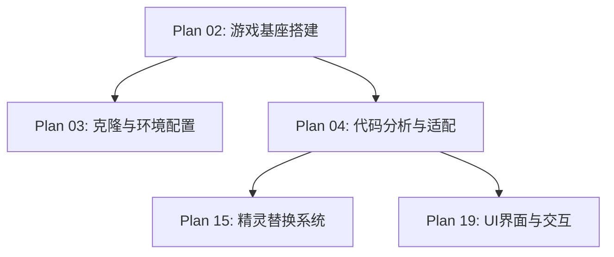

# Plan 02 - 游戏基座搭建

## 1. 模块概述

**目标：** 将 justinmeister/Mario-Level-1 作为游戏基座，完成克隆、环境配置、代码分析，并设计扩展接口以便后续模块接入。

**背景：** Mario-Level-1 是一个基于 Pygame 的经典马里奥第一关复刻项目，包含完整的关卡逻辑、精灵系统、状态机和碰撞检测。我们将在此基础上扩展人脸替换功能。

**依赖关系：** 无前置依赖，本模块为整个项目的基础。

---

## 2. 具体步骤

### 步骤 1：克隆仓库

```bash
cd D:\Document\GitHub\Mario
git clone https://github.com/justinmeister/Mario-Level-1.git mario_level_1
```

### 步骤 2：环境配置

```bash
# 创建虚拟环境
python -m venv venv
venv\Scripts\activate

# 安装游戏基座依赖
pip install pygame==2.5.2

# 安装项目所有依赖
pip install -r requirements.txt
```

`requirements.txt` 内容：

```txt
pygame>=2.5.0
mediapipe>=0.10.0
opencv-python>=4.8.0
numpy>=1.24.0
Pillow>=10.0.0
pyinstaller>=6.0.0
```

### 步骤 3：运行验证

```bash
cd mario_level_1
python mario_level_1.py
```

验证游戏窗口是否正常弹出，关卡是否可操控。

### 步骤 4：代码结构分析

对游戏基座进行全面分析，输出分析文档，标记关键修改点。

---

## 3. 代码分析重点

### 3.1 项目结构

```
mario_level_1/
├── data/
│   ├── __init__.py
│   ├── main.py              # 游戏主循环
│   ├── constants.py          # 常量定义
│   ├── setup.py              # 资源加载
│   ├── tools.py              # 工具函数
│   ├── components/
│   │   ├── player.py         # ★ 马里奥角色（核心修改点）
│   │   ├── enemies.py        # 敌人
│   │   ├── powerups.py       # 道具
│   │   ├── bricks.py         # 砖块
│   │   ├── coin.py           # 金币
│   │   └── ...
│   └── states/
│       ├── main_menu.py      # ★ 主菜单（需扩展）
│       ├── load_screen.py    # 加载画面
│       ├── level1.py         # ★ 关卡逻辑
│       └── ...
└── resources/
    └── graphics/
        ├── mario_bros.png    # ★ 马里奥精灵表（核心资源）
        ├── enemies.png
        ├── tile_set.png
        └── ...
```

### 3.2 关键类分析

#### Player 类（player.py）

```python
# 需要分析的关键属性和方法
class Player(pygame.sprite.Sprite):
    def __init__(self, x, y):
        # 精灵表加载 → 这是人脸替换的入口点
        self.sprite_sheet = setup.GFX['mario_bros']
        self.load_images()  # ★ 核心方法：加载所有帧图像

    def load_images(self):
        # 从精灵表裁切各状态图像
        # small_normal, small_walk, small_jump...
        # big_normal, big_walk, big_jump...
        # fire_normal, fire_walk, fire_jump...
        pass

    def update(self, keys, game_info, fire_group):
        # 状态更新 → 需要在此注入精灵替换逻辑
        self.handle_state(keys, fire_group)
        self.animation()  # ★ 动画切换方法
```

#### 精灵表加载机制（setup.py / tools.py）

```python
# tools.py 中的精灵表裁切函数
def get_image(sheet, x, y, width, height, colorkey, resize):
    """从精灵表中裁切指定区域的图像"""
    image = pygame.Surface([width, height])
    image.blit(sheet, (0, 0), (x, y, width, height))
    image.set_colorkey(colorkey)
    if resize:
        image = pygame.transform.scale(image, resize)
    return image
```

---

## 4. 扩展接口设计

### 4.1 精灵替换接口

在 Player 类中添加钩子，使得外部模块可以替换精灵头部：

```python
class SpriteReplacer:
    """精灵替换接口 - 桥接人脸系统和游戏引擎"""

    def __init__(self):
        self.face_surface = None  # 处理后的人脸 Pygame Surface
        self.enabled = False

    def set_face(self, face_surface: pygame.Surface):
        """设置要替换的人脸"""
        self.face_surface = face_surface
        self.enabled = True

    def apply_to_frame(self, original_frame: pygame.Surface,
                       head_rect: pygame.Rect,
                       facing_right: bool) -> pygame.Surface:
        """将人脸应用到指定帧的头部区域"""
        if not self.enabled or self.face_surface is None:
            return original_frame

        result = original_frame.copy()
        face = self.face_surface
        if not facing_right:
            face = pygame.transform.flip(face, True, False)

        face_scaled = pygame.transform.scale(face, (head_rect.width, head_rect.height))
        result.blit(face_scaled, head_rect.topleft)
        return result
```

### 4.2 状态管理扩展

```python
# 新增游戏状态用于人脸设置流程
FACE_SETUP = 'face_setup'

# 在状态机中注册新状态
state_dict = {
    'main_menu': MainMenu(),
    'face_setup': FaceSetupState(),  # 新增
    'load_screen': LoadScreen(),
    'level1': Level1(),
    # ...
}
```

### 4.3 配置扩展

```python
# config.py - 全局配置
FACE_CONFIG = {
    'enabled': False,
    'style': 'pixel',          # pixel / original / cartoon
    'face_image_path': None,
    'cache_enabled': True,
    'sprite_cache_dir': 'cache/sprites/',
}
```

---

## 5. 输入/输出说明

| 项目 | 说明 |
|------|------|
| 输入 | GitHub 仓库 URL、Python 环境 |
| 输出 | 可运行的游戏基座 + 代码分析文档 + 扩展接口骨架代码 |

---

## 6. 依赖关系



---

## 7. 验收标准

- [ ] 游戏基座代码成功克隆到 `mario_level_1/` 目录
- [ ] 虚拟环境创建成功，所有依赖安装无报错
- [ ] 运行 `python mario_level_1.py` 可正常启动游戏
- [ ] 完成代码结构分析文档，标记所有关键修改点
- [ ] 扩展接口设计文档编写完成
- [ ] `SpriteReplacer` 骨架代码可正常实例化
- [ ] Player 类的精灵加载流程完全理解并记录
