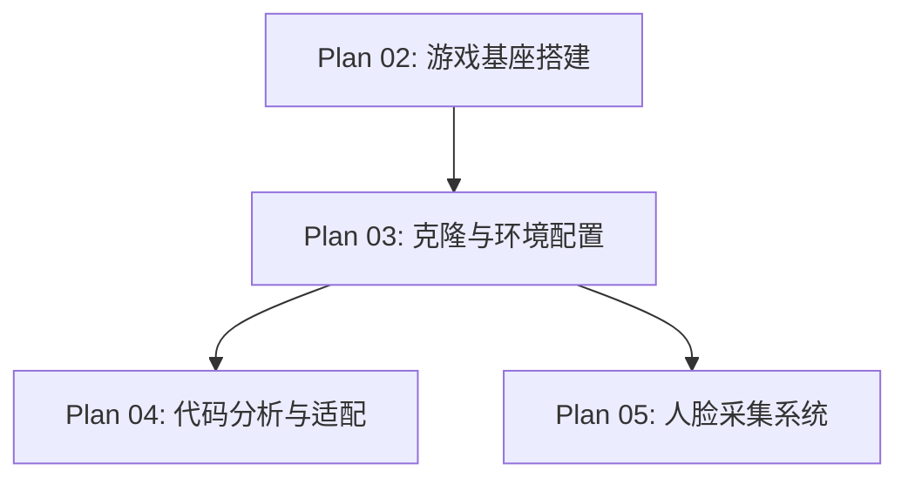

# Plan 03 - 克隆与环境配置

## 1. 目标

**目标：** 完成 Mario-Level-1 仓库的克隆、Python 虚拟环境搭建、所有项目依赖的安装，以及游戏的初次运行验证。

**背景：** 这是项目启动的第一个实操步骤，确保开发环境正确配置是后续所有工作的前提。

---

## 2. 具体步骤

### 步骤 1：克隆游戏仓库

```bash
# 进入项目根目录
cd D:\Document\GitHub\Mario

# 克隆 Mario-Level-1 仓库
git clone https://github.com/justinmeister/Mario-Level-1.git mario_level_1

# 验证克隆结果
dir mario_level_1
```

**预期输出：** 包含 `data/`, `resources/`, `mario_level_1.py` 等文件和目录。

### 步骤 2：创建 Python 虚拟环境

```bash
# 确认 Python 版本（需 3.10+）
python --version

# 创建虚拟环境
python -m venv venv

# 激活虚拟环境（Windows）
venv\Scripts\activate

# 验证激活状态
where python
# 输出应指向 venv 内的 python.exe
```

### 步骤 3：安装依赖

```bash
# 升级 pip
python -m pip install --upgrade pip

# 安装游戏基座核心依赖
pip install pygame==2.5.2

# 安装 AI 和图像处理依赖
pip install mediapipe>=0.10.0
pip install opencv-python>=4.8.0
pip install numpy>=1.24.0
pip install Pillow>=10.0.0

# 安装打包工具
pip install pyinstaller>=6.0.0
```

或者使用 `requirements.txt` 一次性安装：

```bash
pip install -r requirements.txt
```

**requirements.txt 内容：**

```txt
pygame>=2.5.0,<3.0.0
mediapipe>=0.10.0
opencv-python>=4.8.0
numpy>=1.24.0
Pillow>=10.0.0
pyinstaller>=6.0.0
```

### 步骤 4：验证依赖安装

```python
# verify_deps.py - 依赖验证脚本
import sys

def check_dependency(name, import_name=None):
    """检查依赖是否正确安装"""
    if import_name is None:
        import_name = name
    try:
        module = __import__(import_name)
        version = getattr(module, '__version__', 'unknown')
        print(f"  [OK] {name}: {version}")
        return True
    except ImportError:
        print(f"  [FAIL] {name}: 未安装")
        return False

print("=== 依赖检查 ===")
print(f"Python: {sys.version}")
print()

deps = [
    ("pygame", "pygame"),
    ("mediapipe", "mediapipe"),
    ("opencv-python", "cv2"),
    ("numpy", "numpy"),
    ("Pillow", "PIL"),
]

all_ok = all(check_dependency(name, imp) for name, imp in deps)
print()
print("结果:", "全部通过" if all_ok else "存在未安装的依赖")
```

```bash
python verify_deps.py
```

### 步骤 5：运行游戏验证

```bash
cd D:\Document\GitHub\Mario\mario_level_1
python mario_level_1.py
```

**验证清单：**

- [ ] 游戏窗口正常弹出（约 800x600 分辨率）
- [ ] 主菜单正常显示
- [ ] 按键后游戏开始
- [ ] 马里奥角色可操控（方向键移动、空格/上箭头跳跃）
- [ ] 敌人、砖块、道具正常渲染
- [ ] 游戏运行流畅，无报错

### 步骤 6：解决常见问题

#### 问题 1：Pygame 版本不兼容

```bash
# 如果 pygame 2.5 有问题，尝试 2.1
pip install pygame==2.1.3
```

#### 问题 2：资源文件路径错误

```python
# 检查资源路径是否正确
import os
resource_path = os.path.join('resources', 'graphics')
assert os.path.exists(resource_path), f"资源目录不存在: {resource_path}"
print("资源目录检查通过")
```

#### 问题 3：Python 版本过低

```bash
# 如果系统 Python 版本低于 3.10
# 从 https://www.python.org/downloads/ 下载安装 Python 3.10+
# 使用 py launcher 指定版本
py -3.10 -m venv venv
```

---

## 3. 输入/输出说明

| 项目 | 说明 |
|------|------|
| 输入 | GitHub 仓库 URL: `https://github.com/justinmeister/Mario-Level-1.git` |
| 输入 | Python 3.10+ 运行环境 |
| 输出 | `mario_level_1/` 目录（完整游戏代码） |
| 输出 | `venv/` 虚拟环境目录 |
| 输出 | 所有依赖安装完成的开发环境 |
| 输出 | 游戏成功运行的验证截图/记录 |

---

## 4. 依赖关系



- **前置依赖：** Plan 02（了解整体架构）
- **后续依赖：** Plan 04（代码分析）、Plan 05（人脸采集开发需要环境）

---

## 5. 验收标准

- [ ] `mario_level_1/` 目录包含完整的游戏源代码
- [ ] `venv/` 虚拟环境创建成功，Python 版本 >= 3.10
- [ ] 运行 `pip list` 显示所有依赖已安装：pygame, mediapipe, opencv-python, numpy, Pillow
- [ ] `verify_deps.py` 脚本输出全部通过
- [ ] 游戏 `mario_level_1.py` 可正常启动并运行
- [ ] 游戏操作正常：移动、跳跃、碰撞检测均无异常
- [ ] 无 ImportError 或 ModuleNotFoundError 报错
