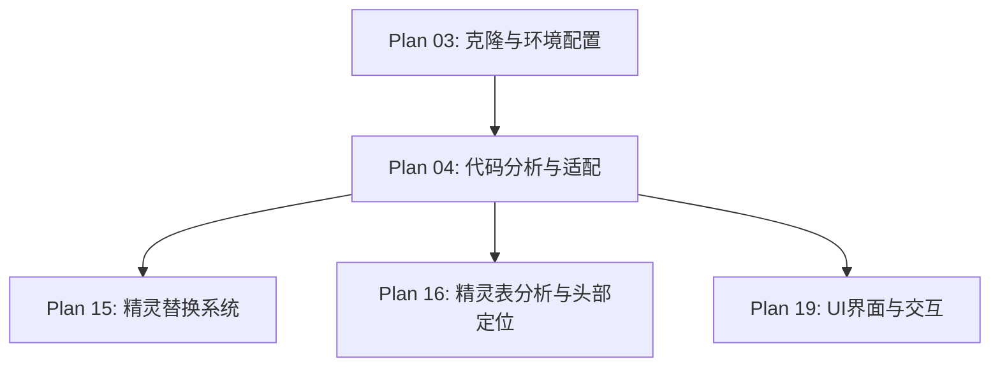

# Plan 04 - 游戏代码分析与适配

## 1. 目标

**目标：** 深入分析 Mario-Level-1 游戏代码，理解精灵加载机制、状态管理系统、渲染流程，并标记所有需要修改的代码位置，为后续的精灵替换和 UI 扩展做好准备。

**背景：** 在修改游戏代码之前，必须充分理解现有架构，避免破坏原有功能。本步骤是"读懂代码"阶段。

---

## 2. 具体分析任务

### 2.1 精灵加载机制分析

#### 精灵表结构（mario_bros.png）

```
mario_bros.png 精灵表布局（概念图）：
┌─────────────────────────────────────────────────┐
│ Row 0: 小马里奥 - 站立, 行走1, 行走2, 行走3,    │
│        跳跃, 死亡                                │
├─────────────────────────────────────────────────┤
│ Row 1: 大马里奥 - 站立, 行走1, 行走2, 行走3,    │
│        跳跃, 蹲下                                │
├─────────────────────────────────────────────────┤
│ Row 2: 火焰马里奥 - 站立, 行走1, 行走2, 行走3,  │
│        跳跃, 蹲下, 投掷                          │
└─────────────────────────────────────────────────┘
```

#### 关键代码 - get_image 函数

```python
# data/tools.py
def get_image(sheet, x, y, width, height, colorkey, resize):
    """
    从精灵表裁切图像
    参数：
        sheet: 精灵表 Surface
        x, y: 裁切起始坐标
        width, height: 裁切尺寸
        colorkey: 透明色键
        resize: 缩放目标尺寸 (width, height) 或 None
    返回：
        裁切后的 Pygame Surface
    """
    image = pygame.Surface([width, height])
    image.blit(sheet, (0, 0), (x, y, width, height))
    image.set_colorkey(colorkey)
    if resize:
        image = pygame.transform.scale(image, resize)
    return image
```

**修改点标记：** 此函数需要增加人脸替换的钩子，或者在调用此函数后对返回的 Surface 进行后处理。

#### 关键代码 - Player.load_images

```python
# data/components/player.py（伪代码示意）
def load_images(self):
    sheet = self.sprite_sheet

    # ★ 修改点：这里加载的每一帧图像都需要记录头部位置
    # 小马里奥帧
    self.right_small_normal = tools.get_image(sheet, 178, 32, 12, 16, (92,148,252), (32, 32))
    self.right_small_walk1  = tools.get_image(sheet, 80, 32, 15, 16, (92,148,252), (32, 32))
    # ... 更多帧

    # 大马里奥帧
    self.right_big_normal = tools.get_image(sheet, 176, 0, 16, 32, (92,148,252), (32, 64))
    # ... 更多帧

    # 火焰马里奥帧
    self.right_fire_normal = tools.get_image(sheet, 176, 48, 16, 32, (92,148,252), (32, 64))
    # ... 更多帧
```

**修改点标记：** `load_images` 方法是人脸替换的核心入口。需要：
1. 记录每帧的头部坐标和尺寸
2. 在加载后对每帧执行人脸替换
3. 或者在渲染时动态替换

### 2.2 状态管理系统分析

```python
# 游戏状态机结构
class Control:
    """主控制器"""
    def __init__(self):
        self.state_dict = {}     # 状态字典
        self.state = None        # 当前状态

    def setup_states(self, state_dict, start_state):
        self.state_dict = state_dict
        self.state = self.state_dict[start_state]

    def update(self):
        # ★ 修改点：状态切换逻辑，需要加入 face_setup 状态
        if self.state.done:
            self.flip_state()
        self.state.update(self.keys)

    def flip_state(self):
        previous = self.state_name
        self.state_name = self.state.next
        self.state = self.state_dict[self.state_name]
        self.state.startup(self.current_time, previous)
```

**修改点标记：**
1. 在 `state_dict` 中注册新的 `face_setup` 状态
2. 修改主菜单的 `next` 属性，使其可以跳转到人脸设置
3. 新增状态之间的转换逻辑

### 2.3 渲染流程分析

```python
# 渲染管线
class Level1(State):
    def update(self, surface, keys, current_time):
        self.update_all_sprites(keys)
        self.draw_all(surface)  # ★ 渲染入口

    def draw_all(self, surface):
        surface.blit(self.background, self.viewport, self.viewport)
        # ★ 精灵渲染 - 如果用动态替换方案，需要在这里拦截
        self.all_sprites.draw(surface)
        self.draw_info(surface)
```

---

## 3. 修改点汇总

| 编号 | 文件 | 位置 | 修改类型 | 说明 |
|------|------|------|----------|------|
| M01 | `data/tools.py` | `get_image()` | 扩展 | 增加头部坐标返回或后处理钩子 |
| M02 | `data/components/player.py` | `load_images()` | 重写 | 加载帧后执行人脸替换 |
| M03 | `data/components/player.py` | `animation()` | 扩展 | 动画切换时更新替换精灵 |
| M04 | `data/components/player.py` | `__init__()` | 扩展 | 注入 SpriteReplacer 实例 |
| M05 | `data/main.py` | `Control` 类 | 扩展 | 注册新状态 |
| M06 | `data/states/main_menu.py` | `MainMenu` 类 | 扩展 | 添加"人脸设置"选项 |
| M07 | `data/setup.py` | 资源加载 | 扩展 | 加载额外的 UI 资源 |
| M08 | `data/constants.py` | 常量定义 | 扩展 | 添加人脸相关常量 |

---

## 4. 适配层设计

为了最小化对原始代码的侵入，设计适配层：

```python
# adapter.py - 游戏适配层
class GameAdapter:
    """
    游戏适配层：桥接原始游戏代码和人脸替换系统
    设计原则：最小侵入，所有修改通过适配层进行
    """

    def __init__(self, game_control):
        self.game = game_control
        self.sprite_replacer = None

    def inject_face_setup_state(self, face_setup_state):
        """注入人脸设置状态到游戏状态机"""
        self.game.state_dict['face_setup'] = face_setup_state

    def patch_player(self, player):
        """
        补丁 Player 实例，注入精灵替换器
        使用猴子补丁方式，不修改原始类定义
        """
        original_load_images = player.load_images

        def patched_load_images():
            original_load_images()
            if self.sprite_replacer and self.sprite_replacer.enabled:
                self._replace_all_frames(player)

        player.load_images = patched_load_images

    def _replace_all_frames(self, player):
        """替换玩家所有帧的头部"""
        frame_groups = [
            player.right_frames,
            player.left_frames,
        ]
        for group in frame_groups:
            for state_name, frames in group.items():
                for i, frame in enumerate(frames):
                    frames[i] = self.sprite_replacer.apply_to_frame(
                        frame, self._get_head_rect(state_name, i),
                        facing_right=True
                    )
```

---

## 5. 输入/输出说明

| 项目 | 说明 |
|------|------|
| 输入 | 克隆完成的 `mario_level_1/` 源代码 |
| 输出 | 代码分析文档（本文档） |
| 输出 | 修改点标记清单（上表 M01-M08） |
| 输出 | 适配层设计代码（`adapter.py`） |
| 输出 | 每帧精灵的头部坐标数据 |

---

## 6. 依赖关系



- **前置依赖：** Plan 03（需要可运行的游戏基座）
- **后续依赖：** Plan 15、16（精灵替换依赖此分析）、Plan 19（UI 扩展依赖状态机分析）

---

## 7. 验收标准

- [ ] 完成精灵表 `mario_bros.png` 的完整布局分析
- [ ] 记录每种马里奥状态（小/大/火焰）的所有帧坐标
- [ ] 完成 `Player` 类的完整方法调用链分析
- [ ] 完成状态机的状态转换图
- [ ] 标记所有 8 个修改点（M01-M08）并确认可行性
- [ ] `GameAdapter` 骨架代码编写完成并可实例化
- [ ] 确认适配方案不破坏原始游戏功能（运行原始游戏验证）
