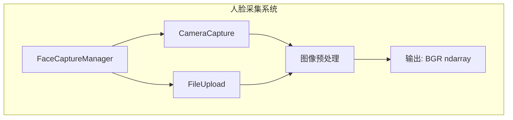
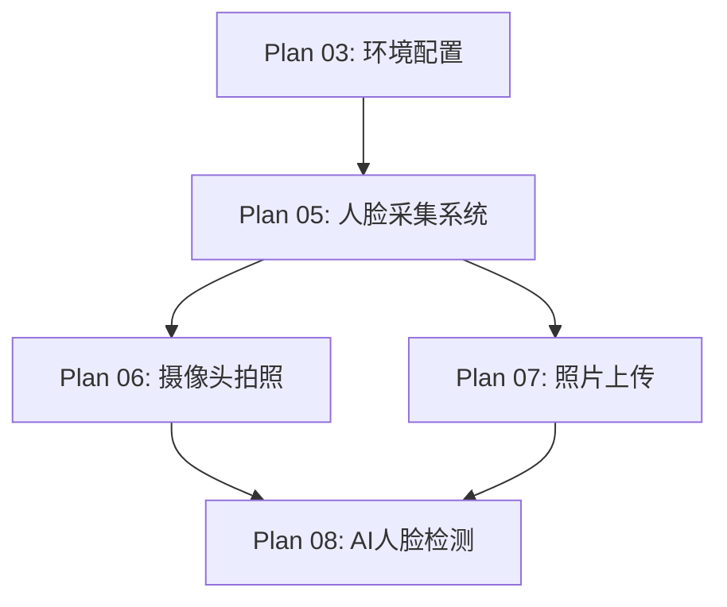

# Plan 05 - 人脸采集系统

## 1. 目标

**目标：** 设计并实现人脸采集系统，支持摄像头实时拍照和本地文件上传两种输入方式，为后续 AI 人脸检测提供高质量的人脸图像。

**背景：** 人脸采集是整个处理管线的入口。需要提供灵活的采集方式，适应不同用户环境（有/无摄像头）。

---

## 2. 系统设计

### 2.1 架构概览



### 2.2 统一接口

```python
# face_system/__init__.py
from abc import ABC, abstractmethod
import numpy as np

class FaceCaptureBase(ABC):
    """人脸采集基类"""

    @abstractmethod
    def capture(self) -> np.ndarray | None:
        """
        采集人脸图像
        返回: BGR 格式的 ndarray，失败返回 None
        """
        pass

    @abstractmethod
    def is_available(self) -> bool:
        """检查采集源是否可用"""
        pass

class FaceCaptureManager:
    """人脸采集管理器 - 统一管理所有采集方式"""

    def __init__(self):
        self.camera = CameraCapture()
        self.uploader = FileUpload()
        self.current_image = None

    def capture_from_camera(self) -> np.ndarray | None:
        """从摄像头拍照"""
        if not self.camera.is_available():
            print("摄像头不可用")
            return None
        self.current_image = self.camera.capture()
        return self.current_image

    def capture_from_file(self) -> np.ndarray | None:
        """从文件上传"""
        self.current_image = self.uploader.capture()
        return self.current_image

    def get_current_image(self) -> np.ndarray | None:
        """获取当前采集的图像"""
        return self.current_image

    def preprocess(self, image: np.ndarray) -> np.ndarray:
        """图像预处理"""
        # 确保最小分辨率
        h, w = image.shape[:2]
        if w < 320 or h < 240:
            scale = max(320 / w, 240 / h)
            image = cv2.resize(image, None, fx=scale, fy=scale)

        # 亮度/对比度自动调整
        image = self._auto_adjust(image)
        return image

    def _auto_adjust(self, image: np.ndarray) -> np.ndarray:
        """自动亮度对比度调整"""
        lab = cv2.cvtColor(image, cv2.COLOR_BGR2LAB)
        l_channel = lab[:, :, 0]
        clahe = cv2.createCLAHE(clipLimit=2.0, tileGridSize=(8, 8))
        lab[:, :, 0] = clahe.apply(l_channel)
        return cv2.cvtColor(lab, cv2.COLOR_LAB2BGR)
```

---

## 3. 两种输入方式

### 方式一：摄像头拍照

详见 **Plan 06 - 摄像头拍照功能**

- 使用 OpenCV VideoCapture
- 实时预览窗口
- 按键/按钮触发拍照
- 支持定时倒计时拍照

### 方式二：文件上传

详见 **Plan 07 - 照片上传功能**

- 使用 tkinter filedialog
- 支持 JPG/PNG/BMP/WebP 格式
- 文件大小限制与预处理
- 预览确认

---

## 4. 图像预处理管线

```python
def preprocess_pipeline(image: np.ndarray) -> np.ndarray:
    """
    完整的图像预处理管线
    输入: 原始 BGR 图像
    输出: 预处理后的 BGR 图像
    """
    # Step 1: 尺寸规范化
    image = resize_to_standard(image, max_dim=1024)

    # Step 2: 旋转校正（基于 EXIF）
    image = correct_orientation(image)

    # Step 3: 亮度对比度优化
    image = auto_brightness_contrast(image)

    # Step 4: 降噪（可选）
    image = cv2.fastNlMeansDenoisingColored(image, None, 5, 5, 7, 21)

    return image

def resize_to_standard(image, max_dim=1024):
    """将图像缩放到标准尺寸，保持宽高比"""
    h, w = image.shape[:2]
    if max(h, w) > max_dim:
        scale = max_dim / max(h, w)
        image = cv2.resize(image, None, fx=scale, fy=scale,
                          interpolation=cv2.INTER_AREA)
    return image

def correct_orientation(image):
    """根据 EXIF 信息校正图像方向"""
    # 使用 Pillow 读取 EXIF
    from PIL import Image
    from PIL.ExifTags import Tags
    # 实现略...
    return image
```

---

## 5. 输入/输出说明

| 项目 | 格式 | 说明 |
|------|------|------|
| 输入（摄像头） | 实时视频流 | OpenCV VideoCapture 读取 |
| 输入（文件） | JPG/PNG/BMP/WebP | 本地文件路径 |
| 输出 | BGR ndarray | 预处理后的图像，最大 1024px |
| 输出 | 状态标志 | success/failure + 错误信息 |

---

## 6. 依赖关系



- **前置依赖：** Plan 03（OpenCV、Pillow 已安装）
- **后续依赖：** Plan 06、07（具体实现），Plan 08（检测需要采集的图像）

---

## 7. 验收标准

- [ ] `FaceCaptureManager` 类可正常实例化
- [ ] 摄像头采集方式可返回有效的 BGR ndarray
- [ ] 文件上传方式可正确读取 JPG/PNG/BMP/WebP 格式
- [ ] 预处理管线正确处理各种尺寸和亮度的图像
- [ ] 无摄像头时 `is_available()` 返回 False，不崩溃
- [ ] 图像输出格式统一为 BGR ndarray
- [ ] 预处理后图像质量满足人脸检测要求
