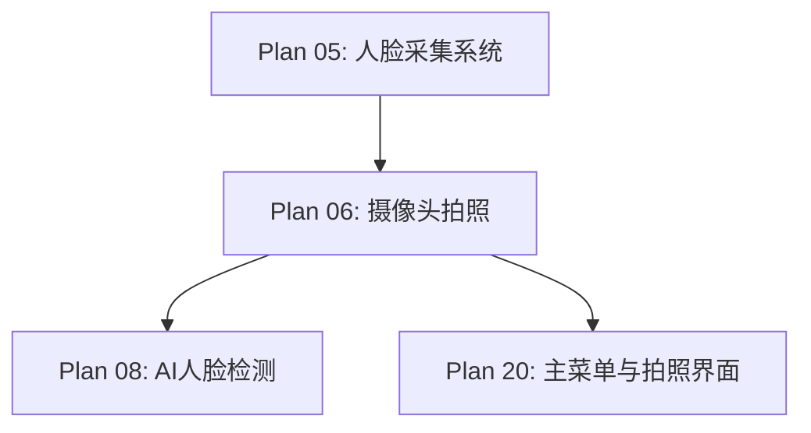

# Plan 06 - 摄像头拍照功能

## 1. 目标

**目标：** 使用 OpenCV VideoCapture 实现摄像头实时预览和拍照功能，提供流畅的用户体验，支持倒计时拍照和实时画面显示。

**背景：** 摄像头拍照是最直接的人脸采集方式，需要在 Pygame 窗口中嵌入实时预览，或使用独立的 OpenCV 窗口。

---

## 2. 具体步骤

### 步骤 1：摄像头初始化与检测

```python
# face_system/capture.py
import cv2
import numpy as np
import time

class CameraCapture:
    """摄像头拍照模块"""

    def __init__(self, camera_index=0, width=640, height=480):
        self.camera_index = camera_index
        self.width = width
        self.height = height
        self.cap = None
        self._available = None

    def is_available(self) -> bool:
        """检测摄像头是否可用"""
        if self._available is not None:
            return self._available

        try:
            cap = cv2.VideoCapture(self.camera_index)
            if cap.isOpened():
                ret, _ = cap.read()
                self._available = ret
            else:
                self._available = False
            cap.release()
        except Exception:
            self._available = False

        return self._available

    def open(self) -> bool:
        """打开摄像头"""
        if self.cap is not None and self.cap.isOpened():
            return True

        self.cap = cv2.VideoCapture(self.camera_index)
        self.cap.set(cv2.CAP_PROP_FRAME_WIDTH, self.width)
        self.cap.set(cv2.CAP_PROP_FRAME_HEIGHT, self.height)
        self.cap.set(cv2.CAP_PROP_FPS, 30)

        return self.cap.isOpened()

    def close(self):
        """关闭摄像头"""
        if self.cap is not None:
            self.cap.release()
            self.cap = None
```

### 步骤 2：实时预览

```python
    def get_frame(self) -> np.ndarray | None:
        """获取当前帧（用于实时预览）"""
        if self.cap is None or not self.cap.isOpened():
            return None

        ret, frame = self.cap.read()
        if not ret:
            return None

        # 水平翻转（镜像效果，更自然）
        frame = cv2.flip(frame, 1)
        return frame

    def preview_loop(self, on_frame_callback=None):
        """
        实时预览循环
        参数：
            on_frame_callback: 每帧回调函数，接收 frame 参数
                              返回 True 表示继续预览，False 表示停止
        """
        if not self.open():
            print("无法打开摄像头")
            return None

        captured_image = None

        while True:
            frame = self.get_frame()
            if frame is None:
                continue

            # 在预览帧上绘制提示
            display_frame = frame.copy()
            self._draw_guide(display_frame)

            if on_frame_callback:
                result = on_frame_callback(display_frame)
                if result is False:
                    break

            cv2.imshow('Camera Preview - Press SPACE to capture', display_frame)

            key = cv2.waitKey(1) & 0xFF
            if key == ord(' '):  # 空格键拍照
                captured_image = frame.copy()
                break
            elif key == 27:  # ESC 取消
                break

        cv2.destroyAllWindows()
        return captured_image
```

### 步骤 3：拍照保存

```python
    def capture(self) -> np.ndarray | None:
        """执行拍照"""
        return self.preview_loop()

    def capture_with_countdown(self, seconds=3) -> np.ndarray | None:
        """倒计时拍照"""
        if not self.open():
            return None

        start_time = None
        captured = None

        while True:
            frame = self.get_frame()
            if frame is None:
                continue

            display = frame.copy()

            if start_time is not None:
                elapsed = time.time() - start_time
                remaining = seconds - int(elapsed)

                if remaining > 0:
                    # 显示倒计时
                    cv2.putText(display, str(remaining),
                               (self.width // 2 - 30, self.height // 2),
                               cv2.FONT_HERSHEY_SIMPLEX, 3, (0, 255, 0), 5)
                else:
                    # 拍照
                    captured = frame.copy()
                    # 闪光效果
                    flash = np.ones_like(frame) * 255
                    cv2.imshow('Camera', flash)
                    cv2.waitKey(100)
                    break
            else:
                cv2.putText(display, "Press SPACE to start countdown",
                           (50, 30), cv2.FONT_HERSHEY_SIMPLEX, 0.7, (255, 255, 255), 2)

            cv2.imshow('Camera', display)

            key = cv2.waitKey(1) & 0xFF
            if key == ord(' ') and start_time is None:
                start_time = time.time()
            elif key == 27:
                break

        cv2.destroyAllWindows()
        return captured

    def _draw_guide(self, frame):
        """在预览帧上绘制人脸对齐引导框"""
        h, w = frame.shape[:2]
        center_x, center_y = w // 2, h // 2
        guide_w, guide_h = w // 3, h // 2

        # 绘制椭圆引导框
        cv2.ellipse(frame, (center_x, center_y),
                    (guide_w // 2, guide_h // 2), 0, 0, 360,
                    (0, 255, 0), 2)

        # 提示文字
        cv2.putText(frame, "Align face in the oval",
                   (center_x - 120, center_y + guide_h // 2 + 30),
                   cv2.FONT_HERSHEY_SIMPLEX, 0.6, (0, 255, 0), 1)
```

### 步骤 4：Pygame 集成预览

```python
    def get_frame_as_pygame_surface(self) -> 'pygame.Surface | None':
        """获取当前帧并转换为 Pygame Surface"""
        import pygame

        frame = self.get_frame()
        if frame is None:
            return None

        # BGR -> RGB
        frame_rgb = cv2.cvtColor(frame, cv2.COLOR_BGR2RGB)
        # 转置为 Pygame 格式 (width, height, channels)
        surface = pygame.surfarray.make_surface(
            np.transpose(frame_rgb, (1, 0, 2))
        )
        return surface
```

---

## 3. 输入/输出说明

| 项目 | 说明 |
|------|------|
| 输入 | 摄像头视频流（默认设备 index=0） |
| 输入 | 用户按键操作（空格拍照、ESC取消） |
| 输出 | BGR ndarray（640x480 或摄像头原始分辨率） |
| 输出 | Pygame Surface（用于游戏内预览） |

---

## 4. 依赖关系



- **前置依赖：** Plan 05（采集系统接口定义）
- **后续依赖：** Plan 08（拍照结果送入检测），Plan 20（UI 集成）

---

## 5. 验收标准

- [ ] `CameraCapture` 类可正常实例化
- [ ] `is_available()` 正确检测摄像头状态
- [ ] 实时预览窗口帧率 >= 24 FPS
- [ ] 预览画面显示引导框（椭圆对齐框）
- [ ] 空格键拍照返回有效的 BGR ndarray
- [ ] ESC 键取消返回 None，不崩溃
- [ ] 倒计时拍照功能正确倒数并在结束时拍照
- [ ] 摄像头资源正确释放（`close()` 后无残留进程）
- [ ] `get_frame_as_pygame_surface()` 返回有效的 Pygame Surface
- [ ] 无摄像头设备时优雅处理，不抛出异常
