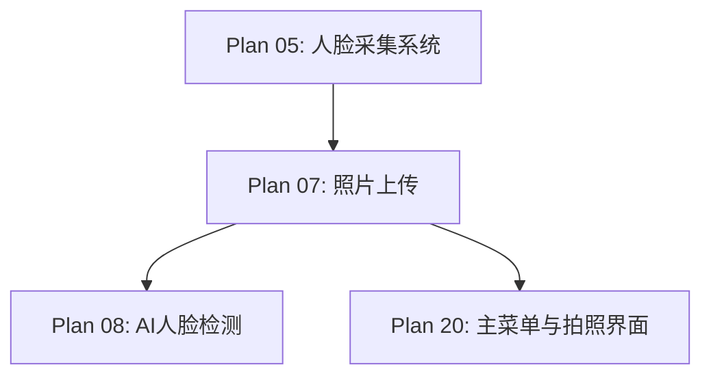

# Plan 07 - 照片上传功能

## 1. 目标

**目标：** 使用 tkinter filedialog 实现本地照片上传功能，支持多种图片格式，包含格式验证和预处理，提供上传预览确认。

**背景：** 当用户没有摄像头或偏好使用已有照片时，文件上传是必要的替代方案。需要处理各种格式、尺寸和方向的图片。

---

## 2. 具体步骤

### 步骤 1：文件选择对话框

```python
# face_system/upload.py
import cv2
import numpy as np
from PIL import Image, ExifTags
import tkinter as tk
from tkinter import filedialog
import os

class FileUpload:
    """照片上传模块"""

    # 支持的文件格式
    SUPPORTED_FORMATS = {
        '.jpg': 'JPEG',
        '.jpeg': 'JPEG',
        '.png': 'PNG',
        '.bmp': 'BMP',
        '.webp': 'WebP',
    }

    MAX_FILE_SIZE = 10 * 1024 * 1024  # 10MB
    MIN_RESOLUTION = (100, 100)        # 最小分辨率
    MAX_RESOLUTION = (4096, 4096)      # 最大分辨率

    def __init__(self):
        self._last_directory = os.path.expanduser("~\\Pictures")

    def is_available(self) -> bool:
        """文件上传始终可用"""
        return True

    def capture(self) -> np.ndarray | None:
        """打开文件选择对话框并读取图像"""
        file_path = self._open_file_dialog()
        if file_path is None:
            return None

        # 验证文件
        if not self._validate_file(file_path):
            return None

        # 读取并预处理
        image = self._load_image(file_path)
        if image is None:
            return None

        # 记住上次目录
        self._last_directory = os.path.dirname(file_path)

        return image

    def _open_file_dialog(self) -> str | None:
        """打开文件选择对话框"""
        # 创建隐藏的 tk 根窗口
        root = tk.Tk()
        root.withdraw()
        root.attributes('-topmost', True)  # 确保对话框在最上层

        filetypes = [
            ("图片文件", "*.jpg *.jpeg *.png *.bmp *.webp"),
            ("JPEG", "*.jpg *.jpeg"),
            ("PNG", "*.png"),
            ("BMP", "*.bmp"),
            ("WebP", "*.webp"),
            ("所有文件", "*.*"),
        ]

        file_path = filedialog.askopenfilename(
            title="选择人脸照片",
            initialdir=self._last_directory,
            filetypes=filetypes,
        )

        root.destroy()

        if not file_path:
            return None

        return file_path
```

### 步骤 2：文件验证

```python
    def _validate_file(self, file_path: str) -> bool:
        """验证文件有效性"""
        # 检查文件是否存在
        if not os.path.isfile(file_path):
            print(f"文件不存在: {file_path}")
            return False

        # 检查文件大小
        file_size = os.path.getsize(file_path)
        if file_size > self.MAX_FILE_SIZE:
            print(f"文件过大: {file_size / 1024 / 1024:.1f}MB > {self.MAX_FILE_SIZE / 1024 / 1024}MB")
            return False

        if file_size == 0:
            print("文件为空")
            return False

        # 检查文件扩展名
        ext = os.path.splitext(file_path)[1].lower()
        if ext not in self.SUPPORTED_FORMATS:
            print(f"不支持的格式: {ext}")
            return False

        # 尝试用 Pillow 打开验证
        try:
            with Image.open(file_path) as img:
                img.verify()
        except Exception as e:
            print(f"文件损坏或格式错误: {e}")
            return False

        return True
```

### 步骤 3：图像加载与预处理

```python
    def _load_image(self, file_path: str) -> np.ndarray | None:
        """加载图像并预处理"""
        try:
            # 使用 Pillow 加载（支持 EXIF 旋转）
            pil_image = Image.open(file_path)

            # EXIF 方向校正
            pil_image = self._fix_orientation(pil_image)

            # 转换为 RGB（处理 RGBA、灰度等情况）
            if pil_image.mode == 'RGBA':
                # 在白色背景上合成
                background = Image.new('RGB', pil_image.size, (255, 255, 255))
                background.paste(pil_image, mask=pil_image.split()[3])
                pil_image = background
            elif pil_image.mode != 'RGB':
                pil_image = pil_image.convert('RGB')

            # 转换为 numpy array
            rgb_array = np.array(pil_image)

            # RGB -> BGR (OpenCV 格式)
            bgr_array = cv2.cvtColor(rgb_array, cv2.COLOR_RGB2BGR)

            # 尺寸检查和调整
            bgr_array = self._resize_if_needed(bgr_array)

            return bgr_array

        except Exception as e:
            print(f"图像加载失败: {e}")
            return None

    def _fix_orientation(self, image: Image.Image) -> Image.Image:
        """根据 EXIF 信息校正图像方向"""
        try:
            exif = image._getexif()
            if exif is None:
                return image

            # 查找 Orientation 标签
            orientation_key = None
            for key, val in ExifTags.TAGS.items():
                if val == 'Orientation':
                    orientation_key = key
                    break

            if orientation_key is None or orientation_key not in exif:
                return image

            orientation = exif[orientation_key]

            # 根据方向值旋转/翻转
            transforms = {
                2: [Image.FLIP_LEFT_RIGHT],
                3: [Image.ROTATE_180],
                4: [Image.FLIP_TOP_BOTTOM],
                5: [Image.FLIP_LEFT_RIGHT, Image.ROTATE_90],
                6: [Image.ROTATE_270],
                7: [Image.FLIP_LEFT_RIGHT, Image.ROTATE_270],
                8: [Image.ROTATE_90],
            }

            if orientation in transforms:
                for transform in transforms[orientation]:
                    image = image.transpose(transform)

        except (AttributeError, KeyError, TypeError):
            pass

        return image

    def _resize_if_needed(self, image: np.ndarray) -> np.ndarray:
        """根据需要调整图像尺寸"""
        h, w = image.shape[:2]

        # 检查最小分辨率
        if w < self.MIN_RESOLUTION[0] or h < self.MIN_RESOLUTION[1]:
            scale = max(self.MIN_RESOLUTION[0] / w, self.MIN_RESOLUTION[1] / h)
            image = cv2.resize(image, None, fx=scale, fy=scale,
                             interpolation=cv2.INTER_CUBIC)

        # 检查最大分辨率
        if w > self.MAX_RESOLUTION[0] or h > self.MAX_RESOLUTION[1]:
            scale = min(self.MAX_RESOLUTION[0] / w, self.MAX_RESOLUTION[1] / h)
            image = cv2.resize(image, None, fx=scale, fy=scale,
                             interpolation=cv2.INTER_AREA)

        return image
```

### 步骤 4：预览确认

```python
    def capture_with_preview(self) -> np.ndarray | None:
        """带预览确认的上传流程"""
        image = self.capture()
        if image is None:
            return None

        # 显示预览窗口
        preview = image.copy()
        h, w = preview.shape[:2]

        # 缩放预览到合适尺寸
        max_preview = 600
        if max(h, w) > max_preview:
            scale = max_preview / max(h, w)
            preview = cv2.resize(preview, None, fx=scale, fy=scale)

        cv2.putText(preview, "Press ENTER to confirm, ESC to cancel",
                   (10, 25), cv2.FONT_HERSHEY_SIMPLEX, 0.6, (0, 255, 0), 1)
        cv2.imshow("Preview - Confirm Photo", preview)

        while True:
            key = cv2.waitKey(0) & 0xFF
            if key == 13:  # Enter 确认
                cv2.destroyAllWindows()
                return image
            elif key == 27:  # ESC 取消
                cv2.destroyAllWindows()
                return None

    def load_from_path(self, file_path: str) -> np.ndarray | None:
        """直接从路径加载（编程接口，跳过对话框）"""
        if not self._validate_file(file_path):
            return None
        return self._load_image(file_path)
```

---

## 3. 格式支持说明

| 格式 | 扩展名 | 说明 |
|------|--------|------|
| JPEG | .jpg, .jpeg | 最常见的照片格式，有损压缩 |
| PNG | .png | 支持透明通道，无损 |
| BMP | .bmp | Windows 位图，无压缩 |
| WebP | .webp | Google 开发，高效压缩 |

---

## 4. 输入/输出说明

| 项目 | 说明 |
|------|------|
| 输入 | 本地图片文件（JPG/PNG/BMP/WebP） |
| 输入 | 文件路径（用户通过对话框选择或直接传入） |
| 输出 | BGR ndarray（经过方向校正和尺寸规范化） |
| 输出 | None（用户取消或文件无效时） |

---

## 5. 依赖关系



- **前置依赖：** Plan 05（采集系统接口）
- **后续依赖：** Plan 08（上传的照片送入检测），Plan 20（UI 集成）

---

## 6. 验收标准

- [ ] 文件选择对话框正常弹出，显示正确的文件过滤器
- [ ] 成功加载 JPG、PNG、BMP、WebP 四种格式
- [ ] EXIF 方向校正正确（手机竖拍照片不旋转90度）
- [ ] RGBA 图像正确转换为 BGR（透明区域变为白色）
- [ ] 文件大小超过 10MB 时正确拒绝
- [ ] 分辨率过小的图像被自动放大
- [ ] 分辨率过大的图像被自动缩小
- [ ] 损坏的图片文件被正确识别并拒绝
- [ ] 用户取消选择时返回 None
- [ ] 预览确认窗口正常显示，Enter 确认 / ESC 取消
- [ ] `load_from_path()` 编程接口正常工作
