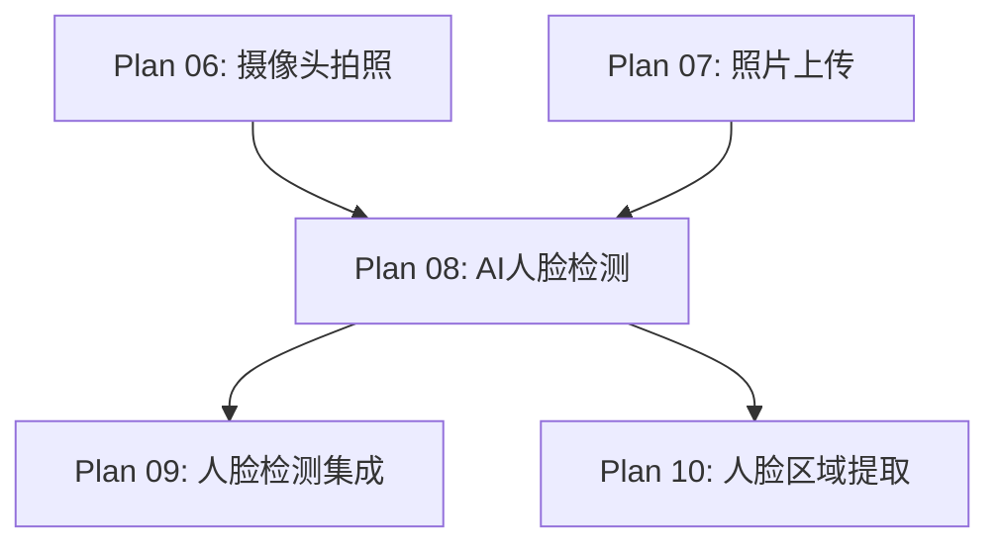

# Plan 08 - AI 人脸检测与提取

## 1. 目标

**目标：** 使用 Google MediaPipe 实现高精度的人脸检测和 468 个面部特征点提取，为后续的人脸区域裁剪和风格转换提供准确的面部数据。

**背景：** MediaPipe 提供了轻量级、高性能的人脸检测（FaceDetection）和面部网格（FaceMesh）模型，可在 CPU 上实时运行，非常适合本项目的需求。

---

## 2. 具体步骤

### 步骤 1：MediaPipe 安装与配置

```bash
pip install mediapipe>=0.10.0
```

```python
# face_system/detector.py
import mediapipe as mp
import cv2
import numpy as np
from dataclasses import dataclass
from typing import List, Tuple, Optional

# MediaPipe 模块初始化
mp_face_detection = mp.solutions.face_detection
mp_face_mesh = mp.solutions.face_mesh
mp_drawing = mp.solutions.drawing_utils
mp_drawing_styles = mp.solutions.drawing_styles
```

### 步骤 2：FaceDetection 初始化

```python
@dataclass
class FaceDetectionResult:
    """人脸检测结果"""
    bbox: Tuple[int, int, int, int]  # (x, y, w, h) 边界框
    confidence: float                 # 置信度 0-1
    landmarks: List[Tuple[int, int]] # 关键点列表（6个）
    # 关键点: 右眼, 左眼, 鼻尖, 嘴巴中心, 右耳, 左耳

class FaceDetector:
    """人脸检测器"""

    def __init__(self, model_selection=1, min_detection_confidence=0.5):
        """
        初始化人脸检测器
        参数:
            model_selection: 0=近距离(2m内), 1=远距离(5m内)
            min_detection_confidence: 最小检测置信度
        """
        self.detector = mp_face_detection.FaceDetection(
            model_selection=model_selection,
            min_detection_confidence=min_detection_confidence,
        )

    def detect(self, image: np.ndarray) -> List[FaceDetectionResult]:
        """
        检测图像中的人脸
        参数:
            image: BGR 格式的 ndarray
        返回:
            FaceDetectionResult 列表
        """
        # BGR -> RGB (MediaPipe 需要 RGB)
        rgb_image = cv2.cvtColor(image, cv2.COLOR_BGR2RGB)
        results = self.detector.process(rgb_image)

        if not results.detections:
            return []

        h, w = image.shape[:2]
        faces = []

        for detection in results.detections:
            # 提取边界框
            bbox = detection.location_data.relative_bounding_box
            x = int(bbox.xmin * w)
            y = int(bbox.ymin * h)
            bw = int(bbox.width * w)
            bh = int(bbox.height * h)

            # 确保边界框在图像范围内
            x = max(0, x)
            y = max(0, y)
            bw = min(bw, w - x)
            bh = min(bh, h - y)

            # 提取 6 个关键点
            landmarks = []
            for kp in detection.location_data.relative_keypoints:
                lx = int(kp.x * w)
                ly = int(kp.y * h)
                landmarks.append((lx, ly))

            faces.append(FaceDetectionResult(
                bbox=(x, y, bw, bh),
                confidence=detection.score[0],
                landmarks=landmarks,
            ))

        # 按置信度排序，最高在前
        faces.sort(key=lambda f: f.confidence, reverse=True)
        return faces

    def detect_largest(self, image: np.ndarray) -> Optional[FaceDetectionResult]:
        """检测最大的人脸（适用于自拍场景）"""
        faces = self.detect(image)
        if not faces:
            return None

        # 选择面积最大的人脸
        return max(faces, key=lambda f: f.bbox[2] * f.bbox[3])

    def close(self):
        """释放资源"""
        self.detector.close()
```

### 步骤 3：FaceMesh 特征点提取

```python
@dataclass
class FaceMeshResult:
    """面部网格结果"""
    landmarks: np.ndarray   # (468, 3) 特征点坐标 (x, y, z)
    face_oval: List[int]    # 面部轮廓索引
    left_eye: List[int]     # 左眼轮廓索引
    right_eye: List[int]    # 右眼轮廓索引
    lips: List[int]         # 嘴唇轮廓索引

class FaceMeshExtractor:
    """面部网格特征点提取器"""

    # MediaPipe FaceMesh 关键轮廓索引
    FACE_OVAL_INDICES = [
        10, 338, 297, 332, 284, 251, 389, 356, 454, 323, 361, 288,
        397, 365, 379, 378, 400, 377, 152, 148, 176, 149, 150, 136,
        172, 58, 132, 93, 234, 127, 162, 21, 54, 103, 67, 109
    ]

    LEFT_EYE_INDICES = [
        362, 382, 381, 380, 374, 373, 390, 249, 263, 466, 388, 387,
        386, 385, 384, 398
    ]

    RIGHT_EYE_INDICES = [
        33, 7, 163, 144, 145, 153, 154, 155, 133, 173, 157, 158,
        159, 160, 161, 246
    ]

    LIPS_INDICES = [
        61, 146, 91, 181, 84, 17, 314, 405, 321, 375, 291, 308,
        324, 318, 402, 317, 14, 87, 178, 88, 95, 185, 40, 39, 37,
        0, 267, 269, 270, 409, 415, 310, 311, 312, 13, 82, 81, 42,
        183, 78
    ]

    def __init__(self,
                 static_image_mode=True,
                 max_num_faces=1,
                 refine_landmarks=True,
                 min_detection_confidence=0.5,
                 min_tracking_confidence=0.5):
        """
        初始化 FaceMesh
        参数:
            static_image_mode: True=单张图片, False=视频流
            max_num_faces: 最大检测人脸数
            refine_landmarks: 是否精细化特征点(包含虹膜)
            min_detection_confidence: 最小检测置信度
            min_tracking_confidence: 最小追踪置信度
        """
        self.mesh = mp_face_mesh.FaceMesh(
            static_image_mode=static_image_mode,
            max_num_faces=max_num_faces,
            refine_landmarks=refine_landmarks,
            min_detection_confidence=min_detection_confidence,
            min_tracking_confidence=min_tracking_confidence,
        )

    def extract(self, image: np.ndarray) -> Optional[FaceMeshResult]:
        """
        提取面部特征点
        参数:
            image: BGR ndarray
        返回:
            FaceMeshResult 或 None
        """
        rgb_image = cv2.cvtColor(image, cv2.COLOR_BGR2RGB)
        results = self.mesh.process(rgb_image)

        if not results.multi_face_landmarks:
            return None

        # 取第一张脸
        face_landmarks = results.multi_face_landmarks[0]
        h, w = image.shape[:2]

        # 转换为像素坐标
        landmarks = np.array([
            [int(lm.x * w), int(lm.y * h), lm.z]
            for lm in face_landmarks.landmark
        ])

        return FaceMeshResult(
            landmarks=landmarks,
            face_oval=self.FACE_OVAL_INDICES,
            left_eye=self.LEFT_EYE_INDICES,
            right_eye=self.RIGHT_EYE_INDICES,
            lips=self.LIPS_INDICES,
        )

    def get_face_contour(self, mesh_result: FaceMeshResult) -> np.ndarray:
        """获取面部轮廓点（用于裁剪）"""
        contour_points = mesh_result.landmarks[mesh_result.face_oval, :2]
        return contour_points.astype(np.int32)

    def close(self):
        """释放资源"""
        self.mesh.close()
```

### 步骤 4：可视化调试工具

```python
def draw_detection(image: np.ndarray, result: FaceDetectionResult) -> np.ndarray:
    """在图像上绘制检测结果（调试用）"""
    output = image.copy()
    x, y, w, h = result.bbox

    # 绘制边界框
    cv2.rectangle(output, (x, y), (x + w, y + h), (0, 255, 0), 2)

    # 绘制置信度
    cv2.putText(output, f"{result.confidence:.2f}",
               (x, y - 10), cv2.FONT_HERSHEY_SIMPLEX, 0.6, (0, 255, 0), 2)

    # 绘制关键点
    for lx, ly in result.landmarks:
        cv2.circle(output, (lx, ly), 3, (0, 0, 255), -1)

    return output

def draw_mesh(image: np.ndarray, mesh_result: FaceMeshResult) -> np.ndarray:
    """在图像上绘制面部网格（调试用）"""
    output = image.copy()

    # 绘制所有特征点
    for i, (x, y, z) in enumerate(mesh_result.landmarks):
        cv2.circle(output, (int(x), int(y)), 1, (0, 255, 0), -1)

    # 绘制面部轮廓
    contour = mesh_result.landmarks[mesh_result.face_oval, :2].astype(np.int32)
    cv2.polylines(output, [contour], True, (255, 0, 0), 2)

    return output
```

---

## 3. 输入/输出说明

| 项目 | 格式 | 说明 |
|------|------|------|
| 输入 | BGR ndarray | 包含人脸的图像 |
| 输出（检测） | FaceDetectionResult | 边界框 + 置信度 + 6 关键点 |
| 输出（网格） | FaceMeshResult | 468 特征点 + 轮廓索引 |
| 输出（轮廓） | ndarray (N, 2) | 面部轮廓坐标数组 |

---

## 4. 依赖关系



- **前置依赖：** Plan 06/07（提供人脸图像）
- **后续依赖：** Plan 09（集成配置），Plan 10（区域提取需要检测结果）

---

## 5. 验收标准

- [ ] MediaPipe 0.10+ 安装成功
- [ ] `FaceDetector` 可正确检测正面人脸，置信度 > 0.8
- [ ] `FaceDetector` 可检测侧面人脸（45度内），置信度 > 0.5
- [ ] `FaceMeshExtractor` 返回 468 个特征点
- [ ] 面部轮廓索引正确，`get_face_contour()` 返回闭合轮廓
- [ ] 无人脸时返回 None，不崩溃
- [ ] 多人脸时 `detect_largest()` 返回最大人脸
- [ ] 可视化调试工具正确绘制检测结果
- [ ] 单张图片检测耗时 < 100ms（CPU）
- [ ] `close()` 正确释放 MediaPipe 资源
