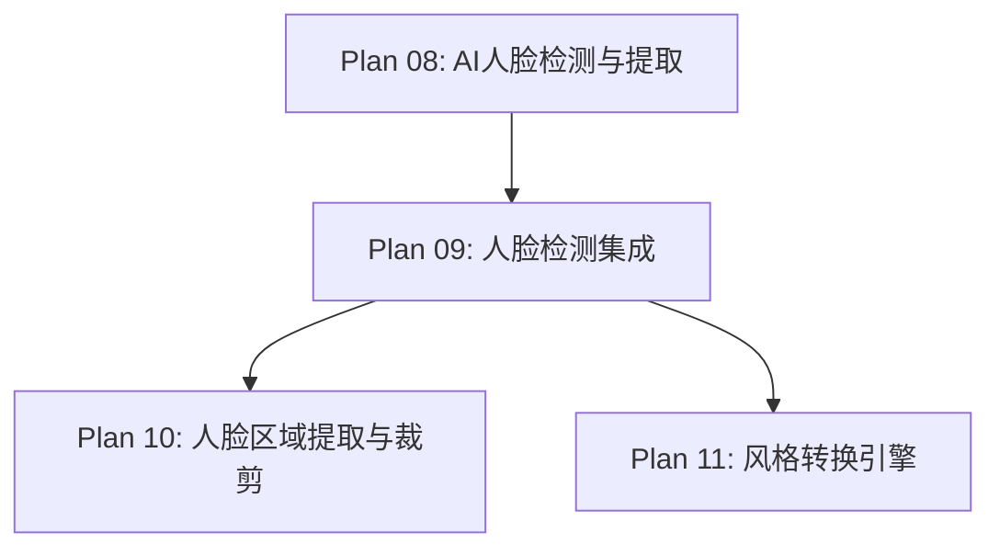

# Plan 09 - 人脸检测集成

## 1. 目标

**目标：** 将 MediaPipe FaceDetection 和 FaceMesh 集成到项目中，完成初始化配置、错误处理、性能优化，并提供统一的检测管线接口。

**背景：** Plan 08 定义了检测器和提取器的核心逻辑，本计划负责将它们集成为一个完整的、可配置的检测管线。

---

## 2. 具体步骤

### 步骤 1：依赖安装验证

```bash
# 安装 MediaPipe
pip install mediapipe>=0.10.0

# 验证安装
python -c "import mediapipe as mp; print(f'MediaPipe {mp.__version__}')"
```

### 步骤 2：检测管线集成

```python
# face_system/detection_pipeline.py
import cv2
import numpy as np
import mediapipe as mp
from typing import Optional, Tuple
from dataclasses import dataclass
import logging

logger = logging.getLogger(__name__)

@dataclass
class DetectionConfig:
    """检测配置"""
    # FaceDetection 参数
    detection_model: int = 1                    # 0=近距离, 1=远距离
    detection_confidence: float = 0.5           # 检测置信度阈值

    # FaceMesh 参数
    mesh_max_faces: int = 1                     # 最大检测人脸数
    mesh_refine_landmarks: bool = True          # 精细化特征点
    mesh_detection_confidence: float = 0.5      # Mesh 检测阈值
    mesh_tracking_confidence: float = 0.5       # 追踪阈值

    # 预处理参数
    input_max_size: int = 1024                  # 输入图像最大尺寸
    face_padding: float = 0.2                   # 人脸边界框扩展比例

@dataclass
class PipelineResult:
    """管线输出结果"""
    success: bool
    face_image: Optional[np.ndarray]           # 裁剪的人脸图像 (RGBA)
    face_bbox: Optional[Tuple[int, int, int, int]]  # 边界框
    face_landmarks: Optional[np.ndarray]       # 468 特征点
    face_contour: Optional[np.ndarray]         # 轮廓点
    confidence: float = 0.0
    error_message: str = ""

class FaceDetectionPipeline:
    """人脸检测集成管线"""

    def __init__(self, config: DetectionConfig = None):
        self.config = config or DetectionConfig()
        self._detector = None
        self._mesh = None
        self._initialized = False

    def initialize(self) -> bool:
        """
        初始化 MediaPipe 模型
        返回: 是否初始化成功
        """
        try:
            # 初始化 FaceDetection
            self._detector = mp.solutions.face_detection.FaceDetection(
                model_selection=self.config.detection_model,
                min_detection_confidence=self.config.detection_confidence,
            )

            # 初始化 FaceMesh
            self._mesh = mp.solutions.face_mesh.FaceMesh(
                static_image_mode=True,
                max_num_faces=self.config.mesh_max_faces,
                refine_landmarks=self.config.mesh_refine_landmarks,
                min_detection_confidence=self.config.mesh_detection_confidence,
                min_tracking_confidence=self.config.mesh_tracking_confidence,
            )

            self._initialized = True
            logger.info("人脸检测管线初始化成功")
            return True

        except Exception as e:
            logger.error(f"人脸检测管线初始化失败: {e}")
            self._initialized = False
            return False

    def process(self, image: np.ndarray) -> PipelineResult:
        """
        完整检测管线
        参数:
            image: BGR ndarray
        返回:
            PipelineResult
        """
        if not self._initialized:
            if not self.initialize():
                return PipelineResult(
                    success=False,
                    face_image=None,
                    face_bbox=None,
                    face_landmarks=None,
                    face_contour=None,
                    error_message="管线未初始化",
                )

        # Step 1: 预处理
        processed = self._preprocess(image)

        # Step 2: 人脸检测
        rgb = cv2.cvtColor(processed, cv2.COLOR_BGR2RGB)
        detection_result = self._detector.process(rgb)

        if not detection_result.detections:
            return PipelineResult(
                success=False,
                face_image=None,
                face_bbox=None,
                face_landmarks=None,
                face_contour=None,
                error_message="未检测到人脸",
            )

        # 取置信度最高的人脸
        detection = max(detection_result.detections,
                       key=lambda d: d.score[0])
        confidence = detection.score[0]

        # 提取边界框
        h, w = processed.shape[:2]
        bbox_rel = detection.location_data.relative_bounding_box
        bbox = (
            int(bbox_rel.xmin * w),
            int(bbox_rel.ymin * h),
            int(bbox_rel.width * w),
            int(bbox_rel.height * h),
        )

        # Step 3: FaceMesh 特征点
        mesh_result = self._mesh.process(rgb)

        landmarks = None
        contour = None
        if mesh_result.multi_face_landmarks:
            face_lm = mesh_result.multi_face_landmarks[0]
            landmarks = np.array([
                [int(lm.x * w), int(lm.y * h), lm.z]
                for lm in face_lm.landmark
            ])

            # 提取面部轮廓
            FACE_OVAL = [
                10, 338, 297, 332, 284, 251, 389, 356, 454, 323, 361, 288,
                397, 365, 379, 378, 400, 377, 152, 148, 176, 149, 150, 136,
                172, 58, 132, 93, 234, 127, 162, 21, 54, 103, 67, 109
            ]
            contour = landmarks[FACE_OVAL, :2].astype(np.int32)

        # Step 4: 裁剪人脸（带 padding）
        face_image = self._crop_face(processed, bbox, contour)

        return PipelineResult(
            success=True,
            face_image=face_image,
            face_bbox=bbox,
            face_landmarks=landmarks,
            face_contour=contour,
            confidence=confidence,
        )

    def _preprocess(self, image: np.ndarray) -> np.ndarray:
        """输入预处理"""
        h, w = image.shape[:2]
        max_size = self.config.input_max_size

        if max(h, w) > max_size:
            scale = max_size / max(h, w)
            image = cv2.resize(image, None, fx=scale, fy=scale,
                             interpolation=cv2.INTER_AREA)
        return image

    def _crop_face(self, image: np.ndarray, bbox: tuple,
                   contour: Optional[np.ndarray]) -> np.ndarray:
        """裁剪人脸区域"""
        h, w = image.shape[:2]
        x, y, bw, bh = bbox

        # 添加 padding
        pad = self.config.face_padding
        px = int(bw * pad)
        py = int(bh * pad)

        x1 = max(0, x - px)
        y1 = max(0, y - py)
        x2 = min(w, x + bw + px)
        y2 = min(h, y + bh + py)

        face_crop = image[y1:y2, x1:x2]

        # 转换为 RGBA
        face_rgba = cv2.cvtColor(face_crop, cv2.COLOR_BGR2BGRA)

        # 如果有轮廓点，创建掩码
        if contour is not None:
            mask = np.zeros((y2 - y1, x2 - x1), dtype=np.uint8)
            shifted_contour = contour - np.array([x1, y1])
            cv2.fillConvexPoly(mask, shifted_contour, 255)

            # 羽化边缘
            mask = cv2.GaussianBlur(mask, (5, 5), 2)
            face_rgba[:, :, 3] = mask

        return face_rgba

    def shutdown(self):
        """释放所有资源"""
        if self._detector:
            self._detector.close()
        if self._mesh:
            self._mesh.close()
        self._initialized = False
        logger.info("人脸检测管线已关闭")
```

### 步骤 3：错误处理与重试

```python
    def process_with_retry(self, image: np.ndarray,
                           max_retries: int = 3) -> PipelineResult:
        """带重试的检测"""
        for attempt in range(max_retries):
            result = self.process(image)
            if result.success:
                return result

            # 每次重试调低置信度阈值
            if attempt < max_retries - 1:
                logger.info(f"检测重试 {attempt + 1}/{max_retries}")
                # 尝试增强图像
                image = self._enhance_for_retry(image, attempt)

        return result

    def _enhance_for_retry(self, image: np.ndarray,
                           attempt: int) -> np.ndarray:
        """为重试增强图像"""
        if attempt == 0:
            # 增加亮度
            return cv2.convertScaleAbs(image, alpha=1.2, beta=30)
        elif attempt == 1:
            # 直方图均衡化
            lab = cv2.cvtColor(image, cv2.COLOR_BGR2LAB)
            lab[:, :, 0] = cv2.equalizeHist(lab[:, :, 0])
            return cv2.cvtColor(lab, cv2.COLOR_LAB2BGR)
        return image
```

---

## 3. 输入/输出说明

| 项目 | 说明 |
|------|------|
| 输入 | BGR ndarray（来自摄像头或文件上传） |
| 输入 | DetectionConfig（可选的配置参数） |
| 输出 | PipelineResult（包含人脸图像、特征点、轮廓等） |

---

## 4. 依赖关系



- **前置依赖：** Plan 08（检测器和提取器的核心实现）
- **后续依赖：** Plan 10（精细裁剪），Plan 11（风格转换需要检测结果）

---

## 5. 验收标准

- [ ] `FaceDetectionPipeline` 可正常初始化
- [ ] `initialize()` 成功加载 FaceDetection 和 FaceMesh 模型
- [ ] `process()` 对正面人脸图像返回 `success=True`
- [ ] `PipelineResult` 包含完整的人脸图像、边界框、特征点
- [ ] 无人脸图像返回 `success=False` 且错误信息明确
- [ ] `process_with_retry()` 在首次失败后可通过增强重试成功
- [ ] `shutdown()` 正确释放资源
- [ ] 整个管线处理耗时 < 200ms（CPU）
- [ ] `DetectionConfig` 参数调整可正常生效
- [ ] 日志输出清晰，便于调试
