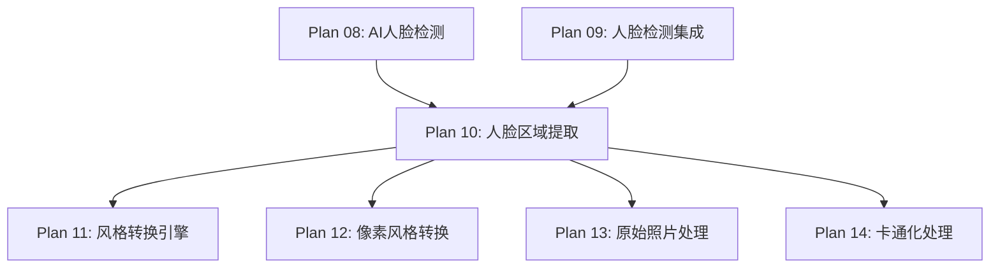

# Plan 10 - 人脸区域提取与裁剪

## 1. 目标

**目标：** 基于 MediaPipe FaceMesh 的 468 个特征点，精确提取人脸区域，创建轮廓掩码，输出带透明通道的 RGBA 图像，为风格转换引擎提供干净的人脸素材。

**背景：** 简单的矩形裁剪会包含大量背景，影响后续风格转换的效果。使用特征点轮廓进行精确裁剪可以获得更好的人脸素材。

---

## 2. 具体步骤

### 步骤 1：特征点轮廓提取

```python
# face_system/extractor.py
import cv2
import numpy as np
from typing import Optional, Tuple
from scipy.spatial import ConvexHull

class FaceExtractor:
    """人脸区域精确提取器"""

    # 面部轮廓特征点索引（MediaPipe FaceMesh）
    FACE_OVAL_INDICES = [
        10, 338, 297, 332, 284, 251, 389, 356, 454, 323, 361, 288,
        397, 365, 379, 378, 400, 377, 152, 148, 176, 149, 150, 136,
        172, 58, 132, 93, 234, 127, 162, 21, 54, 103, 67, 109
    ]

    # 额头扩展点（轮廓上方）
    FOREHEAD_INDICES = [10, 338, 297, 332, 284, 251, 21, 54, 103, 67, 109]

    def __init__(self, padding_ratio: float = 0.1,
                 feather_radius: int = 5,
                 include_forehead: bool = True):
        """
        参数:
            padding_ratio: 边界扩展比例
            feather_radius: 边缘羽化半径
            include_forehead: 是否包含额头区域
        """
        self.padding_ratio = padding_ratio
        self.feather_radius = feather_radius
        self.include_forehead = include_forehead
```

### 步骤 2：轮廓掩码创建

```python
    def create_face_mask(self, image_shape: Tuple[int, int],
                         landmarks: np.ndarray) -> np.ndarray:
        """
        创建人脸区域掩码
        参数:
            image_shape: (height, width) 图像尺寸
            landmarks: (468, 3) 特征点数组
        返回:
            uint8 掩码，人脸区域为 255，背景为 0
        """
        h, w = image_shape[:2]
        mask = np.zeros((h, w), dtype=np.uint8)

        # 获取面部轮廓点
        contour_points = landmarks[self.FACE_OVAL_INDICES, :2].astype(np.int32)

        # 如果需要额头，向上扩展轮廓
        if self.include_forehead:
            contour_points = self._extend_forehead(contour_points, landmarks)

        # 填充轮廓
        cv2.fillConvexPoly(mask, contour_points, 255)

        # 使用更精确的非凸填充（效果更好）
        hull = ConvexHull(contour_points)
        hull_points = contour_points[hull.vertices]
        cv2.fillConvexPoly(mask, hull_points, 255)

        # 也用 fillPoly 处理凹区域（如下巴凹陷）
        cv2.fillPoly(mask, [contour_points], 255)

        return mask

    def _extend_forehead(self, contour: np.ndarray,
                         landmarks: np.ndarray) -> np.ndarray:
        """向上扩展额头区域"""
        forehead_points = landmarks[self.FOREHEAD_INDICES, :2].astype(np.int32)

        # 计算额头中心和眉毛中心的距离
        eyebrow_center = np.mean(forehead_points, axis=0)

        # 鼻尖位置
        nose_tip = landmarks[1, :2]

        # 额头高度 = 眉毛到鼻尖距离 * 0.6
        forehead_height = int(np.linalg.norm(eyebrow_center - nose_tip) * 0.6)

        # 将额头点向上移动
        extended = contour.copy()
        top_indices = [i for i, pt in enumerate(contour)
                       if pt[1] < np.mean(contour[:, 1])]

        for idx in top_indices:
            extended[idx, 1] -= forehead_height

        return extended
```

### 步骤 3：羽化边缘处理

```python
    def feather_mask(self, mask: np.ndarray) -> np.ndarray:
        """
        对掩码边缘进行羽化处理，使裁剪结果更自然
        参数:
            mask: uint8 掩码
        返回:
            羽化后的掩码
        """
        if self.feather_radius <= 0:
            return mask

        # 方法1: 高斯模糊羽化
        feathered = cv2.GaussianBlur(
            mask, (0, 0),
            sigmaX=self.feather_radius,
            sigmaY=self.feather_radius
        )

        # 保持中心区域完全不透明
        # 通过腐蚀获取内部区域
        kernel_size = self.feather_radius * 2 + 1
        kernel = cv2.getStructuringElement(
            cv2.MORPH_ELLIPSE, (kernel_size, kernel_size)
        )
        inner = cv2.erode(mask, kernel)

        # 合并：内部完全不透明 + 边缘羽化
        result = np.maximum(inner, feathered)

        return result
```

### 步骤 4：RGBA 输出

```python
    def extract(self, image: np.ndarray,
                landmarks: np.ndarray) -> Optional[np.ndarray]:
        """
        完整的人脸提取流程
        参数:
            image: BGR ndarray 原始图像
            landmarks: (468, 3) 特征点数组
        返回:
            RGBA ndarray 裁剪的人脸图像（带透明通道）
        """
        h, w = image.shape[:2]

        # 1. 创建掩码
        mask = self.create_face_mask((h, w), landmarks)

        # 2. 羽化边缘
        mask = self.feather_mask(mask)

        # 3. 转换为 RGBA
        rgba = cv2.cvtColor(image, cv2.COLOR_BGR2BGRA)
        rgba[:, :, 3] = mask

        # 4. 裁剪到人脸边界框（减少图像大小）
        face_bbox = self._get_mask_bbox(mask)
        if face_bbox is None:
            return None

        x, y, bw, bh = face_bbox
        # 添加 padding
        pad_x = int(bw * self.padding_ratio)
        pad_y = int(bh * self.padding_ratio)

        x1 = max(0, x - pad_x)
        y1 = max(0, y - pad_y)
        x2 = min(w, x + bw + pad_x)
        y2 = min(h, y + bh + pad_y)

        face_rgba = rgba[y1:y2, x1:x2]

        return face_rgba

    def _get_mask_bbox(self, mask: np.ndarray) -> Optional[Tuple[int, int, int, int]]:
        """获取掩码的边界框"""
        coords = cv2.findNonZero(mask)
        if coords is None:
            return None
        x, y, w, h = cv2.boundingRect(coords)
        return (x, y, w, h)

    def extract_square(self, image: np.ndarray,
                       landmarks: np.ndarray,
                       target_size: int = 256) -> Optional[np.ndarray]:
        """
        提取正方形人脸（便于后续处理）
        参数:
            image: BGR ndarray
            landmarks: 特征点
            target_size: 目标尺寸
        返回:
            (target_size, target_size, 4) RGBA ndarray
        """
        face = self.extract(image, landmarks)
        if face is None:
            return None

        h, w = face.shape[:2]

        # 扩展为正方形
        size = max(h, w)
        square = np.zeros((size, size, 4), dtype=np.uint8)

        # 居中放置
        y_offset = (size - h) // 2
        x_offset = (size - w) // 2
        square[y_offset:y_offset + h, x_offset:x_offset + w] = face

        # 缩放到目标尺寸
        result = cv2.resize(square, (target_size, target_size),
                           interpolation=cv2.INTER_AREA)

        return result
```

---

## 3. 输入/输出说明

| 项目 | 格式 | 说明 |
|------|------|------|
| 输入 | BGR ndarray | 原始图像 |
| 输入 | ndarray (468, 3) | MediaPipe FaceMesh 特征点 |
| 输出 | RGBA ndarray | 带透明通道的人脸区域，背景透明 |
| 输出（正方形） | RGBA ndarray (N, N, 4) | 正方形裁剪，适合精灵替换 |

### 输出示例

```
裁剪结果示意：
┌──────────────┐
│ ░░░░████░░░░ │   ░ = 透明 (alpha=0)
│ ░░████████░░ │   █ = 人脸区域 (alpha=255)
│ ░██████████░ │   ▓ = 羽化边缘 (0<alpha<255)
│ ░▓████████▓░ │
│ ░░▓██████▓░░ │
│ ░░░▓████▓░░░ │
│ ░░░░▓██▓░░░░ │
└──────────────┘
```

---

## 4. 依赖关系



- **前置依赖：** Plan 08/09（提供检测结果和特征点）
- **后续依赖：** Plan 11-14（风格转换需要裁剪后的人脸）

---

## 5. 验收标准

- [ ] `FaceExtractor` 正确提取人脸轮廓区域
- [ ] 输出图像为 RGBA 格式，人脸区域 alpha=255，背景 alpha=0
- [ ] 边缘羽化效果平滑自然，无明显锯齿
- [ ] 额头区域正确扩展，不会裁掉前额
- [ ] `extract_square()` 输出正方形图像，人脸居中
- [ ] 无人脸特征点时返回 None，不崩溃
- [ ] 处理耗时 < 50ms
- [ ] 支持不同尺寸的输入图像
- [ ] padding 参数可调，效果正确
