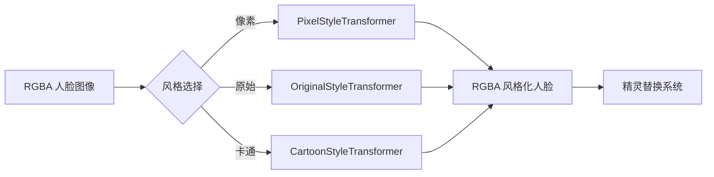
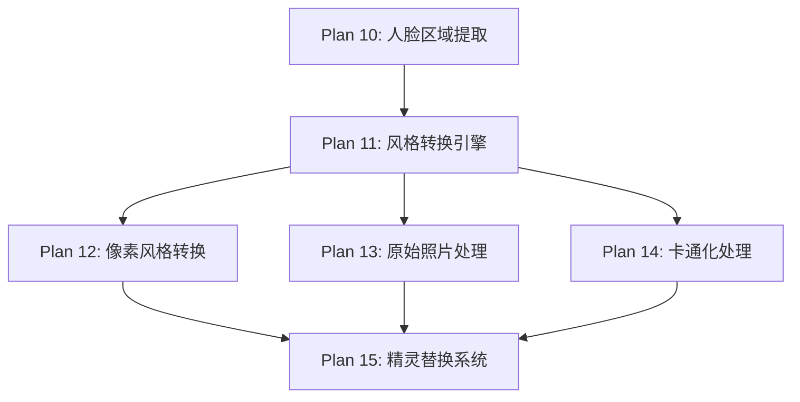

# Plan 11 - 风格转换引擎

## 1. 目标

**目标：** 设计并实现风格转换引擎，提供三种风格管线（像素风格、原始照片、卡通化），并定义统一的接口，使所有风格转换器可互换使用。

**背景：** 裁剪后的人脸需要进行风格转换才能与马里奥精灵视觉风格匹配。不同用户可能偏好不同的视觉效果，因此提供三种风格供选择。

---

## 2. 三种风格管线概述

| 风格 | 说明 | 视觉效果 | 实现难度 |
|------|------|----------|----------|
| 像素风格 (Pixel) | NES 8-bit 风格像素化 | 复古像素感，与原版最搭 | 中等 |
| 原始照片 (Original) | 保留照片原始外观 | 真实人脸，边缘平滑 | 简单 |
| 卡通化 (Cartoon) | 卡通手绘风格 | 色彩鲜明、线条清晰 | 较高 |

---

## 3. 统一接口设计

```python
# style_engine/base.py
from abc import ABC, abstractmethod
import numpy as np
from dataclasses import dataclass
from enum import Enum
from typing import Optional, Dict, Any

class StyleType(Enum):
    """风格类型枚举"""
    PIXEL = "pixel"
    ORIGINAL = "original"
    CARTOON = "cartoon"

@dataclass
class StyleConfig:
    """风格转换配置"""
    style_type: StyleType = StyleType.PIXEL
    target_size: tuple = (16, 16)          # 目标精灵尺寸
    quality: int = 3                        # 质量等级 1-5
    custom_params: Dict[str, Any] = None    # 自定义参数

    def __post_init__(self):
        if self.custom_params is None:
            self.custom_params = {}

class StyleTransformer(ABC):
    """风格转换器基类"""

    def __init__(self, config: StyleConfig = None):
        self.config = config or StyleConfig()
        self._name = "base"

    @property
    def name(self) -> str:
        return self._name

    @abstractmethod
    def transform(self, face_image: np.ndarray) -> np.ndarray:
        """
        执行风格转换
        参数:
            face_image: RGBA ndarray，裁剪后的人脸
        返回:
            RGBA ndarray，风格转换后的人脸
        """
        pass

    def preview(self, face_image: np.ndarray,
                preview_size: tuple = (128, 128)) -> np.ndarray:
        """
        生成预览图（用于风格选择界面）
        """
        result = self.transform(face_image)
        import cv2
        preview = cv2.resize(result, preview_size,
                            interpolation=cv2.INTER_NEAREST)
        return preview

    def get_params(self) -> Dict[str, Any]:
        """获取当前参数"""
        return self.config.custom_params.copy()

    def set_params(self, **kwargs):
        """设置参数"""
        self.config.custom_params.update(kwargs)
```

### 风格引擎管理器

```python
# style_engine/__init__.py
class StyleEngine:
    """风格转换引擎 - 管理所有风格转换器"""

    def __init__(self):
        self._transformers: Dict[StyleType, StyleTransformer] = {}
        self._current_style: StyleType = StyleType.PIXEL
        self._register_defaults()

    def _register_defaults(self):
        """注册默认风格转换器"""
        from .pixel_style import PixelStyleTransformer
        from .original_style import OriginalStyleTransformer
        from .cartoon_style import CartoonStyleTransformer

        self._transformers[StyleType.PIXEL] = PixelStyleTransformer()
        self._transformers[StyleType.ORIGINAL] = OriginalStyleTransformer()
        self._transformers[StyleType.CARTOON] = CartoonStyleTransformer()

    def register(self, style_type: StyleType,
                 transformer: StyleTransformer):
        """注册自定义风格转换器"""
        self._transformers[style_type] = transformer

    def set_style(self, style_type: StyleType):
        """设置当前风格"""
        if style_type not in self._transformers:
            raise ValueError(f"未注册的风格: {style_type}")
        self._current_style = style_type

    def get_current_transformer(self) -> StyleTransformer:
        """获取当前风格转换器"""
        return self._transformers[self._current_style]

    def transform(self, face_image: np.ndarray,
                  style: StyleType = None) -> np.ndarray:
        """
        执行风格转换
        参数:
            face_image: RGBA ndarray
            style: 指定风格（None 使用当前风格）
        返回:
            RGBA ndarray
        """
        style = style or self._current_style
        transformer = self._transformers[style]
        return transformer.transform(face_image)

    def get_all_previews(self, face_image: np.ndarray,
                         preview_size: tuple = (128, 128)
                        ) -> Dict[StyleType, np.ndarray]:
        """
        生成所有风格的预览图
        返回: {StyleType: preview_image} 字典
        """
        previews = {}
        for style_type, transformer in self._transformers.items():
            previews[style_type] = transformer.preview(face_image, preview_size)
        return previews

    def get_available_styles(self) -> list:
        """获取所有可用风格"""
        return list(self._transformers.keys())
```

---

## 4. 数据流



---

## 5. 使用示例

```python
# 使用示例
from style_engine import StyleEngine, StyleType

# 初始化引擎
engine = StyleEngine()

# 设置风格
engine.set_style(StyleType.PIXEL)

# 转换
styled_face = engine.transform(face_rgba_image)

# 获取所有预览
previews = engine.get_all_previews(face_rgba_image)
for style, preview in previews.items():
    print(f"{style.value}: {preview.shape}")

# 直接指定风格转换
cartoon_face = engine.transform(face_rgba_image, StyleType.CARTOON)
```

---

## 6. 输入/输出说明

| 项目 | 格式 | 说明 |
|------|------|------|
| 输入 | RGBA ndarray | 裁剪后的人脸图像，带透明通道 |
| 输入 | StyleType | 风格类型选择 |
| 输出 | RGBA ndarray | 风格转换后的人脸，保持透明通道 |
| 输出（预览） | RGBA ndarray (128x128) | 风格预览缩略图 |

---

## 7. 依赖关系



- **前置依赖：** Plan 10（提供裁剪后的 RGBA 人脸图像）
- **后续依赖：** Plan 12-14（三种具体风格实现），Plan 15（精灵替换）

---

## 8. 验收标准

- [ ] `StyleEngine` 类可正常实例化
- [ ] 三种风格转换器均已注册
- [ ] `transform()` 方法正确调用对应的转换器
- [ ] `get_all_previews()` 返回三种风格的预览图
- [ ] 所有输出保持 RGBA 格式和透明通道
- [ ] 自定义风格可通过 `register()` 注册
- [ ] 风格切换即时生效
- [ ] 参数调整通过 `set_params()` 正常工作
- [ ] 整体转换耗时 < 500ms
