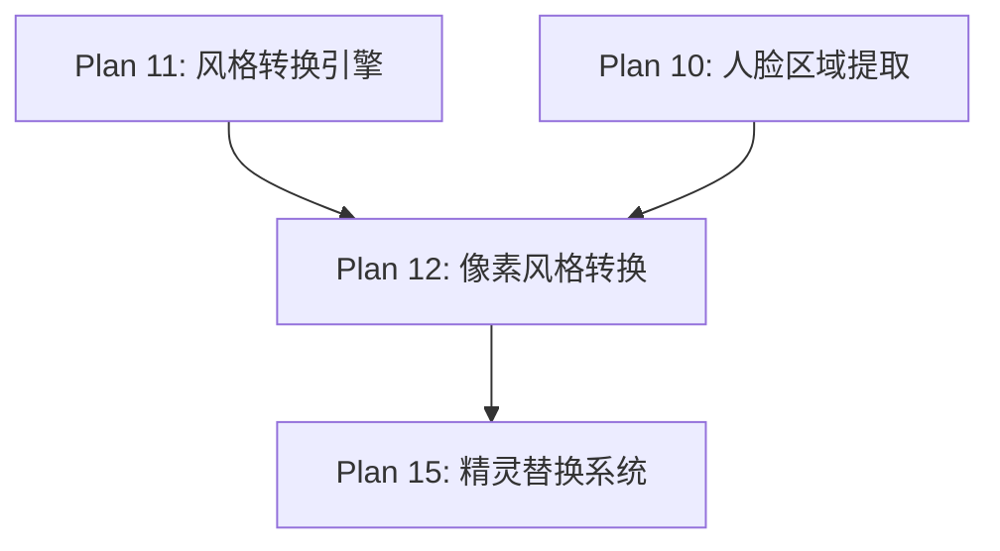

# Plan 12 - 像素风格转换

## 1. 目标

**目标：** 实现 NES 8-bit 风格的像素化处理，将高清人脸图像转换为低分辨率像素风格，匹配经典马里奥的视觉风格，使用 INTER_NEAREST 缩放和 NES 调色板映射。

**背景：** 原版 Super Mario Bros 运行在 NES 平台上，使用 8-bit 图形。像素风格是最能与游戏原始画风融合的选择。NES 的调色板仅有 54 种颜色，精灵尺寸通常为 16x16 或 16x32 像素。

---

## 2. 具体步骤

### 步骤 1：NES 调色板定义

```python
# style_engine/pixel_style.py
import cv2
import numpy as np
from .base import StyleTransformer, StyleConfig
from typing import Optional

class PixelStyleTransformer(StyleTransformer):
    """像素风格转换器 - NES 8-bit 风格"""

    # NES 调色板 (54 colors) - RGB 格式
    NES_PALETTE = np.array([
        # 灰度
        [124, 124, 124], [0, 0, 0], [255, 255, 255],
        [188, 188, 188], [248, 248, 248],
        # 红色系
        [248, 56, 0], [228, 0, 16], [168, 0, 32],
        [136, 20, 0], [248, 120, 88],
        # 橙色/黄色系
        [248, 164, 0], [248, 184, 0], [216, 248, 120],
        [248, 216, 120], [248, 184, 56],
        # 绿色系
        [0, 184, 0], [0, 168, 0], [0, 144, 56],
        [0, 120, 0], [184, 248, 24],
        [88, 216, 84], [0, 228, 48],
        # 蓝色系
        [0, 120, 248], [0, 88, 248], [104, 68, 252],
        [0, 64, 168], [0, 0, 252],
        [60, 188, 252], [104, 136, 252],
        [152, 120, 248], [0, 0, 188],
        # 肤色系（重要！）
        [252, 224, 168], [248, 184, 112], [240, 208, 176],
        [228, 164, 88], [196, 140, 80],
        [184, 108, 52], [160, 88, 44],
        # 棕色系
        [120, 68, 0], [172, 124, 0], [228, 148, 24],
        # 紫色系
        [248, 120, 248], [216, 0, 204], [152, 0, 136],
        [184, 0, 172],
        # 青色系
        [0, 232, 216], [0, 252, 252], [0, 200, 200],
        [60, 188, 252], [128, 208, 240],
        # 补充色
        [0, 168, 68], [16, 168, 140], [48, 96, 176],
        [68, 40, 188], [148, 0, 132],
        [168, 0, 16], [224, 60, 60],
    ], dtype=np.uint8)

    def __init__(self, config: StyleConfig = None):
        super().__init__(config)
        self._name = "pixel"
        self._palette_tree = None  # KD-Tree 用于快速颜色匹配
        self._build_palette_tree()

    def _build_palette_tree(self):
        """构建调色板 KD-Tree 用于快速最近邻颜色匹配"""
        from scipy.spatial import cKDTree
        self._palette_tree = cKDTree(self.NES_PALETTE.astype(np.float32))
```

### 步骤 2：INTER_NEAREST 缩放

```python
    def transform(self, face_image: np.ndarray) -> np.ndarray:
        """
        像素风格转换
        参数:
            face_image: RGBA ndarray，裁剪后的人脸
        返回:
            RGBA ndarray，像素化后的人脸
        """
        if face_image is None or face_image.size == 0:
            return face_image

        h, w = face_image.shape[:2]

        # 分离 alpha 通道
        if face_image.shape[2] == 4:
            bgr = face_image[:, :, :3]
            alpha = face_image[:, :, 3]
        else:
            bgr = face_image
            alpha = np.full((h, w), 255, dtype=np.uint8)

        # Step 1: 缩小到像素尺寸（关键步骤）
        pixel_size = self.config.custom_params.get('pixel_size', 16)
        small = cv2.resize(bgr, (pixel_size, pixel_size),
                          interpolation=cv2.INTER_AREA)

        # Step 2: 颜色量化 - 映射到 NES 调色板
        small_rgb = cv2.cvtColor(small, cv2.COLOR_BGR2RGB)
        quantized = self._quantize_to_palette(small_rgb)

        # Step 3: 放大回原始尺寸（使用最近邻插值保持像素感）
        target_w = self.config.target_size[0] if self.config.target_size else w
        target_h = self.config.target_size[1] if self.config.target_size else h
        pixelated = cv2.resize(quantized, (target_w, target_h),
                              interpolation=cv2.INTER_NEAREST)

        # Step 4: 转回 BGR
        pixelated_bgr = cv2.cvtColor(pixelated, cv2.COLOR_RGB2BGR)

        # Step 5: 处理 alpha 通道
        alpha_small = cv2.resize(alpha, (pixel_size, pixel_size),
                                interpolation=cv2.INTER_AREA)
        # 二值化 alpha（像素风格不需要半透明）
        _, alpha_binary = cv2.threshold(alpha_small, 128, 255, cv2.THRESH_BINARY)
        alpha_resized = cv2.resize(alpha_binary, (target_w, target_h),
                                  interpolation=cv2.INTER_NEAREST)

        # 合并 RGBA
        result = cv2.merge([
            pixelated_bgr[:, :, 0],
            pixelated_bgr[:, :, 1],
            pixelated_bgr[:, :, 2],
            alpha_resized
        ])

        return result
```

### 步骤 3：NES 调色板颜色映射

```python
    def _quantize_to_palette(self, image_rgb: np.ndarray) -> np.ndarray:
        """
        将图像颜色映射到最近的 NES 调色板颜色
        参数:
            image_rgb: RGB ndarray
        返回:
            量化后的 RGB ndarray
        """
        h, w = image_rgb.shape[:2]
        pixels = image_rgb.reshape(-1, 3).astype(np.float32)

        # 使用 KD-Tree 查找最近邻颜色
        _, indices = self._palette_tree.query(pixels)

        # 映射到调色板颜色
        quantized = self.NES_PALETTE[indices].reshape(h, w, 3)

        return quantized

    def _quantize_simple(self, image_rgb: np.ndarray,
                         n_colors: int = 8) -> np.ndarray:
        """
        简化版颜色量化（不使用调色板，用 K-Means）
        """
        h, w = image_rgb.shape[:2]
        pixels = image_rgb.reshape(-1, 3).astype(np.float32)

        criteria = (cv2.TERM_CRITERIA_EPS + cv2.TERM_CRITERIA_MAX_ITER,
                    20, 1.0)
        _, labels, centers = cv2.kmeans(
            pixels, n_colors, None, criteria, 10, cv2.KMEANS_PP_CENTERS
        )

        centers = np.uint8(centers)
        quantized = centers[labels.flatten()].reshape(h, w, 3)

        return quantized
```

### 步骤 4：增强效果（可选）

```python
    def add_pixel_grid(self, image: np.ndarray,
                       grid_color: tuple = (0, 0, 0),
                       grid_alpha: float = 0.1) -> np.ndarray:
        """添加像素网格线（增强像素感）"""
        h, w = image.shape[:2]
        pixel_size = self.config.custom_params.get('pixel_size', 16)

        if w <= pixel_size or h <= pixel_size:
            return image

        result = image.copy()
        step_x = w // pixel_size
        step_y = h // pixel_size

        overlay = result.copy()
        for x in range(0, w, step_x):
            cv2.line(overlay, (x, 0), (x, h), grid_color, 1)
        for y in range(0, h, step_y):
            cv2.line(overlay, (0, y), (w, y), grid_color, 1)

        cv2.addWeighted(overlay, grid_alpha, result, 1 - grid_alpha, 0, result)
        return result

    def add_scanlines(self, image: np.ndarray,
                      intensity: float = 0.15) -> np.ndarray:
        """添加扫描线效果（CRT 风格）"""
        h, w = image.shape[:2]
        result = image.copy()

        for y in range(0, h, 2):
            result[y] = (result[y].astype(np.float32) * (1 - intensity)).astype(np.uint8)

        return result
```

---

## 3. 参数配置

```python
# 默认配置
PIXEL_DEFAULT_PARAMS = {
    'pixel_size': 16,          # 像素化分辨率
    'use_nes_palette': True,   # 是否使用 NES 调色板
    'n_colors': 8,             # K-Means 颜色数（不使用调色板时）
    'add_grid': False,         # 是否添加像素网格
    'add_scanlines': False,    # 是否添加扫描线
    'scanline_intensity': 0.15, # 扫描线强度
}
```

---

## 4. 输入/输出说明

| 项目 | 格式 | 说明 |
|------|------|------|
| 输入 | RGBA ndarray (可变尺寸) | 裁剪后的高清人脸 |
| 输出 | RGBA ndarray (16x16 ~ 32x32) | 像素化人脸，NES 调色板 |

---

## 5. 依赖关系



- **前置依赖：** Plan 10（裁剪的人脸），Plan 11（基类定义）
- **后续依赖：** Plan 15（像素化人脸送入精灵替换）

---

## 6. 验收标准

- [ ] `PixelStyleTransformer` 继承 `StyleTransformer` 基类
- [ ] INTER_NEAREST 缩放产生清晰的像素块
- [ ] NES 调色板映射颜色准确，肤色自然
- [ ] 输出保持 RGBA 格式，alpha 通道正确二值化
- [ ] 16x16 和 32x32 两种目标尺寸均正常工作
- [ ] 像素网格和扫描线效果可选启用
- [ ] 处理耗时 < 50ms（单张图片）
- [ ] 预览图视觉效果接近 NES 原版风格
