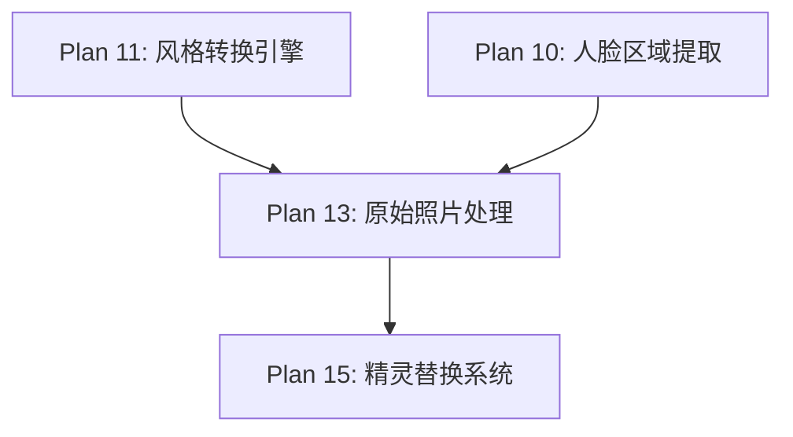

# Plan 13 - 原始照片处理

## 1. 目标

**目标：** 实现原始照片风格转换器，在保留人脸真实外观的同时进行边缘平滑和尺寸适配，使真实照片能够自然地融入游戏精灵中。

**背景：** 部分用户可能希望在游戏中看到真实的自己，而不是风格化的版本。原始照片风格需要处理的关键问题是尺寸适配（从高清照片到 16x16/32x32 像素）和边缘过渡。

---

## 2. 具体步骤

### 步骤 1：基础缩放与保留外观

```python
# style_engine/original_style.py
import cv2
import numpy as np
from .base import StyleTransformer, StyleConfig

class OriginalStyleTransformer(StyleTransformer):
    """原始照片风格转换器 - 保留真实外观"""

    def __init__(self, config: StyleConfig = None):
        super().__init__(config)
        self._name = "original"

    def transform(self, face_image: np.ndarray) -> np.ndarray:
        """
        原始照片风格转换
        参数:
            face_image: RGBA ndarray
        返回:
            RGBA ndarray，保持原始外观
        """
        if face_image is None or face_image.size == 0:
            return face_image

        h, w = face_image.shape[:2]

        # 分离通道
        if face_image.shape[2] == 4:
            bgr = face_image[:, :, :3]
            alpha = face_image[:, :, 3]
        else:
            bgr = face_image
            alpha = np.full((h, w), 255, dtype=np.uint8)

        # Step 1: 轻微降噪（保留细节的同时减少噪点）
        denoised = cv2.fastNlMeansDenoisingColored(
            bgr, None,
            h=5,            # 滤波强度
            hForColorComponents=5,
            templateWindowSize=7,
            searchWindowSize=21
        )

        # Step 2: 色彩增强
        enhanced = self._enhance_colors(denoised)

        # Step 3: 锐化
        sharpened = self._sharpen(enhanced)

        # Step 4: 缩放到目标尺寸
        target_w, target_h = self._get_target_size()
        resized = cv2.resize(sharpened, (target_w, target_h),
                            interpolation=cv2.INTER_AREA)

        # Step 5: 边缘平滑处理
        resized = self._smooth_edges(resized)

        # Step 6: 处理 alpha 通道
        alpha_resized = cv2.resize(alpha, (target_w, target_h),
                                  interpolation=cv2.INTER_AREA)
        # 平滑 alpha 边缘
        alpha_resized = cv2.GaussianBlur(alpha_resized, (3, 3), 0.5)

        # 合并 RGBA
        result = cv2.merge([
            resized[:, :, 0],
            resized[:, :, 1],
            resized[:, :, 2],
            alpha_resized
        ])

        return result

    def _get_target_size(self):
        """获取目标尺寸"""
        if self.config.target_size:
            return self.config.target_size
        return (32, 32)
```

### 步骤 2：色彩增强

```python
    def _enhance_colors(self, image: np.ndarray) -> np.ndarray:
        """色彩增强 - 提高饱和度和对比度"""
        # 转换到 LAB 色彩空间
        lab = cv2.cvtColor(image, cv2.COLOR_BGR2LAB)
        l, a, b = cv2.split(lab)

        # CLAHE 对比度增强
        clahe = cv2.createCLAHE(clipLimit=2.0, tileGridSize=(4, 4))
        l = clahe.apply(l)

        # 增加饱和度
        saturation_factor = self.config.custom_params.get('saturation', 1.2)
        a = cv2.convertScaleAbs(a, alpha=saturation_factor, beta=0)
        b = cv2.convertScaleAbs(b, alpha=saturation_factor, beta=0)

        enhanced_lab = cv2.merge([l, a, b])
        enhanced = cv2.cvtColor(enhanced_lab, cv2.COLOR_LAB2BGR)

        return enhanced

    def _sharpen(self, image: np.ndarray) -> np.ndarray:
        """锐化处理"""
        strength = self.config.custom_params.get('sharpness', 0.5)

        # USM (Unsharp Mask) 锐化
        blurred = cv2.GaussianBlur(image, (0, 0), 3)
        sharpened = cv2.addWeighted(image, 1 + strength, blurred, -strength, 0)

        return sharpened
```

### 步骤 3：边缘平滑

```python
    def _smooth_edges(self, image: np.ndarray) -> np.ndarray:
        """
        边缘平滑处理
        在小尺寸下消除锯齿和不自然的边缘
        """
        smooth_radius = self.config.custom_params.get('edge_smooth', 1)

        if smooth_radius <= 0:
            return image

        # 对小图像使用轻微高斯模糊
        kernel_size = smooth_radius * 2 + 1
        smoothed = cv2.GaussianBlur(image, (kernel_size, kernel_size), 0.5)

        # 只在边缘区域混合（保持中心清晰）
        h, w = image.shape[:2]
        mask = np.ones((h, w), dtype=np.float32)

        # 创建边缘权重（边缘处更多模糊）
        border = max(1, min(h, w) // 8)
        mask[:border, :] *= 0.5
        mask[-border:, :] *= 0.5
        mask[:, :border] *= 0.5
        mask[:, -border:] *= 0.5

        # 混合原始和平滑版本
        mask_3d = np.stack([mask] * 3, axis=-1)
        result = (image * mask_3d + smoothed * (1 - mask_3d)).astype(np.uint8)

        return result
```

### 步骤 4：质量预设

```python
    @classmethod
    def get_quality_presets(cls):
        """质量预设参数"""
        return {
            'low': {
                'saturation': 1.0,
                'sharpness': 0.0,
                'edge_smooth': 0,
                'denoise': False,
            },
            'medium': {
                'saturation': 1.2,
                'sharpness': 0.3,
                'edge_smooth': 1,
                'denoise': True,
            },
            'high': {
                'saturation': 1.3,
                'sharpness': 0.5,
                'edge_smooth': 1,
                'denoise': True,
            },
        }

    def apply_preset(self, preset_name: str):
        """应用质量预设"""
        presets = self.get_quality_presets()
        if preset_name in presets:
            self.config.custom_params.update(presets[preset_name])
```

---

## 3. 输入/输出说明

| 项目 | 格式 | 说明 |
|------|------|------|
| 输入 | RGBA ndarray (可变尺寸) | 裁剪后的真实人脸照片 |
| 输出 | RGBA ndarray (16x16 ~ 32x32) | 缩小、增强、平滑后的人脸 |

### 处理效果对比

```
输入 (256x256):            输出 (32x32):
┌──────────────┐           ┌────┐
│ 高清人脸照片 │  ──────>  │平滑│
│ 含毛孔细节   │ 缩放+增强 │自然│
│ 可能有噪点   │ +边缘平滑 │清晰│
└──────────────┘           └────┘
```

---

## 4. 依赖关系



- **前置依赖：** Plan 10（裁剪的人脸），Plan 11（基类定义）
- **后续依赖：** Plan 15（处理后人脸送入精灵替换）

---

## 5. 验收标准

- [ ] `OriginalStyleTransformer` 继承 `StyleTransformer` 基类
- [ ] 缩放后人脸仍可辨识，不会变成模糊色块
- [ ] 边缘平滑无明显锯齿
- [ ] 色彩增强后肤色自然，不过饱和
- [ ] 降噪不丢失重要面部细节
- [ ] 输出保持 RGBA 格式，alpha 通道平滑过渡
- [ ] 三种质量预设（low/medium/high）效果有明显区别
- [ ] 处理耗时 < 100ms
- [ ] 在 32x32 尺寸下人脸特征（眼睛、嘴巴）仍可辨识
