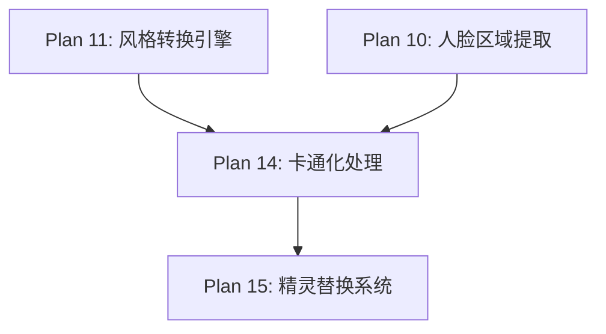

# Plan 14 - 卡通化处理

## 1. 目标

**目标：** 使用双边滤波、边缘检测和颜色量化技术实现卡通化风格转换，将真实人脸照片转换为具有清晰轮廓线和简化色彩的卡通手绘风格。

**背景：** 卡通化风格在真实照片和完全像素化之间取得平衡，提供了一种艺术化但仍能辨识面部特征的效果。

---

## 2. 具体步骤

### 步骤 1：双边滤波 - 平滑区域保留边缘

```python
# style_engine/cartoon_style.py
import cv2
import numpy as np
from .base import StyleTransformer, StyleConfig

class CartoonStyleTransformer(StyleTransformer):
    """卡通化风格转换器"""

    def __init__(self, config: StyleConfig = None):
        super().__init__(config)
        self._name = "cartoon"

    def transform(self, face_image: np.ndarray) -> np.ndarray:
        """
        卡通化风格转换
        参数:
            face_image: RGBA ndarray
        返回:
            RGBA ndarray，卡通化后的人脸
        """
        if face_image is None or face_image.size == 0:
            return face_image

        h, w = face_image.shape[:2]

        # 分离通道
        if face_image.shape[2] == 4:
            bgr = face_image[:, :, :3]
            alpha = face_image[:, :, 3]
        else:
            bgr = face_image
            alpha = np.full((h, w), 255, dtype=np.uint8)

        # 卡通化管线
        # Step 1: 双边滤波（多次迭代）
        smoothed = self._bilateral_filter(bgr)

        # Step 2: 边缘检测
        edges = self._detect_edges(bgr)

        # Step 3: 颜色量化
        quantized = self._quantize_colors(smoothed)

        # Step 4: 合并边缘和量化结果
        cartoon = self._combine(quantized, edges)

        # Step 5: 缩放到目标尺寸
        target_w, target_h = self._get_target_size()
        cartoon_resized = cv2.resize(cartoon, (target_w, target_h),
                                    interpolation=cv2.INTER_AREA)

        # Step 6: 处理 alpha
        alpha_resized = cv2.resize(alpha, (target_w, target_h),
                                  interpolation=cv2.INTER_AREA)

        # 合并 RGBA
        result = cv2.merge([
            cartoon_resized[:, :, 0],
            cartoon_resized[:, :, 1],
            cartoon_resized[:, :, 2],
            alpha_resized
        ])

        return result

    def _bilateral_filter(self, image: np.ndarray) -> np.ndarray:
        """
        多次双边滤波
        双边滤波在平滑区域的同时保留边缘
        """
        n_iterations = self.config.custom_params.get('bilateral_iterations', 7)
        d = self.config.custom_params.get('bilateral_d', 9)
        sigma_color = self.config.custom_params.get('bilateral_sigma_color', 75)
        sigma_space = self.config.custom_params.get('bilateral_sigma_space', 75)

        result = image.copy()
        for _ in range(n_iterations):
            result = cv2.bilateralFilter(
                result, d, sigma_color, sigma_space
            )

        return result
```

### 步骤 2：边缘检测

```python
    def _detect_edges(self, image: np.ndarray) -> np.ndarray:
        """
        边缘检测 - 生成清晰的轮廓线
        """
        method = self.config.custom_params.get('edge_method', 'adaptive')

        # 转灰度
        gray = cv2.cvtColor(image, cv2.COLOR_BGR2GRAY)

        # 中值模糊减少噪声
        gray = cv2.medianBlur(gray, 5)

        if method == 'adaptive':
            # 自适应阈值 - 产生更自然的线条
            edges = cv2.adaptiveThreshold(
                gray,
                255,
                cv2.ADAPTIVE_THRESH_MEAN_C,
                cv2.THRESH_BINARY,
                blockSize=self.config.custom_params.get('edge_block_size', 9),
                C=self.config.custom_params.get('edge_c', 2)
            )
        elif method == 'canny':
            # Canny 边缘检测 - 更精确但线条更细
            edges_raw = cv2.Canny(gray, 100, 200)
            # 反转（线条为黑色）
            edges = cv2.bitwise_not(edges_raw)
            # 膨胀线条使其更粗
            kernel = np.ones((2, 2), np.uint8)
            edges = cv2.erode(edges, kernel, iterations=1)
        elif method == 'laplacian':
            # 拉普拉斯边缘
            edges_raw = cv2.Laplacian(gray, cv2.CV_8U, ksize=5)
            _, edges = cv2.threshold(edges_raw, 30, 255, cv2.THRESH_BINARY_INV)
        else:
            edges = np.full_like(gray, 255)

        return edges
```

### 步骤 3：颜色量化

```python
    def _quantize_colors(self, image: np.ndarray) -> np.ndarray:
        """
        颜色量化 - 将连续色彩简化为有限调色板
        产生"平涂"效果
        """
        n_colors = self.config.custom_params.get('n_colors', 8)
        method = self.config.custom_params.get('quantize_method', 'kmeans')

        if method == 'kmeans':
            return self._kmeans_quantize(image, n_colors)
        elif method == 'bitshift':
            return self._bitshift_quantize(image, n_colors)
        else:
            return self._kmeans_quantize(image, n_colors)

    def _kmeans_quantize(self, image: np.ndarray,
                         n_colors: int) -> np.ndarray:
        """K-Means 颜色量化"""
        h, w = image.shape[:2]
        pixels = image.reshape(-1, 3).astype(np.float32)

        criteria = (
            cv2.TERM_CRITERIA_EPS + cv2.TERM_CRITERIA_MAX_ITER,
            20, 1.0
        )

        _, labels, centers = cv2.kmeans(
            pixels, n_colors, None,
            criteria, 10, cv2.KMEANS_PP_CENTERS
        )

        centers = np.uint8(centers)
        quantized = centers[labels.flatten()].reshape(h, w, 3)

        return quantized

    def _bitshift_quantize(self, image: np.ndarray,
                           n_levels: int) -> np.ndarray:
        """位移量化（更快但效果稍差）"""
        # 计算每个通道的量化级别
        shift = max(1, 8 - int(np.log2(n_levels)))

        quantized = (image >> shift) << shift
        # 加回半个量化步长，使颜色更接近原始值
        quantized = quantized + (1 << (shift - 1))

        return np.clip(quantized, 0, 255).astype(np.uint8)
```

### 步骤 4：合并边缘和颜色

```python
    def _combine(self, quantized: np.ndarray,
                 edges: np.ndarray) -> np.ndarray:
        """合并量化颜色和边缘线条"""
        edge_strength = self.config.custom_params.get('edge_strength', 1.0)

        # 将边缘转为 3 通道
        edges_3ch = cv2.cvtColor(edges, cv2.COLOR_GRAY2BGR)

        # 相乘合并（边缘线条为黑色）
        result = cv2.bitwise_and(quantized, edges_3ch)

        # 可选：调整边缘线条强度
        if edge_strength < 1.0:
            # 减弱边缘效果
            blend = cv2.addWeighted(
                quantized, 1 - edge_strength,
                result, edge_strength,
                0
            )
            return blend

        return result

    def _get_target_size(self):
        """获取目标尺寸"""
        if self.config.target_size:
            return self.config.target_size
        return (32, 32)
```

### 步骤 5：增强效果

```python
    def add_outline(self, image: np.ndarray,
                    color: tuple = (0, 0, 0),
                    thickness: int = 1) -> np.ndarray:
        """给人脸添加外轮廓线"""
        if image.shape[2] == 4:
            alpha = image[:, :, 3]
        else:
            return image

        # 从 alpha 通道提取轮廓
        _, binary = cv2.threshold(alpha, 128, 255, cv2.THRESH_BINARY)
        contours, _ = cv2.findContours(
            binary, cv2.RETR_EXTERNAL, cv2.CHAIN_APPROX_SIMPLE
        )

        result = image.copy()
        cv2.drawContours(result, contours, -1,
                        (*color, 255), thickness)

        return result

    def adjust_saturation(self, image: np.ndarray,
                          factor: float = 1.5) -> np.ndarray:
        """增加饱和度，使卡通效果更鲜艳"""
        bgr = image[:, :, :3] if image.shape[2] == 4 else image
        hsv = cv2.cvtColor(bgr, cv2.COLOR_BGR2HSV).astype(np.float32)
        hsv[:, :, 1] = np.clip(hsv[:, :, 1] * factor, 0, 255)
        result = cv2.cvtColor(hsv.astype(np.uint8), cv2.COLOR_HSV2BGR)

        if image.shape[2] == 4:
            result = cv2.merge([result[:, :, 0], result[:, :, 1],
                               result[:, :, 2], image[:, :, 3]])
        return result
```

---

## 3. 参数配置

```python
CARTOON_DEFAULT_PARAMS = {
    'bilateral_iterations': 7,    # 双边滤波迭代次数
    'bilateral_d': 9,             # 双边滤波直径
    'bilateral_sigma_color': 75,  # 色彩相似性参数
    'bilateral_sigma_space': 75,  # 空间距离参数
    'edge_method': 'adaptive',    # 边缘检测方法
    'edge_block_size': 9,         # 自适应阈值块大小
    'edge_c': 2,                  # 自适应阈值常数
    'edge_strength': 1.0,         # 边缘线条强度
    'n_colors': 8,                # 颜色量化数
    'quantize_method': 'kmeans',  # 量化方法
}
```

---

## 4. 输入/输出说明

| 项目 | 格式 | 说明 |
|------|------|------|
| 输入 | RGBA ndarray (可变尺寸) | 裁剪后的人脸照片 |
| 输出 | RGBA ndarray (16x16 ~ 32x32) | 卡通化后的人脸 |

---

## 5. 依赖关系



- **前置依赖：** Plan 10（裁剪的人脸），Plan 11（基类定义）
- **后续依赖：** Plan 15（卡通化人脸送入精灵替换）

---

## 6. 验收标准

- [ ] `CartoonStyleTransformer` 继承 `StyleTransformer` 基类
- [ ] 双边滤波有效平滑面部，保留边缘
- [ ] 边缘检测产生清晰的轮廓线
- [ ] 颜色量化产生"平涂"效果，色块均匀
- [ ] 三种边缘检测方法（adaptive/canny/laplacian）均可用
- [ ] K-Means 量化颜色数可调（4-16）
- [ ] 输出保持 RGBA 格式
- [ ] 卡通效果在 32x32 尺寸下仍可辨识面部特征
- [ ] 处理耗时 < 300ms（K-Means 量化较慢）
- [ ] 饱和度调整后色彩鲜艳但不失真
