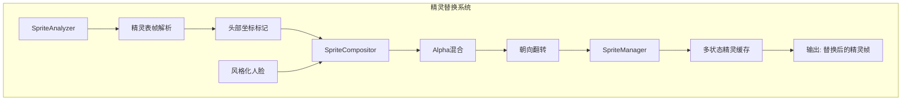
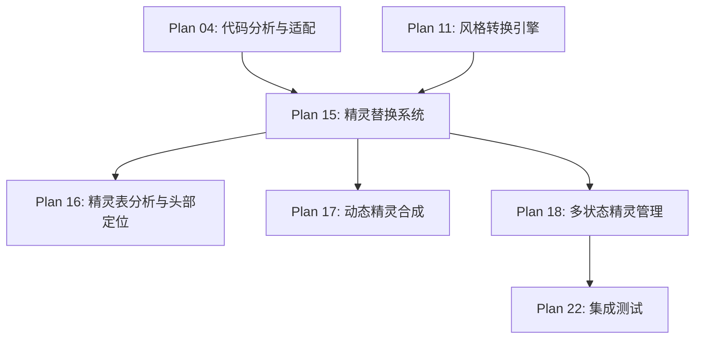

# Plan 15 - 精灵替换系统

## 1. 目标

**目标：** 设计并实现精灵替换系统，完成精灵表分析、头部定位、动态合成，将风格化的人脸图像替换到马里奥精灵的头部位置，覆盖所有动画状态。

**背景：** 这是项目的核心模块，需要精确分析原始精灵表中每一帧马里奥的头部位置和尺寸，然后将处理后的人脸无缝替换上去。

---

## 2. 系统架构



---

## 3. 具体步骤

### 步骤 1：精灵表分析

```python
# sprite_system/analyzer.py
import pygame
import numpy as np
from dataclasses import dataclass, field
from typing import List, Dict, Tuple, Optional

@dataclass
class SpriteFrame:
    """单帧精灵数据"""
    name: str                              # 帧名称 (如 "small_walk_0")
    state: str                             # 马里奥状态 (small/big/fire)
    action: str                            # 动作 (stand/walk/jump/duck/die)
    frame_index: int                       # 帧编号
    sheet_rect: pygame.Rect                # 在精灵表中的位置
    display_size: Tuple[int, int]          # 显示尺寸
    head_rect: pygame.Rect                 # 头部区域（相对于帧）
    surface: Optional[pygame.Surface] = None

@dataclass
class SpriteSheet:
    """精灵表数据"""
    image: pygame.Surface
    frames: Dict[str, List[SpriteFrame]] = field(default_factory=dict)
    # frames 结构: {"small_walk": [frame0, frame1, ...], "big_jump": [...]}

class SpriteAnalyzer:
    """精灵表分析器"""

    # 马里奥精灵表中各帧的位置（像素坐标）
    # 这些坐标需要根据实际的 mario_bros.png 精灵表确定
    FRAME_DEFINITIONS = {
        # ===== 小马里奥 (16x16) =====
        'small': {
            'stand': [
                {'x': 178, 'y': 32, 'w': 12, 'h': 16, 'display': (32, 32)},
            ],
            'walk': [
                {'x': 80, 'y': 32, 'w': 15, 'h': 16, 'display': (32, 32)},
                {'x': 97, 'y': 32, 'w': 16, 'h': 16, 'display': (32, 32)},
                {'x': 114, 'y': 32, 'w': 16, 'h': 16, 'display': (32, 32)},
            ],
            'jump': [
                {'x': 144, 'y': 32, 'w': 16, 'h': 16, 'display': (32, 32)},
            ],
            'die': [
                {'x': 160, 'y': 32, 'w': 16, 'h': 16, 'display': (32, 32)},
            ],
        },
        # ===== 大马里奥 (16x32) =====
        'big': {
            'stand': [
                {'x': 176, 'y': 0, 'w': 16, 'h': 32, 'display': (32, 64)},
            ],
            'walk': [
                {'x': 81, 'y': 0, 'w': 16, 'h': 32, 'display': (32, 64)},
                {'x': 97, 'y': 0, 'w': 15, 'h': 32, 'display': (32, 64)},
                {'x': 113, 'y': 0, 'w': 15, 'h': 32, 'display': (32, 64)},
            ],
            'jump': [
                {'x': 144, 'y': 0, 'w': 16, 'h': 32, 'display': (32, 64)},
            ],
            'duck': [
                {'x': 160, 'y': 0, 'w': 16, 'h': 32, 'display': (32, 64)},
            ],
        },
        # ===== 火焰马里奥 (16x32) =====
        'fire': {
            'stand': [
                {'x': 176, 'y': 48, 'w': 16, 'h': 32, 'display': (32, 64)},
            ],
            'walk': [
                {'x': 81, 'y': 48, 'w': 16, 'h': 32, 'display': (32, 64)},
                {'x': 97, 'y': 48, 'w': 15, 'h': 32, 'display': (32, 64)},
                {'x': 113, 'y': 48, 'w': 15, 'h': 32, 'display': (32, 64)},
            ],
            'jump': [
                {'x': 144, 'y': 48, 'w': 16, 'h': 32, 'display': (32, 64)},
            ],
            'throw': [
                {'x': 200, 'y': 48, 'w': 16, 'h': 32, 'display': (32, 64)},
            ],
        },
    }

    # 头部区域定义（相对于帧的显示尺寸）
    HEAD_REGIONS = {
        'small': {
            'default': {'x': 4, 'y': 0, 'w': 24, 'h': 16},
            # 小马里奥：头部占上半部分
        },
        'big': {
            'default': {'x': 4, 'y': 0, 'w': 24, 'h': 24},
            'duck': {'x': 4, 'y': 8, 'w': 24, 'h': 24},
            # 大马里奥：头部占上1/3，蹲下时头部下移
        },
        'fire': {
            'default': {'x': 4, 'y': 0, 'w': 24, 'h': 24},
            'duck': {'x': 4, 'y': 8, 'w': 24, 'h': 24},
        },
    }

    def __init__(self, sprite_sheet: pygame.Surface):
        self.sheet = sprite_sheet
        self.colorkey = (92, 148, 252)  # 马里奥精灵表的透明色

    def analyze(self) -> SpriteSheet:
        """分析精灵表，提取所有帧"""
        sprite_sheet = SpriteSheet(image=self.sheet)

        for state, actions in self.FRAME_DEFINITIONS.items():
            for action, frames_def in actions.items():
                key = f"{state}_{action}"
                sprite_sheet.frames[key] = []

                for i, frame_def in enumerate(frames_def):
                    # 裁切精灵帧
                    surface = self._get_frame_surface(frame_def)

                    # 获取头部区域
                    head_rect = self._get_head_rect(state, action)

                    frame = SpriteFrame(
                        name=f"{key}_{i}",
                        state=state,
                        action=action,
                        frame_index=i,
                        sheet_rect=pygame.Rect(
                            frame_def['x'], frame_def['y'],
                            frame_def['w'], frame_def['h']
                        ),
                        display_size=frame_def['display'],
                        head_rect=head_rect,
                        surface=surface,
                    )
                    sprite_sheet.frames[key].append(frame)

        return sprite_sheet

    def _get_frame_surface(self, frame_def: dict) -> pygame.Surface:
        """从精灵表裁切帧"""
        surface = pygame.Surface(
            [frame_def['w'], frame_def['h']],
            pygame.SRCALPHA
        )
        surface.blit(self.sheet, (0, 0), (
            frame_def['x'], frame_def['y'],
            frame_def['w'], frame_def['h']
        ))
        surface.set_colorkey(self.colorkey)

        if frame_def.get('display'):
            surface = pygame.transform.scale(surface, frame_def['display'])

        return surface

    def _get_head_rect(self, state: str, action: str) -> pygame.Rect:
        """获取头部区域"""
        regions = self.HEAD_REGIONS.get(state, {})
        region = regions.get(action, regions.get('default', {}))

        return pygame.Rect(
            region.get('x', 0),
            region.get('y', 0),
            region.get('w', 16),
            region.get('h', 16),
        )
```

### 步骤 2：动态精灵合成

详见 **Plan 17 - 动态精灵合成**

### 步骤 3：多状态精灵管理

详见 **Plan 18 - 多状态精灵管理**

---

## 4. 输入/输出说明

| 项目 | 格式 | 说明 |
|------|------|------|
| 输入 | pygame.Surface | 原始精灵表 (mario_bros.png) |
| 输入 | RGBA ndarray | 风格化的人脸图像 |
| 输出 | SpriteSheet | 分析后的精灵数据（含帧、头部坐标） |
| 输出 | Dict[str, List[pygame.Surface]] | 替换后的精灵帧集合 |

---

## 5. 依赖关系



- **前置依赖：** Plan 04（游戏代码分析），Plan 11（风格化人脸）
- **后续依赖：** Plan 16-18（具体实现），Plan 22（集成测试）

---

## 6. 验收标准

- [ ] `SpriteAnalyzer` 正确解析 mario_bros.png 精灵表
- [ ] 所有马里奥状态（小/大/火焰）的帧都被正确裁切
- [ ] 头部区域坐标精确，视觉上与帧图像匹配
- [ ] 替换后的精灵在游戏中正确显示
- [ ] 所有动画帧（站立、行走、跳跃、蹲下、死亡）均被处理
- [ ] 替换效果自然，无明显拼接痕迹
- [ ] 系统可处理不同风格的人脸输入
- [ ] 精灵翻转（面朝左/右）正确
