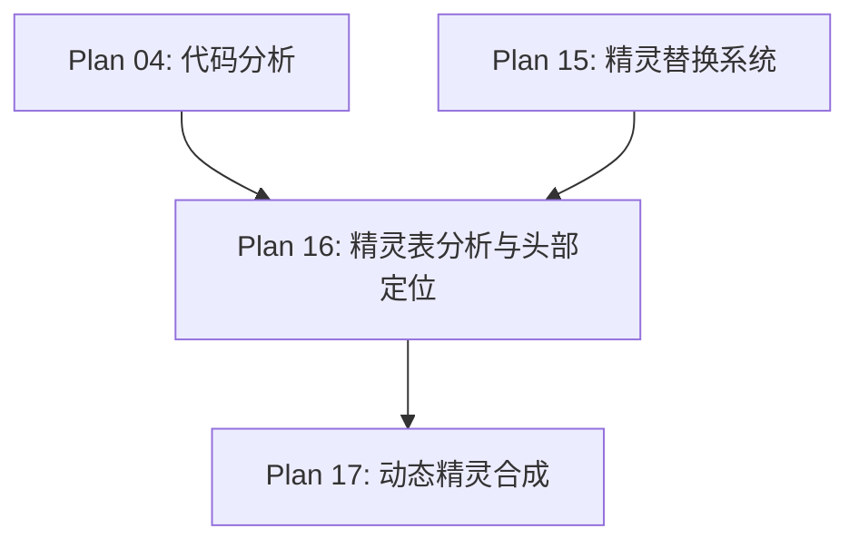

# Plan 16 - 精灵表分析与头部定位

## 1. 目标

**目标：** 对 mario_bros.png 精灵表进行逐帧分析，精确标记每一帧中马里奥头部的坐标和尺寸，建立完整的头部定位数据库。

**背景：** 精确的头部定位是人脸替换效果好坏的关键。不同状态（小/大/火焰）和不同动作（站立/行走/跳跃/蹲下）的头部位置各不相同，需要逐帧标记。

---

## 2. 具体步骤

### 步骤 1：精灵表可视化工具

```python
# sprite_system/analyzer_tool.py
import pygame
import sys

class SpriteSheetViewer:
    """精灵表查看和标记工具"""

    def __init__(self, sheet_path: str):
        pygame.init()
        self.sheet = pygame.image.load(sheet_path)
        self.sheet_w, self.sheet_h = self.sheet.get_size()

        # 显示窗口（放大4倍便于观察）
        self.scale = 4
        self.screen_w = self.sheet_w * self.scale
        self.screen_h = self.sheet_h * self.scale + 100  # 底部留信息栏

        self.screen = pygame.display.set_mode((self.screen_w, self.screen_h))
        pygame.display.set_caption("Sprite Sheet Analyzer")

        self.font = pygame.font.SysFont('consolas', 14)
        self.mouse_pos = (0, 0)
        self.marked_rects = []

    def run(self):
        """运行查看器"""
        running = True
        while running:
            for event in pygame.event.get():
                if event.type == pygame.QUIT:
                    running = False
                elif event.type == pygame.MOUSEMOTION:
                    self.mouse_pos = event.pos
                elif event.type == pygame.MOUSEBUTTONDOWN:
                    if event.button == 1:  # 左键标记
                        self._mark_point(event.pos)

            self._draw()
            pygame.display.flip()

        pygame.quit()

    def _draw(self):
        """绘制"""
        self.screen.fill((50, 50, 50))

        # 绘制放大的精灵表
        scaled_sheet = pygame.transform.scale(
            self.sheet, (self.screen_w, self.sheet_h * self.scale)
        )
        self.screen.blit(scaled_sheet, (0, 0))

        # 绘制网格线
        for x in range(0, self.screen_w, 16 * self.scale):
            pygame.draw.line(self.screen, (100, 100, 100),
                           (x, 0), (x, self.sheet_h * self.scale))
        for y in range(0, self.sheet_h * self.scale, 16 * self.scale):
            pygame.draw.line(self.screen, (100, 100, 100),
                           (0, y), (self.screen_w, y))

        # 绘制鼠标位置信息
        mx, my = self.mouse_pos
        sheet_x = mx // self.scale
        sheet_y = my // self.scale
        info = f"Sheet pos: ({sheet_x}, {sheet_y}) | Mouse: ({mx}, {my})"
        text = self.font.render(info, True, (255, 255, 255))
        self.screen.blit(text, (10, self.sheet_h * self.scale + 10))

    def _mark_point(self, pos):
        """标记点"""
        x = pos[0] // self.scale
        y = pos[1] // self.scale
        print(f"Marked: ({x}, {y})")
        self.marked_rects.append((x, y))
```

### 步骤 2：逐帧头部坐标标记

```python
# sprite_system/head_mapping.py
from dataclasses import dataclass
from typing import Dict, List, Tuple

@dataclass
class HeadPosition:
    """头部位置数据"""
    x: int          # 头部左上角 X（相对于帧显示尺寸）
    y: int          # 头部左上角 Y
    width: int      # 头部宽度
    height: int     # 头部高度

class HeadMapping:
    """头部位置映射数据库"""

    # ==========================================
    # 所有马里奥帧的头部坐标映射
    # 坐标基于缩放后的显示尺寸 (32x32 或 32x64)
    # ==========================================

    HEAD_MAP: Dict[str, Dict[str, List[HeadPosition]]] = {
        # ===== 小马里奥 (显示尺寸 32x32) =====
        'small': {
            'stand': [
                HeadPosition(x=6, y=0, width=20, height=14),
            ],
            'walk': [
                HeadPosition(x=6, y=0, width=20, height=14),  # walk_0
                HeadPosition(x=6, y=0, width=20, height=14),  # walk_1
                HeadPosition(x=6, y=0, width=20, height=14),  # walk_2
            ],
            'jump': [
                HeadPosition(x=6, y=0, width=20, height=14),
            ],
            'die': [
                HeadPosition(x=6, y=0, width=20, height=14),
            ],
        },

        # ===== 大马里奥 (显示尺寸 32x64) =====
        'big': {
            'stand': [
                HeadPosition(x=6, y=0, width=20, height=20),
            ],
            'walk': [
                HeadPosition(x=6, y=0, width=20, height=20),  # walk_0
                HeadPosition(x=6, y=0, width=20, height=20),  # walk_1
                HeadPosition(x=6, y=0, width=20, height=20),  # walk_2
            ],
            'jump': [
                HeadPosition(x=4, y=0, width=24, height=20),
            ],
            'duck': [
                HeadPosition(x=6, y=6, width=20, height=18),
                # 蹲下时头部下移
            ],
        },

        # ===== 火焰马里奥 (显示尺寸 32x64) =====
        'fire': {
            'stand': [
                HeadPosition(x=6, y=0, width=20, height=20),
            ],
            'walk': [
                HeadPosition(x=6, y=0, width=20, height=20),
                HeadPosition(x=6, y=0, width=20, height=20),
                HeadPosition(x=6, y=0, width=20, height=20),
            ],
            'jump': [
                HeadPosition(x=4, y=0, width=24, height=20),
            ],
            'duck': [
                HeadPosition(x=6, y=6, width=20, height=18),
            ],
            'throw': [
                HeadPosition(x=4, y=0, width=20, height=20),
            ],
        },
    }

    @classmethod
    def get_head(cls, state: str, action: str,
                 frame_index: int = 0) -> HeadPosition:
        """
        获取指定帧的头部位置
        参数:
            state: 'small' / 'big' / 'fire'
            action: 'stand' / 'walk' / 'jump' / 'duck' / 'die' / 'throw'
            frame_index: 帧编号
        返回:
            HeadPosition
        """
        state_data = cls.HEAD_MAP.get(state, {})
        action_frames = state_data.get(action, state_data.get('stand', []))

        if not action_frames:
            # 返回默认值
            return HeadPosition(x=4, y=0, width=24, height=16)

        index = min(frame_index, len(action_frames) - 1)
        return action_frames[index]

    @classmethod
    def get_head_rect(cls, state: str, action: str,
                      frame_index: int = 0) -> Tuple[int, int, int, int]:
        """返回 (x, y, w, h) 元组"""
        hp = cls.get_head(state, action, frame_index)
        return (hp.x, hp.y, hp.width, hp.height)
```

### 步骤 3：自动头部检测（辅助标记）

```python
class AutoHeadDetector:
    """自动头部区域检测（辅助精确标记）"""

    def __init__(self, colorkey=(92, 148, 252)):
        self.colorkey = colorkey

    def detect_head_region(self, frame_surface: pygame.Surface,
                           state: str) -> HeadPosition:
        """
        自动检测帧中的头部区域
        基于像素分析：头部通常是帧上半部分非透明区域
        """
        # 转换为 numpy array
        arr = pygame.surfarray.array3d(frame_surface)
        arr = arr.transpose(1, 0, 2)  # (H, W, 3)

        h, w = arr.shape[:2]

        # 创建非透明掩码
        ck = np.array(self.colorkey)
        mask = ~np.all(arr == ck, axis=2)

        if state == 'small':
            # 小马里奥：头部在上半部分
            head_region = mask[:h // 2, :]
        else:
            # 大/火焰马里奥：头部在上1/3
            head_region = mask[:h // 3, :]

        # 找到非零区域的边界
        rows = np.any(head_region, axis=1)
        cols = np.any(head_region, axis=0)

        if not np.any(rows) or not np.any(cols):
            return HeadPosition(x=0, y=0, width=w, height=h // 2)

        y_min = np.argmax(rows)
        y_max = len(rows) - np.argmax(rows[::-1])
        x_min = np.argmax(cols)
        x_max = len(cols) - np.argmax(cols[::-1])

        return HeadPosition(
            x=int(x_min),
            y=int(y_min),
            width=int(x_max - x_min),
            height=int(y_max - y_min),
        )
```

---

## 3. 输入/输出说明

| 项目 | 格式 | 说明 |
|------|------|------|
| 输入 | mario_bros.png | 原始精灵表图像 |
| 输出 | HeadMapping | 所有帧的头部坐标数据 |
| 输出 | 可视化标记图 | 标记了头部区域的精灵表 |

---

## 4. 依赖关系



- **前置依赖：** Plan 04（精灵表坐标分析），Plan 15（系统架构）
- **后续依赖：** Plan 17（合成需要头部坐标）

---

## 5. 验收标准

- [ ] 精灵表查看工具可正常运行，放大显示
- [ ] 所有马里奥状态的帧坐标正确无误
- [ ] 头部坐标精确覆盖帽子和面部区域
- [ ] 不同动作的头部位置差异已考虑（如蹲下时下移）
- [ ] `HeadMapping.get_head()` 返回正确的坐标
- [ ] 自动检测辅助工具可给出合理的初始估计
- [ ] 所有数据以结构化方式存储，便于调整
- [ ] 帧编号和坐标一一对应，无错位
