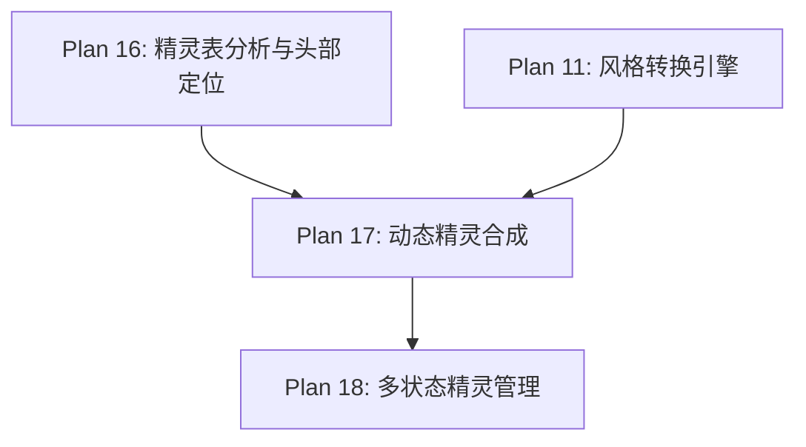

# Plan 17 - 动态精灵合成

## 1. 目标

**目标：** 实现精灵帧的动态合成功能，将风格化的人脸通过 alpha 混合精确贴合到精灵帧的头部位置，支持朝向翻转，确保视觉效果自然流畅。

**背景：** 人脸替换不是简单的覆盖，需要考虑透明度混合、尺寸匹配、朝向镜像等问题，才能让替换效果看起来自然。

---

## 2. 具体步骤

### 步骤 1：Alpha 混合合成

```python
# sprite_system/compositor.py
import pygame
import numpy as np
from typing import Optional, Tuple
from .head_mapping import HeadPosition, HeadMapping

class SpriteCompositor:
    """精灵合成器 - 将人脸合成到精灵帧上"""

    def __init__(self):
        self.blend_mode = 'alpha'  # alpha / replace / overlay
        self.face_offset = (0, 0)  # 人脸偏移微调 (dx, dy)

    def composite(self,
                  frame: pygame.Surface,
                  face: pygame.Surface,
                  head_pos: HeadPosition,
                  facing_right: bool = True) -> pygame.Surface:
        """
        将人脸合成到精灵帧上
        参数:
            frame: 原始精灵帧 (pygame.Surface)
            face: 风格化人脸 (pygame.Surface, 含 alpha)
            head_pos: 头部位置信息
            facing_right: 是否面朝右
        返回:
            合成后的精灵帧
        """
        # 创建结果 Surface（保持原始帧尺寸）
        result = frame.copy()

        # 缩放人脸到头部尺寸
        face_scaled = pygame.transform.scale(
            face, (head_pos.width, head_pos.height)
        )

        # 朝向翻转
        if not facing_right:
            face_scaled = pygame.transform.flip(face_scaled, True, False)

        # 计算合成位置（含偏移微调）
        blit_x = head_pos.x + self.face_offset[0]
        blit_y = head_pos.y + self.face_offset[1]

        # Alpha 混合合成
        if self.blend_mode == 'alpha':
            result.blit(face_scaled, (blit_x, blit_y))
        elif self.blend_mode == 'replace':
            self._replace_blend(result, face_scaled, blit_x, blit_y)
        elif self.blend_mode == 'overlay':
            self._overlay_blend(result, face_scaled, blit_x, blit_y)

        return result

    def _replace_blend(self, target: pygame.Surface,
                       face: pygame.Surface,
                       x: int, y: int):
        """替换模式：完全替换头部区域"""
        # 先清除头部区域
        clear_rect = pygame.Rect(x, y, face.get_width(), face.get_height())
        target.fill((0, 0, 0, 0), clear_rect)
        # 再贴入人脸
        target.blit(face, (x, y))

    def _overlay_blend(self, target: pygame.Surface,
                       face: pygame.Surface,
                       x: int, y: int):
        """叠加模式：人脸半透明叠加在原始头部上"""
        # 降低人脸透明度
        face_copy = face.copy()
        face_copy.set_alpha(180)
        target.blit(face_copy, (x, y))
```

### 步骤 2：批量帧合成

```python
    def composite_all_frames(self,
                             frames: dict,
                             face: pygame.Surface,
                             state: str) -> dict:
        """
        合成所有帧
        参数:
            frames: {"action": [Surface, ...]} 原始帧字典
            face: 风格化人脸
            state: 马里奥状态 (small/big/fire)
        返回:
            合成后的帧字典（相同结构）
        """
        result_frames = {}

        for action, frame_list in frames.items():
            result_frames[action] = []

            for i, frame in enumerate(frame_list):
                head_pos = HeadMapping.get_head(state, action, i)

                # 面朝右的帧
                right_frame = self.composite(frame, face, head_pos, True)
                result_frames[action].append(right_frame)

        return result_frames

    def composite_with_flip(self,
                            frame: pygame.Surface,
                            face: pygame.Surface,
                            head_pos: HeadPosition) -> Tuple[pygame.Surface, pygame.Surface]:
        """
        同时生成面朝左和面朝右的合成帧
        返回: (right_frame, left_frame)
        """
        # 面朝右
        right = self.composite(frame, face, head_pos, facing_right=True)

        # 面朝左 = 整个帧水平翻转
        left = pygame.transform.flip(right, True, False)

        return right, left
```

### 步骤 3：高质量缩放

```python
    def scale_face_to_head(self,
                           face: pygame.Surface,
                           head_pos: HeadPosition,
                           method: str = 'smooth') -> pygame.Surface:
        """
        将人脸缩放到头部尺寸
        参数:
            face: 原始人脸 Surface
            head_pos: 目标头部区域
            method: 缩放方法
                - 'smooth': pygame.transform.smoothscale（抗锯齿）
                - 'nearest': pygame.transform.scale（保持像素感）
                - 'auto': 根据风格自动选择
        """
        target_size = (head_pos.width, head_pos.height)

        if method == 'smooth':
            return pygame.transform.smoothscale(face, target_size)
        elif method == 'nearest':
            return pygame.transform.scale(face, target_size)
        elif method == 'auto':
            # 像素风格用 nearest，其他用 smooth
            return pygame.transform.scale(face, target_size)
        else:
            return pygame.transform.scale(face, target_size)
```

### 步骤 4：NumPy 加速的 Alpha 混合

```python
    @staticmethod
    def alpha_blend_numpy(base: np.ndarray,
                          overlay: np.ndarray,
                          position: Tuple[int, int]) -> np.ndarray:
        """
        使用 NumPy 进行高性能 alpha 混合
        参数:
            base: (H, W, 4) RGBA 基础图像
            overlay: (h, w, 4) RGBA 叠加图像
            position: (x, y) 叠加位置
        返回:
            混合后的 RGBA ndarray
        """
        result = base.copy()
        x, y = position
        oh, ow = overlay.shape[:2]
        bh, bw = base.shape[:2]

        # 计算有效区域（防止越界）
        x1 = max(0, x)
        y1 = max(0, y)
        x2 = min(bw, x + ow)
        y2 = min(bh, y + oh)

        ox1 = x1 - x
        oy1 = y1 - y
        ox2 = ox1 + (x2 - x1)
        oy2 = oy1 + (y2 - y1)

        if x2 <= x1 or y2 <= y1:
            return result

        # Alpha 混合公式: out = overlay * alpha + base * (1 - alpha)
        base_region = result[y1:y2, x1:x2].astype(np.float32)
        over_region = overlay[oy1:oy2, ox1:ox2].astype(np.float32)

        alpha = over_region[:, :, 3:4] / 255.0

        blended = over_region[:, :, :3] * alpha + base_region[:, :, :3] * (1 - alpha)

        result[y1:y2, x1:x2, :3] = blended.astype(np.uint8)

        # 更新 alpha 通道
        base_alpha = base_region[:, :, 3:4] / 255.0
        out_alpha = alpha + base_alpha * (1 - alpha)
        result[y1:y2, x1:x2, 3:4] = (out_alpha * 255).astype(np.uint8)

        return result
```

### 步骤 5：Pygame Surface 与 NumPy 转换工具

```python
def surface_to_array(surface: pygame.Surface) -> np.ndarray:
    """Pygame Surface -> RGBA ndarray"""
    arr = pygame.surfarray.array3d(surface)  # (W, H, 3) RGB
    arr = arr.transpose(1, 0, 2)             # (H, W, 3)

    # 获取 alpha
    alpha_arr = pygame.surfarray.array_alpha(surface)  # (W, H)
    alpha_arr = alpha_arr.transpose(1, 0)               # (H, W)

    # 合并 RGBA
    rgba = np.dstack([arr, alpha_arr])
    return rgba

def array_to_surface(arr: np.ndarray) -> pygame.Surface:
    """RGBA ndarray -> Pygame Surface"""
    h, w = arr.shape[:2]
    surface = pygame.Surface((w, h), pygame.SRCALPHA)

    # RGB
    rgb = arr[:, :, :3].transpose(1, 0, 2)  # (W, H, 3)
    pygame.surfarray.blit_array(surface, rgb)

    # Alpha
    alpha = arr[:, :, 3].transpose(1, 0)     # (W, H)
    alpha_surface = pygame.surfarray.make_surface(
        np.stack([alpha, alpha, alpha], axis=-1)
    )
    # 直接设置像素 alpha（使用 pixels_alpha）
    pixels_alpha = pygame.surfarray.pixels_alpha(surface)
    pixels_alpha[:] = alpha
    del pixels_alpha

    return surface
```

---

## 3. 输入/输出说明

| 项目 | 格式 | 说明 |
|------|------|------|
| 输入 | pygame.Surface | 原始精灵帧 |
| 输入 | pygame.Surface | 风格化人脸（含 alpha） |
| 输入 | HeadPosition | 头部坐标和尺寸 |
| 输出 | pygame.Surface | 合成后的精灵帧 |
| 输出 | (Surface, Surface) | 面朝右和面朝左的帧对 |

---

## 4. 依赖关系



- **前置依赖：** Plan 16（头部坐标数据），Plan 11（风格化人脸）
- **后续依赖：** Plan 18（多状态管理需要合成功能）

---

## 5. 验收标准

- [ ] `SpriteCompositor.composite()` 正确将人脸合成到帧上
- [ ] Alpha 混合效果自然，无硬边
- [ ] 面朝左时人脸正确水平翻转
- [ ] 面朝右时人脸不翻转
- [ ] 人脸缩放到头部尺寸后比例正确
- [ ] `composite_all_frames()` 批量处理所有帧
- [ ] NumPy alpha 混合与 Pygame blit 效果一致
- [ ] Surface 与 ndarray 互转正确无损
- [ ] 合成单帧耗时 < 1ms
- [ ] 批量合成所有帧耗时 < 50ms
