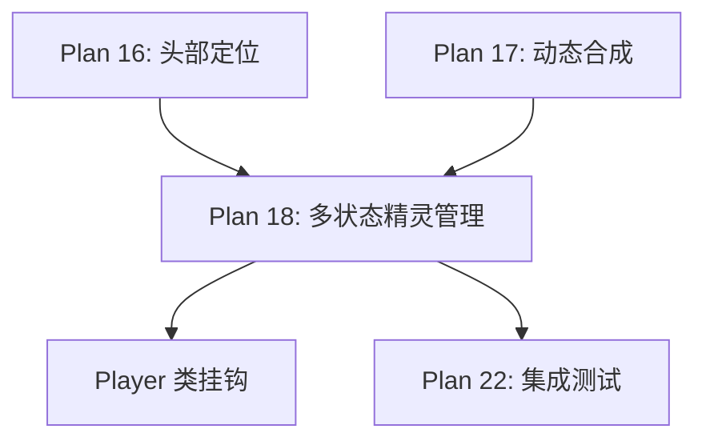

# Plan 18 - 多状态精灵管理

## 1. 目标

**目标：** 实现多状态精灵管理器，管理小马里奥、大马里奥、火焰马里奥三种状态下所有动画帧的人脸替换版本，提供高效的缓存机制和帧切换接口。

**背景：** 马里奥在游戏中有多种状态，每种状态有多个动画帧。管理器需要预先生成所有替换精灵并缓存，避免运行时重复计算，保证游戏帧率。

---

## 2. 马里奥状态与动画帧清单

### 状态总览

| 状态 | 精灵尺寸 | 显示尺寸 | 动作数 | 总帧数 |
|------|----------|----------|--------|--------|
| 小马里奥 (small) | 16x16 | 32x32 | 4 | 6 |
| 大马里奥 (big) | 16x32 | 32x64 | 4 | 6 |
| 火焰马里奥 (fire) | 16x32 | 32x64 | 5 | 7 |
| **合计** | | | **13** | **19** |

### 帧详情

```
小马里奥:
  stand  : [frame_0]                    → 1帧
  walk   : [frame_0, frame_1, frame_2]  → 3帧
  jump   : [frame_0]                    → 1帧
  die    : [frame_0]                    → 1帧

大马里奥:
  stand  : [frame_0]                    → 1帧
  walk   : [frame_0, frame_1, frame_2]  → 3帧
  jump   : [frame_0]                    → 1帧
  duck   : [frame_0]                    → 1帧

火焰马里奥:
  stand  : [frame_0]                    → 1帧
  walk   : [frame_0, frame_1, frame_2]  → 3帧
  jump   : [frame_0]                    → 1帧
  duck   : [frame_0]                    → 1帧
  throw  : [frame_0]                    → 1帧
```

面朝左右各一套，所以实际缓存帧数 = 19 x 2 = **38 帧**。

---

## 3. 具体实现

### 步骤 1：精灵管理器

```python
# sprite_system/manager.py
import pygame
from typing import Dict, List, Optional, Tuple
from .compositor import SpriteCompositor
from .head_mapping import HeadMapping
import time
import logging

logger = logging.getLogger(__name__)

class SpriteState:
    """单个状态的帧集合"""

    def __init__(self, state_name: str):
        self.state_name = state_name
        self.right_frames: Dict[str, List[pygame.Surface]] = {}
        self.left_frames: Dict[str, List[pygame.Surface]] = {}

    def get_frame(self, action: str, frame_index: int,
                  facing_right: bool) -> Optional[pygame.Surface]:
        """获取指定帧"""
        frames = self.right_frames if facing_right else self.left_frames
        action_frames = frames.get(action)
        if action_frames is None:
            return None
        index = frame_index % len(action_frames)
        return action_frames[index]


class SpriteManager:
    """多状态精灵管理器"""

    def __init__(self):
        self.compositor = SpriteCompositor()
        self.states: Dict[str, SpriteState] = {}
        self.original_frames: Dict[str, Dict[str, List[pygame.Surface]]] = {}
        self.face_surface: Optional[pygame.Surface] = None
        self.enabled = False
        self._cache_valid = False
        self._build_time = 0.0

    def load_original_frames(self, sprite_sheet: pygame.Surface):
        """
        从精灵表加载所有原始帧
        参数:
            sprite_sheet: mario_bros.png 的 Surface
        """
        from .analyzer import SpriteAnalyzer

        analyzer = SpriteAnalyzer(sprite_sheet)
        sheet_data = analyzer.analyze()

        for key, frames in sheet_data.frames.items():
            # key 格式: "small_walk", "big_jump" 等
            parts = key.split('_', 1)
            state = parts[0]
            action = parts[1] if len(parts) > 1 else 'stand'

            if state not in self.original_frames:
                self.original_frames[state] = {}

            self.original_frames[state][action] = [f.surface for f in frames]

        logger.info(f"加载了 {sum(len(a) for s in self.original_frames.values() for a in s.values())} 帧原始精灵")

    def set_face(self, face_surface: pygame.Surface):
        """
        设置人脸图像，触发所有帧的重新合成
        参数:
            face_surface: 风格化的人脸 (pygame.Surface, 含 alpha)
        """
        self.face_surface = face_surface
        self.enabled = True
        self._cache_valid = False
        self._rebuild_all()

    def _rebuild_all(self):
        """重建所有替换精灵"""
        if self.face_surface is None:
            return

        start = time.time()
        self.states.clear()

        for state_name, actions in self.original_frames.items():
            sprite_state = SpriteState(state_name)

            for action, frames in actions.items():
                sprite_state.right_frames[action] = []
                sprite_state.left_frames[action] = []

                for i, frame in enumerate(frames):
                    head_pos = HeadMapping.get_head(state_name, action, i)

                    # 生成面朝右的帧
                    right_frame = self.compositor.composite(
                        frame, self.face_surface, head_pos, True
                    )
                    sprite_state.right_frames[action].append(right_frame)

                    # 生成面朝左的帧（翻转整个帧）
                    left_frame = pygame.transform.flip(right_frame, True, False)
                    sprite_state.left_frames[action].append(left_frame)

            self.states[state_name] = sprite_state

        self._build_time = time.time() - start
        self._cache_valid = True

        total_frames = sum(
            len(a) for s in self.states.values()
            for a in s.right_frames.values()
        ) * 2  # x2 因为左右

        logger.info(f"重建了 {total_frames} 帧替换精灵，耗时 {self._build_time:.3f}s")

    def get_frame(self, state: str, action: str,
                  frame_index: int,
                  facing_right: bool) -> Optional[pygame.Surface]:
        """
        获取替换后的精灵帧
        参数:
            state: 'small' / 'big' / 'fire'
            action: 'stand' / 'walk' / 'jump' / 'duck' / 'die' / 'throw'
            frame_index: 帧编号
            facing_right: 是否面朝右
        返回:
            替换后的 pygame.Surface，或 None（未启用时）
        """
        if not self.enabled or not self._cache_valid:
            return None

        sprite_state = self.states.get(state)
        if sprite_state is None:
            return None

        return sprite_state.get_frame(action, frame_index, facing_right)

    def disable(self):
        """禁用人脸替换"""
        self.enabled = False

    def enable(self):
        """启用人脸替换"""
        if self.face_surface is not None:
            self.enabled = True

    def is_ready(self) -> bool:
        """检查是否准备就绪"""
        return self.enabled and self._cache_valid

    def get_cache_info(self) -> dict:
        """获取缓存信息"""
        total_right = sum(
            len(a) for s in self.states.values()
            for a in s.right_frames.values()
        )
        total_left = sum(
            len(a) for s in self.states.values()
            for a in s.left_frames.values()
        )
        return {
            'total_frames': total_right + total_left,
            'states': list(self.states.keys()),
            'build_time': self._build_time,
            'cache_valid': self._cache_valid,
            'enabled': self.enabled,
        }
```

### 步骤 2：与 Player 类集成

```python
class PlayerSpriteHook:
    """Player 类精灵钩子 - 在游戏中拦截精灵渲染"""

    def __init__(self, sprite_manager: SpriteManager):
        self.manager = sprite_manager

    def hook_player(self, player):
        """
        挂钩到 Player 实例
        通过替换 player.image 属性来实现精灵替换
        """
        original_animation = player.animation

        def patched_animation(self_player):
            # 先执行原始动画逻辑
            original_animation()

            # 然后替换图像
            if self.manager.is_ready():
                state = self._get_player_state(self_player)
                action = self._get_player_action(self_player)
                frame_idx = self._get_frame_index(self_player)
                facing_right = self._is_facing_right(self_player)

                replaced = self.manager.get_frame(
                    state, action, frame_idx, facing_right
                )
                if replaced is not None:
                    self_player.image = replaced

        player.animation = lambda: patched_animation(player)

    def _get_player_state(self, player) -> str:
        """推断玩家当前状态"""
        if hasattr(player, 'fire') and player.fire:
            return 'fire'
        elif hasattr(player, 'big') and player.big:
            return 'big'
        return 'small'

    def _get_player_action(self, player) -> str:
        """推断玩家当前动作"""
        state = getattr(player, 'state', 'stand')
        action_map = {
            'stand': 'stand',
            'walk': 'walk',
            'jump': 'jump',
            'fall': 'jump',
            'crouch': 'duck',
            'death_jump': 'die',
        }
        return action_map.get(state, 'stand')

    def _get_frame_index(self, player) -> int:
        """获取当前动画帧编号"""
        return getattr(player, 'frame_index', 0)

    def _is_facing_right(self, player) -> bool:
        """是否面朝右"""
        return getattr(player, 'facing_right', True)
```

---

## 4. 输入/输出说明

| 项目 | 格式 | 说明 |
|------|------|------|
| 输入 | pygame.Surface | 精灵表、风格化人脸 |
| 输入 | state/action/frame_index | 查询参数 |
| 输出 | pygame.Surface | 指定状态和帧的替换精灵 |
| 输出 | cache_info | 缓存状态信息 |

---

## 5. 依赖关系



- **前置依赖：** Plan 16（头部坐标），Plan 17（合成功能）
- **后续依赖：** Player 挂钩集成，Plan 22（集成测试）

---

## 6. 验收标准

- [ ] `SpriteManager` 加载所有原始帧（19帧 x 3状态相关）
- [ ] `set_face()` 触发全帧重建，耗时 < 100ms
- [ ] 缓存包含所有 38 帧（19帧 x 左右各1）
- [ ] `get_frame()` 查询耗时 < 0.1ms（直接从缓存取）
- [ ] 小/大/火焰马里奥三种状态均正确替换
- [ ] 站立、行走、跳跃、蹲下、死亡动画均正确
- [ ] 面朝左右切换流畅，人脸方向正确
- [ ] `PlayerSpriteHook` 正确挂钩到 Player 实例
- [ ] 禁用/启用切换即时生效
- [ ] 缓存信息报告准确
