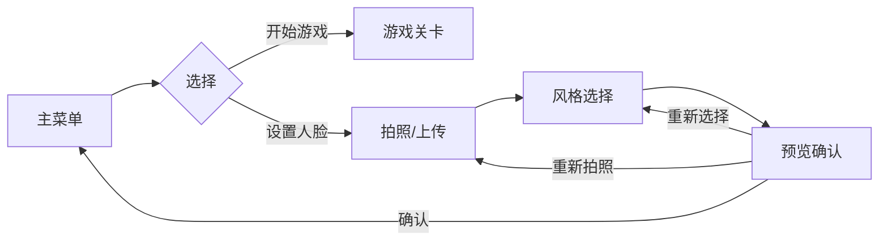
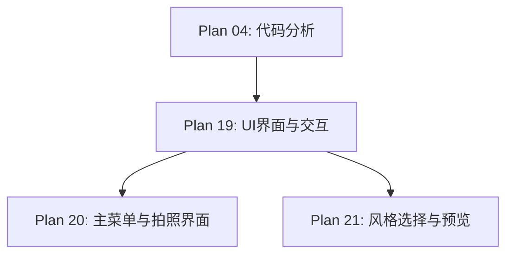

# Plan 19 - UI 界面与交互

## 1. 目标

**目标：** 设计并实现完整的用户交互界面，包括主菜单、人脸拍照/上传界面、风格选择预览界面，使用 Pygame 渲染并结合 tkinter 实现文件对话框等系统功能。

**背景：** 用户需要一个直观的界面来完成人脸采集、风格选择、游戏启动等操作。界面需要与 Pygame 游戏引擎无缝集成。

---

## 2. UI 架构设计

### 2.1 页面流程



### 2.2 组件设计

```python
# ui/__init__.py
import pygame
from typing import Callable, Optional, List, Tuple

class UIComponent:
    """UI 组件基类"""

    def __init__(self, x: int, y: int, width: int, height: int):
        self.rect = pygame.Rect(x, y, width, height)
        self.visible = True
        self.enabled = True

    def draw(self, surface: pygame.Surface):
        """绘制组件"""
        pass

    def handle_event(self, event: pygame.event.Event) -> bool:
        """处理事件，返回是否消费了事件"""
        return False

    def update(self, dt: float):
        """更新逻辑"""
        pass

class Button(UIComponent):
    """按钮组件"""

    def __init__(self, x: int, y: int, width: int, height: int,
                 text: str, callback: Callable = None,
                 font_size: int = 24,
                 color: Tuple = (255, 255, 255),
                 bg_color: Tuple = (50, 50, 150),
                 hover_color: Tuple = (70, 70, 200),
                 active_color: Tuple = (30, 30, 120)):
        super().__init__(x, y, width, height)
        self.text = text
        self.callback = callback
        self.font = pygame.font.SysFont('simhei', font_size)  # 支持中文
        self.color = color
        self.bg_color = bg_color
        self.hover_color = hover_color
        self.active_color = active_color
        self._hovered = False
        self._pressed = False

    def draw(self, surface: pygame.Surface):
        if not self.visible:
            return

        # 选择背景色
        if self._pressed:
            bg = self.active_color
        elif self._hovered:
            bg = self.hover_color
        else:
            bg = self.bg_color

        # 绘制圆角矩形背景
        pygame.draw.rect(surface, bg, self.rect, border_radius=8)
        pygame.draw.rect(surface, self.color, self.rect, 2, border_radius=8)

        # 绘制文字（居中）
        text_surf = self.font.render(self.text, True, self.color)
        text_rect = text_surf.get_rect(center=self.rect.center)
        surface.blit(text_surf, text_rect)

    def handle_event(self, event: pygame.event.Event) -> bool:
        if not self.visible or not self.enabled:
            return False

        if event.type == pygame.MOUSEMOTION:
            self._hovered = self.rect.collidepoint(event.pos)
        elif event.type == pygame.MOUSEBUTTONDOWN and event.button == 1:
            if self.rect.collidepoint(event.pos):
                self._pressed = True
                return True
        elif event.type == pygame.MOUSEBUTTONUP and event.button == 1:
            if self._pressed and self.rect.collidepoint(event.pos):
                self._pressed = False
                if self.callback:
                    self.callback()
                return True
            self._pressed = False

        return False

class ImagePreview(UIComponent):
    """图像预览组件"""

    def __init__(self, x: int, y: int, width: int, height: int):
        super().__init__(x, y, width, height)
        self.image: Optional[pygame.Surface] = None
        self.border_color = (200, 200, 200)
        self.bg_color = (30, 30, 30)

    def set_image(self, surface: pygame.Surface):
        """设置预览图像"""
        # 缩放到预览区域（保持宽高比）
        img_w, img_h = surface.get_size()
        scale = min(self.rect.width / img_w, self.rect.height / img_h)
        new_size = (int(img_w * scale), int(img_h * scale))
        self.image = pygame.transform.smoothscale(surface, new_size)

    def draw(self, surface: pygame.Surface):
        if not self.visible:
            return

        # 背景
        pygame.draw.rect(surface, self.bg_color, self.rect)
        pygame.draw.rect(surface, self.border_color, self.rect, 2)

        # 图像居中显示
        if self.image:
            img_rect = self.image.get_rect(center=self.rect.center)
            surface.blit(self.image, img_rect)
        else:
            # 显示占位文字
            font = pygame.font.SysFont('simhei', 16)
            text = font.render("暂无预览", True, (128, 128, 128))
            text_rect = text.get_rect(center=self.rect.center)
            surface.blit(text, text_rect)

class Label(UIComponent):
    """文字标签"""

    def __init__(self, x: int, y: int, text: str,
                 font_size: int = 20,
                 color: Tuple = (255, 255, 255)):
        self.text = text
        self.font = pygame.font.SysFont('simhei', font_size)
        text_surf = self.font.render(text, True, color)
        super().__init__(x, y, text_surf.get_width(), text_surf.get_height())
        self.color = color
        self._surface = text_surf

    def set_text(self, text: str):
        self.text = text
        self._surface = self.font.render(text, True, self.color)

    def draw(self, surface: pygame.Surface):
        if self.visible:
            surface.blit(self._surface, self.rect.topleft)
```

---

## 3. 页面基类

```python
# ui/page_base.py
class UIPage:
    """UI 页面基类"""

    def __init__(self, screen_size: Tuple[int, int]):
        self.screen_w, self.screen_h = screen_size
        self.components: List[UIComponent] = []
        self.next_page: Optional[str] = None
        self.done = False

    def add_component(self, component: UIComponent):
        self.components.append(component)

    def handle_events(self, events: List[pygame.event.Event]):
        for event in events:
            if event.type == pygame.QUIT:
                self.done = True
                self.next_page = 'quit'
                return

            for component in reversed(self.components):
                if component.handle_event(event):
                    break

    def update(self, dt: float):
        for component in self.components:
            component.update(dt)

    def draw(self, surface: pygame.Surface):
        for component in self.components:
            component.draw(surface)

    def navigate_to(self, page_name: str):
        self.next_page = page_name
        self.done = True
```

### 页面管理器

```python
class UIManager:
    """UI 页面管理器"""

    def __init__(self, screen: pygame.Surface):
        self.screen = screen
        self.pages: Dict[str, UIPage] = {}
        self.current_page: Optional[UIPage] = None
        self.current_page_name: str = ""

    def register_page(self, name: str, page: UIPage):
        self.pages[name] = page

    def navigate_to(self, name: str):
        if name in self.pages:
            self.current_page = self.pages[name]
            self.current_page_name = name
            self.current_page.done = False
            self.current_page.next_page = None

    def update(self, events, dt):
        if self.current_page:
            self.current_page.handle_events(events)
            self.current_page.update(dt)

            if self.current_page.done and self.current_page.next_page:
                self.navigate_to(self.current_page.next_page)

    def draw(self):
        if self.current_page:
            self.current_page.draw(self.screen)
```

---

## 4. 输入/输出说明

| 项目 | 说明 |
|------|------|
| 输入 | 用户鼠标/键盘事件 |
| 输出 | 渲染到 Pygame Surface 的 UI 界面 |
| 输出 | 页面跳转指令 |

---

## 5. 依赖关系



- **前置依赖：** Plan 04（理解游戏状态机以便集成 UI）
- **后续依赖：** Plan 20（主菜单），Plan 21（风格选择）

---

## 6. 验收标准

- [ ] `Button` 组件支持 hover/click 状态变化
- [ ] `ImagePreview` 正确缩放和居中显示图像
- [ ] `Label` 支持中文显示（使用 simhei 字体）
- [ ] `UIPage` 正确管理组件列表
- [ ] `UIManager` 页面切换逻辑正确
- [ ] 所有 UI 组件可正确绘制到 Pygame Surface
- [ ] 事件处理不冲突（上层组件优先）
- [ ] 页面流程符合设计（主菜单 -> 拍照 -> 风格选择 -> 确认）
