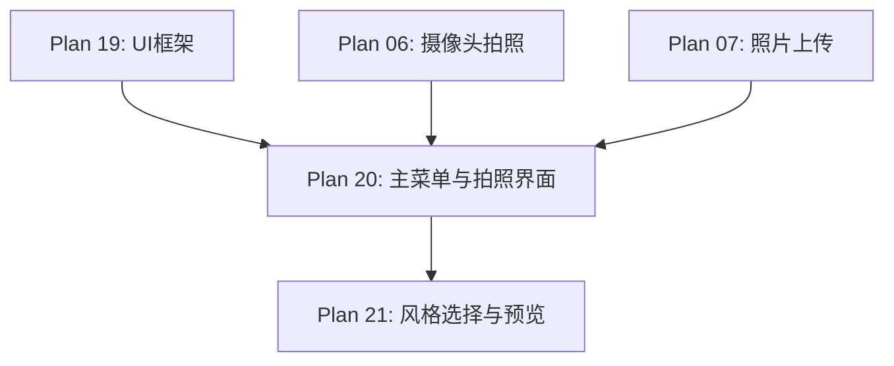

# Plan 20 - 主菜单与拍照界面

## 1. 目标

**目标：** 实现游戏主菜单界面和人脸拍照/上传界面，包含菜单按钮布局、摄像头预览窗口、文件上传入口，以及用户操作的完整交互流程。

**背景：** 主菜单是用户启动游戏后的第一个界面，需要提供"开始游戏"和"设置人脸"两个主要入口。拍照界面需要嵌入摄像头实时预览。

---

## 2. 具体步骤

### 步骤 1：主菜单页面

```python
# ui/main_menu.py
import pygame
from ui import UIPage, Button, Label, ImagePreview

class MainMenuPage(UIPage):
    """主菜单页面"""

    def __init__(self, screen_size):
        super().__init__(screen_size)
        self._build_ui()
        self.face_set = False  # 是否已设置人脸

    def _build_ui(self):
        cx = self.screen_w // 2  # 水平居中

        # 标题
        title = Label(cx - 200, 50, "Super Mario - Face Edition",
                     font_size=36, color=(255, 215, 0))
        self.add_component(title)

        # 副标题
        subtitle = Label(cx - 120, 100, "用你的脸来玩马里奥！",
                        font_size=20, color=(200, 200, 200))
        self.add_component(subtitle)

        # 人脸预览区（显示当前设置的人脸）
        self.face_preview = ImagePreview(cx - 64, 150, 128, 128)
        self.add_component(self.face_preview)

        # 设置人脸按钮
        btn_face = Button(
            cx - 120, 310, 240, 50,
            "拍照/上传人脸",
            callback=self._on_face_setup,
            font_size=22,
        )
        self.add_component(btn_face)

        # 开始游戏按钮
        self.btn_start = Button(
            cx - 120, 380, 240, 50,
            "开始游戏",
            callback=self._on_start_game,
            font_size=22,
            bg_color=(50, 150, 50),
            hover_color=(70, 200, 70),
        )
        self.add_component(self.btn_start)

        # 不设置人脸直接开始
        btn_skip = Button(
            cx - 100, 450, 200, 40,
            "跳过（使用原版）",
            callback=self._on_skip,
            font_size=16,
            bg_color=(80, 80, 80),
            hover_color=(100, 100, 100),
        )
        self.add_component(btn_skip)

        # 退出按钮
        btn_quit = Button(
            cx - 80, 510, 160, 40,
            "退出游戏",
            callback=self._on_quit,
            font_size=16,
            bg_color=(150, 50, 50),
            hover_color=(200, 70, 70),
        )
        self.add_component(btn_quit)

        # 状态提示
        self.status_label = Label(cx - 100, 560, "", font_size=14,
                                  color=(150, 150, 150))
        self.add_component(self.status_label)

    def _on_face_setup(self):
        """跳转到拍照页面"""
        self.navigate_to('capture')

    def _on_start_game(self):
        """开始游戏"""
        self.navigate_to('game')

    def _on_skip(self):
        """跳过人脸设置"""
        self.navigate_to('game')

    def _on_quit(self):
        """退出"""
        self.navigate_to('quit')

    def set_face_preview(self, face_surface: pygame.Surface):
        """设置人脸预览图"""
        self.face_preview.set_image(face_surface)
        self.face_set = True
        self.status_label.set_text("人脸已设置！点击开始游戏")

    def draw(self, surface: pygame.Surface):
        # 背景
        surface.fill((20, 20, 40))

        # 装饰性背景元素
        self._draw_background_decoration(surface)

        # 绘制所有组件
        super().draw(surface)

    def _draw_background_decoration(self, surface):
        """绘制装饰性背景"""
        # 底部地面
        ground_color = (139, 90, 43)
        pygame.draw.rect(surface, ground_color,
                        (0, self.screen_h - 60, self.screen_w, 60))

        # 简单的云朵
        cloud_color = (200, 220, 255)
        pygame.draw.ellipse(surface, cloud_color, (50, 30, 80, 40))
        pygame.draw.ellipse(surface, cloud_color, (600, 50, 100, 50))
```

### 步骤 2：拍照/上传界面

```python
# ui/capture_ui.py
import pygame
import cv2
import numpy as np
from ui import UIPage, Button, Label, ImagePreview

class CapturePage(UIPage):
    """拍照/上传界面"""

    def __init__(self, screen_size, face_capture_manager):
        super().__init__(screen_size)
        self.capture_manager = face_capture_manager
        self.camera_active = False
        self.captured_image = None  # BGR ndarray
        self._build_ui()

    def _build_ui(self):
        # 标题
        self.add_component(Label(20, 10, "人脸采集", font_size=28))

        # 摄像头预览区域
        self.camera_preview = ImagePreview(20, 60, 400, 300)
        self.add_component(self.camera_preview)

        # 拍照结果预览
        self.result_preview = ImagePreview(440, 60, 200, 200)
        self.add_component(self.result_preview)

        # 拍照按钮
        self.btn_capture = Button(
            20, 380, 180, 45,
            "拍照",
            callback=self._on_capture,
            font_size=20,
        )
        self.add_component(self.btn_capture)

        # 上传按钮
        btn_upload = Button(
            220, 380, 180, 45,
            "上传照片",
            callback=self._on_upload,
            font_size=20,
        )
        self.add_component(btn_upload)

        # 开始预览按钮
        self.btn_preview = Button(
            20, 440, 180, 45,
            "开启摄像头",
            callback=self._on_toggle_camera,
            font_size=18,
            bg_color=(80, 80, 80),
        )
        self.add_component(self.btn_preview)

        # 确认按钮
        self.btn_confirm = Button(
            440, 280, 200, 45,
            "使用此照片",
            callback=self._on_confirm,
            font_size=18,
            bg_color=(50, 150, 50),
        )
        self.btn_confirm.visible = False
        self.add_component(self.btn_confirm)

        # 返回按钮
        btn_back = Button(
            440, 340, 200, 45,
            "返回主菜单",
            callback=self._on_back,
            font_size=18,
            bg_color=(150, 50, 50),
        )
        self.add_component(btn_back)

        # 提示文字
        self.hint = Label(20, 500, "请拍照或上传一张正面人脸照片",
                         font_size=14, color=(180, 180, 180))
        self.add_component(self.hint)

    def _on_toggle_camera(self):
        """开启/关闭摄像头"""
        if self.camera_active:
            self.capture_manager.camera.close()
            self.camera_active = False
            self.btn_preview.text = "开启摄像头"
        else:
            if self.capture_manager.camera.is_available():
                self.capture_manager.camera.open()
                self.camera_active = True
                self.btn_preview.text = "关闭摄像头"
            else:
                self.hint.set_text("未检测到摄像头，请使用上传功能")

    def _on_capture(self):
        """拍照"""
        if not self.camera_active:
            self.hint.set_text("请先开启摄像头")
            return

        frame = self.capture_manager.camera.get_frame()
        if frame is not None:
            self.captured_image = frame
            self._update_result_preview(frame)
            self.btn_confirm.visible = True
            self.hint.set_text("拍照成功！可以确认使用或重新拍照")

    def _on_upload(self):
        """上传照片"""
        image = self.capture_manager.capture_from_file()
        if image is not None:
            self.captured_image = image
            self._update_result_preview(image)
            self.btn_confirm.visible = True
            self.hint.set_text("上传成功！可以确认使用或重新选择")

    def _on_confirm(self):
        """确认使用当前照片"""
        if self.captured_image is not None:
            # 将照片传递给下一步（风格选择）
            self.navigate_to('style_select')

    def _on_back(self):
        """返回主菜单"""
        if self.camera_active:
            self.capture_manager.camera.close()
            self.camera_active = False
        self.navigate_to('main_menu')

    def _update_result_preview(self, bgr_image: np.ndarray):
        """更新结果预览"""
        rgb = cv2.cvtColor(bgr_image, cv2.COLOR_BGR2RGB)
        surface = pygame.surfarray.make_surface(
            np.transpose(rgb, (1, 0, 2))
        )
        self.result_preview.set_image(surface)

    def update(self, dt: float):
        super().update(dt)

        # 更新摄像头预览
        if self.camera_active:
            surface = self.capture_manager.camera.get_frame_as_pygame_surface()
            if surface:
                self.camera_preview.set_image(surface)

    def draw(self, surface: pygame.Surface):
        surface.fill((25, 25, 35))
        super().draw(surface)
```

---

## 3. 键盘快捷键支持

```python
    def handle_events(self, events):
        super().handle_events(events)

        for event in events:
            if event.type == pygame.KEYDOWN:
                if event.key == pygame.K_SPACE and self.camera_active:
                    self._on_capture()
                elif event.key == pygame.K_ESCAPE:
                    self._on_back()
                elif event.key == pygame.K_RETURN and self.captured_image is not None:
                    self._on_confirm()
```

---

## 4. 输入/输出说明

| 项目 | 说明 |
|------|------|
| 输入 | 用户交互（鼠标点击、键盘按键） |
| 输入 | 摄像头视频流 / 本地图片文件 |
| 输出 | 页面跳转指令 |
| 输出 | captured_image (BGR ndarray) 传递给风格选择页 |

---

## 5. 依赖关系



- **前置依赖：** Plan 19（UI 组件），Plan 06/07（采集功能）
- **后续依赖：** Plan 21（风格选择页面需要拍照结果）

---

## 6. 验收标准

- [ ] 主菜单正常显示标题、按钮、人脸预览区
- [ ] "设置人脸"按钮跳转到拍照页面
- [ ] "开始游戏"按钮跳转到游戏
- [ ] "跳过"按钮直接开始原版游戏
- [ ] 摄像头预览区实时显示画面，帧率 >= 24 FPS
- [ ] 拍照按钮（空格键）捕获当前画面
- [ ] 上传按钮弹出文件选择对话框
- [ ] 拍照/上传结果在预览区显示
- [ ] "使用此照片"按钮跳转到风格选择
- [ ] 返回按钮正确释放摄像头并返回主菜单
- [ ] ESC 键可返回上一页
- [ ] 中文文字正常显示
