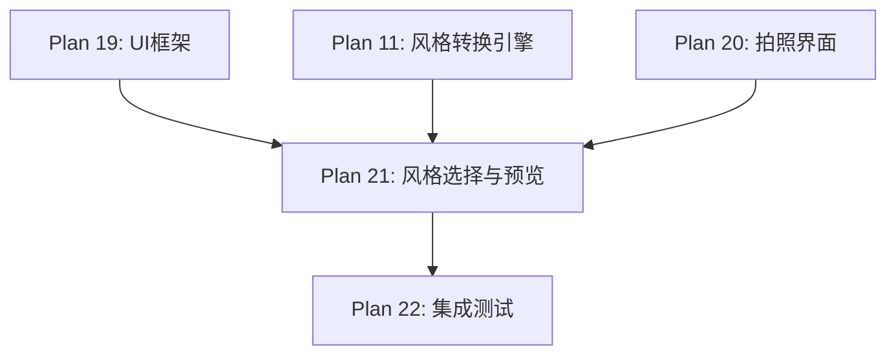

# Plan 21 - 风格选择与预览界面

## 1. 目标

**目标：** 实现风格选择页面，展示三种风格（像素、原始、卡通）的实时预览缩略图，支持风格切换和参数调整，确认后将风格化人脸传递给精灵替换系统。

**背景：** 用户在拍照/上传后需要选择喜欢的风格。直观的实时预览可以帮助用户做出选择。

---

## 2. 具体步骤

### 步骤 1：风格选择页面

```python
# ui/style_select.py
import pygame
import numpy as np
from ui import UIPage, Button, Label, ImagePreview
from style_engine import StyleEngine, StyleType

class StyleSelectPage(UIPage):
    """风格选择与预览界面"""

    STYLE_INFO = {
        StyleType.PIXEL: {
            'name': '像素风格',
            'description': 'NES 8-bit 复古像素效果\n与原版马里奥最搭配',
            'color': (0, 200, 0),
        },
        StyleType.ORIGINAL: {
            'name': '原始照片',
            'description': '保留真实照片外观\n边缘平滑处理',
            'color': (0, 150, 255),
        },
        StyleType.CARTOON: {
            'name': '卡通风格',
            'description': '卡通手绘效果\n色彩鲜明线条清晰',
            'color': (255, 150, 0),
        },
    }

    def __init__(self, screen_size, style_engine: StyleEngine):
        super().__init__(screen_size)
        self.style_engine = style_engine
        self.face_image = None          # 原始人脸 (RGBA ndarray)
        self.styled_face = None         # 风格化结果
        self.selected_style = StyleType.PIXEL
        self.previews = {}              # {StyleType: pygame.Surface}
        self._build_ui()

    def _build_ui(self):
        # 标题
        self.add_component(Label(20, 10, "选择风格", font_size=28))

        # 原始人脸预览
        self.add_component(Label(20, 50, "原始照片:", font_size=16))
        self.original_preview = ImagePreview(20, 75, 120, 120)
        self.add_component(self.original_preview)

        # 三种风格预览卡片
        self.style_cards = {}
        self.style_buttons = {}
        card_x = 20
        card_y = 220

        for i, (style_type, info) in enumerate(self.STYLE_INFO.items()):
            x = card_x + i * 220

            # 风格名称
            name_label = Label(x + 10, card_y, info['name'],
                              font_size=18, color=info['color'])
            self.add_component(name_label)

            # 预览图
            preview = ImagePreview(x + 10, card_y + 30, 180, 180)
            self.style_cards[style_type] = preview
            self.add_component(preview)

            # 选择按钮
            btn = Button(
                x + 10, card_y + 220, 180, 40,
                f"选择{info['name']}",
                callback=lambda st=style_type: self._on_select_style(st),
                font_size=16,
                bg_color=(60, 60, 60),
            )
            self.style_buttons[style_type] = btn
            self.add_component(btn)

        # 选中标记
        self.selection_indicator = Label(
            0, 0, ">>> 已选择 <<<",
            font_size=14, color=(255, 255, 0)
        )
        self.add_component(self.selection_indicator)

        # 大预览区（选中风格的放大预览）
        self.add_component(Label(460, 50, "预览效果:", font_size=16))
        self.large_preview = ImagePreview(460, 75, 180, 180)
        self.add_component(self.large_preview)

        # 确认按钮
        btn_confirm = Button(
            460, 280, 180, 50,
            "确认并开始",
            callback=self._on_confirm,
            font_size=20,
            bg_color=(50, 150, 50),
            hover_color=(70, 200, 70),
        )
        self.add_component(btn_confirm)

        # 重新拍照按钮
        btn_retake = Button(
            460, 345, 180, 40,
            "重新拍照",
            callback=self._on_retake,
            font_size=16,
            bg_color=(150, 100, 50),
        )
        self.add_component(btn_retake)

        # 返回按钮
        btn_back = Button(
            460, 400, 180, 40,
            "返回主菜单",
            callback=self._on_back,
            font_size=16,
            bg_color=(150, 50, 50),
        )
        self.add_component(btn_back)

    def set_face_image(self, face_rgba: np.ndarray):
        """设置原始人脸图像并生成所有预览"""
        self.face_image = face_rgba

        # 显示原始人脸
        orig_surface = self._ndarray_to_surface(face_rgba)
        self.original_preview.set_image(orig_surface)

        # 生成所有风格的预览
        self._generate_previews()

        # 默认选中像素风格
        self._on_select_style(StyleType.PIXEL)

    def _generate_previews(self):
        """生成三种风格的预览图"""
        if self.face_image is None:
            return

        for style_type in self.STYLE_INFO.keys():
            # 执行风格转换
            styled = self.style_engine.transform(
                self.face_image, style_type
            )

            # 转为 Surface
            surface = self._ndarray_to_surface(styled)
            self.previews[style_type] = surface

            # 更新预览卡片
            self.style_cards[style_type].set_image(surface)

    def _on_select_style(self, style_type: StyleType):
        """选择风格"""
        self.selected_style = style_type
        self.style_engine.set_style(style_type)

        # 更新大预览
        if style_type in self.previews:
            self.large_preview.set_image(self.previews[style_type])

        # 更新按钮高亮
        for st, btn in self.style_buttons.items():
            if st == style_type:
                btn.bg_color = self.STYLE_INFO[st]['color']
            else:
                btn.bg_color = (60, 60, 60)

        # 更新选中标记位置
        idx = list(self.STYLE_INFO.keys()).index(style_type)
        x = 20 + idx * 220 + 50
        self.selection_indicator.rect.x = x
        self.selection_indicator.rect.y = 480

    def _on_confirm(self):
        """确认选择"""
        if self.face_image is not None:
            # 执行最终风格转换
            self.styled_face = self.style_engine.transform(
                self.face_image, self.selected_style
            )
            self.navigate_to('main_menu')  # 返回主菜单，人脸已设置

    def _on_retake(self):
        """重新拍照"""
        self.navigate_to('capture')

    def _on_back(self):
        """返回主菜单"""
        self.navigate_to('main_menu')

    def _ndarray_to_surface(self, arr: np.ndarray) -> pygame.Surface:
        """RGBA ndarray -> Pygame Surface"""
        if arr.shape[2] == 4:
            # BGRA -> RGBA
            import cv2
            rgba = cv2.cvtColor(arr, cv2.COLOR_BGRA2RGBA)
        else:
            rgba = arr

        h, w = rgba.shape[:2]
        surface = pygame.image.frombuffer(
            rgba.tobytes(), (w, h), 'RGBA'
        )
        return surface

    def draw(self, surface: pygame.Surface):
        surface.fill((25, 25, 35))

        # 分隔线
        pygame.draw.line(surface, (60, 60, 60),
                        (0, 210), (self.screen_w, 210), 1)

        super().draw(surface)
```

---

## 3. 实时预览效果

```
┌────────────────────────────────────────────────────────┐
│  选择风格                                     预览效果: │
│  ┌────────┐                                  ┌────────┐│
│  │原始照片│                                  │  放大   ││
│  │  预览  │                                  │  预览   ││
│  └────────┘                                  └────────┘│
│─────────────────────────────────────────── [确认并开始] │
│  像素风格      原始照片      卡通风格       [重新拍照]  │
│  ┌────────┐   ┌────────┐   ┌────────┐      [返回菜单]  │
│  │ ██████ │   │ 真实   │   │ 卡通   │                  │
│  │ ██  ██ │   │ 照片   │   │ 效果   │                  │
│  │ ██████ │   │ 效果   │   │ 风格   │                  │
│  └────────┘   └────────┘   └────────┘                  │
│  [选择像素]   [选择原始]   [选择卡通]                   │
│           >>> 已选择 <<<                                │
└────────────────────────────────────────────────────────┘
```

---

## 4. 输入/输出说明

| 项目 | 说明 |
|------|------|
| 输入 | RGBA ndarray（裁剪后的人脸） |
| 输入 | 用户风格选择操作 |
| 输出 | styled_face (RGBA ndarray)（风格化后的人脸） |
| 输出 | 页面跳转指令 |

---

## 5. 依赖关系



- **前置依赖：** Plan 19（UI 组件），Plan 11（风格引擎），Plan 20（拍照结果）
- **后续依赖：** Plan 22（集成测试）

---

## 6. 验收标准

- [ ] 三种风格缩略图同时显示，可对比
- [ ] 风格缩略图在页面加载时自动生成
- [ ] 点击风格按钮高亮选中状态
- [ ] 大预览区显示当前选中风格的放大效果
- [ ] 预览生成总耗时 < 2 秒（三种风格）
- [ ] "确认并开始"按钮将风格化人脸传递给精灵系统
- [ ] "重新拍照"正确跳转到拍照页面
- [ ] 返回按钮回到主菜单
- [ ] 中文标签正常显示
- [ ] 选中标记位置正确跟随风格切换
