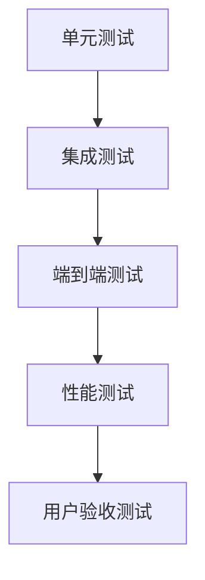
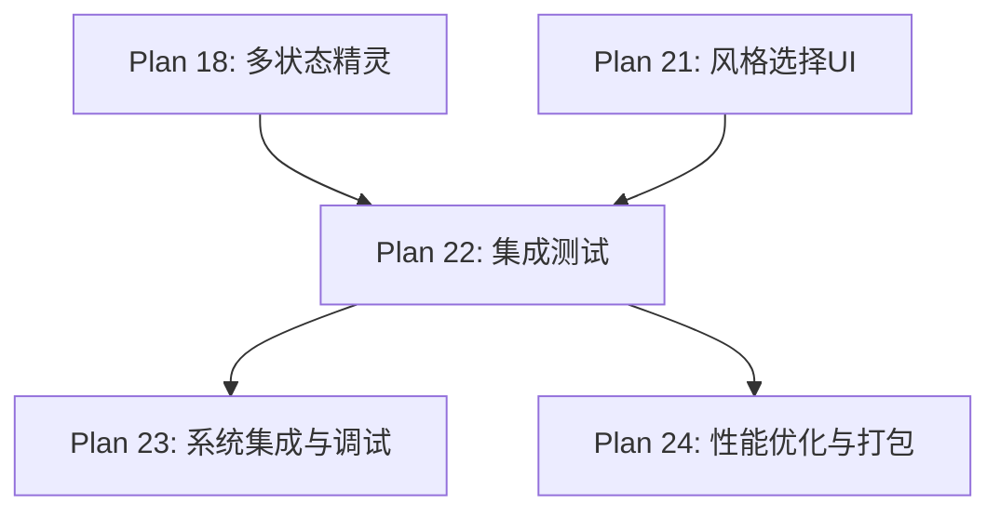

# Plan 22 - 集成测试与优化

## 1. 目标

**目标：** 对整个系统进行全流程集成测试，覆盖从人脸采集到游戏运行的完整链路，发现并修复集成问题，确保各模块协同工作正常。

**背景：** 各模块独立开发完成后，需要进行端到端的集成测试，验证数据流在模块间正确传递，整体功能符合预期。

---

## 2. 测试策略

### 2.1 测试层级



### 2.2 测试覆盖矩阵

| 测试维度 | 测试内容 | 优先级 |
|----------|----------|--------|
| 功能测试 | 各模块核心功能 | P0 |
| 集成测试 | 模块间数据传递 | P0 |
| 端到端测试 | 完整用户流程 | P0 |
| 性能测试 | 帧率、内存、延迟 | P1 |
| 边界测试 | 异常输入、极端情况 | P1 |
| 兼容测试 | 不同分辨率照片 | P2 |

---

## 3. 具体测试用例

### 3.1 单元测试

```python
# tests/test_face_detection.py
import pytest
import cv2
import numpy as np

class TestFaceDetection:
    """人脸检测单元测试"""

    @pytest.fixture
    def detector(self):
        from face_system.detector import FaceDetector
        return FaceDetector()

    @pytest.fixture
    def sample_face_image(self):
        """生成测试用人脸图像（或加载测试图片）"""
        # 使用预置的测试图片
        img = cv2.imread('tests/fixtures/test_face.jpg')
        assert img is not None, "测试图片不存在"
        return img

    def test_detect_face(self, detector, sample_face_image):
        """测试基本人脸检测"""
        results = detector.detect(sample_face_image)
        assert len(results) > 0, "未检测到人脸"
        assert results[0].confidence > 0.5

    def test_detect_no_face(self, detector):
        """测试无人脸图像"""
        blank = np.zeros((480, 640, 3), dtype=np.uint8)
        results = detector.detect(blank)
        assert len(results) == 0

    def test_detect_largest(self, detector, sample_face_image):
        """测试最大人脸检测"""
        result = detector.detect_largest(sample_face_image)
        assert result is not None
        assert result.bbox[2] > 0 and result.bbox[3] > 0


class TestFaceExtractor:
    """人脸提取单元测试"""

    @pytest.fixture
    def extractor(self):
        from face_system.extractor import FaceExtractor
        return FaceExtractor()

    def test_extract_returns_rgba(self, extractor):
        """测试输出格式为 RGBA"""
        # 准备测试数据...
        # result = extractor.extract(image, landmarks)
        # assert result.shape[2] == 4
        pass

    def test_extract_square(self, extractor):
        """测试正方形裁剪"""
        # result = extractor.extract_square(image, landmarks, 256)
        # assert result.shape[0] == result.shape[1] == 256
        pass
```

```python
# tests/test_style_engine.py
class TestStyleEngine:
    """风格转换引擎测试"""

    @pytest.fixture
    def engine(self):
        from style_engine import StyleEngine
        return StyleEngine()

    @pytest.fixture
    def sample_face(self):
        """创建测试用 RGBA 人脸图像"""
        face = np.random.randint(0, 255, (256, 256, 4), dtype=np.uint8)
        face[:, :, 3] = 255  # 不透明
        return face

    def test_pixel_transform(self, engine, sample_face):
        """测试像素风格转换"""
        from style_engine import StyleType
        result = engine.transform(sample_face, StyleType.PIXEL)
        assert result is not None
        assert result.shape[2] == 4  # RGBA

    def test_original_transform(self, engine, sample_face):
        """测试原始照片风格"""
        from style_engine import StyleType
        result = engine.transform(sample_face, StyleType.ORIGINAL)
        assert result is not None

    def test_cartoon_transform(self, engine, sample_face):
        """测试卡通风格转换"""
        from style_engine import StyleType
        result = engine.transform(sample_face, StyleType.CARTOON)
        assert result is not None

    def test_all_previews(self, engine, sample_face):
        """测试所有预览生成"""
        previews = engine.get_all_previews(sample_face)
        assert len(previews) == 3
```

### 3.2 集成测试

```python
# tests/test_integration.py
class TestFullPipeline:
    """全流程集成测试"""

    def test_photo_to_sprite(self):
        """测试：照片 -> 检测 -> 提取 -> 风格化 -> 精灵替换"""
        import cv2
        from face_system.detection_pipeline import FaceDetectionPipeline
        from face_system.extractor import FaceExtractor
        from style_engine import StyleEngine, StyleType

        # Step 1: 加载测试照片
        image = cv2.imread('tests/fixtures/test_face.jpg')
        assert image is not None

        # Step 2: 人脸检测
        pipeline = FaceDetectionPipeline()
        pipeline.initialize()
        result = pipeline.process(image)
        assert result.success, f"检测失败: {result.error_message}"

        # Step 3: 人脸提取
        extractor = FaceExtractor()
        face_rgba = extractor.extract_square(
            image, result.face_landmarks, 256
        )
        assert face_rgba is not None
        assert face_rgba.shape[2] == 4

        # Step 4: 风格转换
        engine = StyleEngine()
        for style in StyleType:
            styled = engine.transform(face_rgba, style)
            assert styled is not None
            assert styled.shape[2] == 4

        # Step 5: 精灵替换（需要 Pygame 初始化）
        # ... Pygame 相关测试单独执行

        pipeline.shutdown()

    def test_camera_to_detection(self):
        """测试：摄像头 -> 检测"""
        from face_system.capture import CameraCapture
        from face_system.detection_pipeline import FaceDetectionPipeline

        camera = CameraCapture()
        if not camera.is_available():
            pytest.skip("无摄像头")

        camera.open()
        frame = camera.get_frame()
        camera.close()

        assert frame is not None

        pipeline = FaceDetectionPipeline()
        pipeline.initialize()
        result = pipeline.process(frame)
        # 注意：可能检测不到人脸（空房间），这不算失败
        pipeline.shutdown()

    def test_data_format_consistency(self):
        """测试数据格式在模块间传递时的一致性"""
        # 确保每个模块的输出格式与下一模块的输入格式匹配
        # 关键检查点：
        # - 采集输出 BGR ndarray -> 检测输入 BGR ndarray
        # - 提取输出 RGBA ndarray -> 风格输入 RGBA ndarray
        # - 风格输出 RGBA ndarray -> 精灵输入 pygame.Surface
        pass
```

### 3.3 性能测试

```python
# tests/test_performance.py
import time

class TestPerformance:
    """性能测试"""

    def test_detection_speed(self):
        """人脸检测速度"""
        image = cv2.imread('tests/fixtures/test_face.jpg')
        pipeline = FaceDetectionPipeline()
        pipeline.initialize()

        times = []
        for _ in range(10):
            start = time.time()
            pipeline.process(image)
            times.append(time.time() - start)

        avg_time = sum(times) / len(times)
        assert avg_time < 0.2, f"检测太慢: {avg_time:.3f}s"
        print(f"人脸检测平均耗时: {avg_time * 1000:.1f}ms")

    def test_style_transform_speed(self):
        """风格转换速度"""
        face = np.random.randint(0, 255, (256, 256, 4), dtype=np.uint8)
        engine = StyleEngine()

        for style in StyleType:
            times = []
            for _ in range(5):
                start = time.time()
                engine.transform(face, style)
                times.append(time.time() - start)

            avg = sum(times) / len(times)
            assert avg < 0.5, f"{style.value} 转换太慢: {avg:.3f}s"
            print(f"{style.value} 平均耗时: {avg * 1000:.1f}ms")

    def test_sprite_rebuild_speed(self):
        """精灵重建速度"""
        # 需要 Pygame 环境
        # manager.set_face(face_surface)
        # 验证 _build_time < 0.1
        pass

    def test_memory_usage(self):
        """内存使用测试"""
        import psutil
        import os

        process = psutil.Process(os.getpid())
        baseline = process.memory_info().rss / 1024 / 1024  # MB

        # 执行完整流程...

        current = process.memory_info().rss / 1024 / 1024
        increase = current - baseline
        assert increase < 500, f"内存增长过大: {increase:.1f}MB"
        print(f"内存使用: {current:.1f}MB (增长 {increase:.1f}MB)")
```

---

## 4. 测试运行命令

```bash
# 运行所有测试
pytest tests/ -v

# 运行单元测试
pytest tests/test_face_detection.py -v
pytest tests/test_style_engine.py -v

# 运行集成测试
pytest tests/test_integration.py -v

# 运行性能测试
pytest tests/test_performance.py -v -s

# 生成测试覆盖率报告
pytest tests/ --cov=. --cov-report=html
```

---

## 5. 输入/输出说明

| 项目 | 说明 |
|------|------|
| 输入 | 测试图片、测试用例脚本 |
| 输出 | 测试报告（通过/失败/性能数据） |
| 输出 | Bug 列表和修复建议 |

---

## 6. 依赖关系



- **前置依赖：** 所有功能模块（Plan 05-21）开发完成
- **后续依赖：** Plan 23（调试），Plan 24（优化与打包）

---

## 7. 验收标准

- [ ] 所有单元测试通过（100%）
- [ ] 集成测试覆盖完整数据流
- [ ] 端到端测试：照片上传到游戏运行全流程通过
- [ ] 人脸检测耗时 < 200ms
- [ ] 风格转换耗时 < 500ms
- [ ] 精灵重建耗时 < 100ms
- [ ] 内存使用 < 500MB
- [ ] 无内存泄漏（多次执行后内存不持续增长）
- [ ] 异常输入不导致崩溃
- [ ] 测试覆盖率 > 70%
