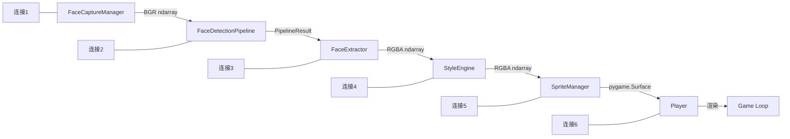
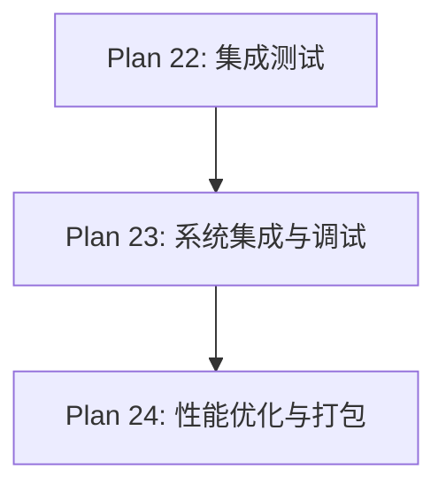

# Plan 23 - 系统集成与调试

## 1. 目标

**目标：** 将所有独立开发的模块连接为一个完整的系统，进行端到端的集成调试，解决模块间的接口不匹配、数据流断裂、状态同步等问题。

**背景：** 各模块在独立开发和单元测试中可能工作正常，但集成时往往会出现意想不到的问题。本阶段专注于"让一切协同工作"。

---

## 2. 模块连接清单

### 2.1 连接点清单



| 连接点 | 上游模块 | 下游模块 | 数据格式 | 潜在问题 |
|--------|----------|----------|----------|----------|
| C1 | 人脸采集 | 人脸检测 | BGR ndarray | 尺寸不一致、色彩空间 |
| C2 | 人脸检测 | 人脸提取 | PipelineResult | landmarks 格式 |
| C3 | 人脸提取 | 风格引擎 | RGBA ndarray | alpha 通道处理 |
| C4 | 风格引擎 | 精灵管理 | RGBA ndarray | 尺寸适配 |
| C5 | 精灵管理 | Player | pygame.Surface | Surface 格式兼容 |
| C6 | Player | 游戏循环 | 渲染 | 帧率同步 |

---

## 3. 集成步骤

### 步骤 1：主程序入口

```python
# main.py
import pygame
import sys
from face_system.capture import CameraCapture
from face_system.upload import FileUpload
from face_system.detection_pipeline import FaceDetectionPipeline
from face_system.extractor import FaceExtractor
from style_engine import StyleEngine
from sprite_system.manager import SpriteManager
from ui.main_menu import MainMenuPage
from ui.capture_ui import CapturePage
from ui.style_select import StyleSelectPage
from ui import UIManager
import config

class MarioFaceGame:
    """主程序入口 - 系统集成"""

    def __init__(self):
        pygame.init()
        self.screen = pygame.display.set_mode(config.SCREEN_SIZE)
        pygame.display.set_caption("Super Mario - Face Edition")
        self.clock = pygame.time.Clock()

        # 初始化各模块
        self._init_modules()

        # 初始化 UI
        self._init_ui()

        # 状态
        self.running = True
        self.in_game = False

    def _init_modules(self):
        """初始化所有模块"""
        # 人脸采集
        self.camera = CameraCapture()
        self.uploader = FileUpload()

        # AI 检测
        self.detection_pipeline = FaceDetectionPipeline()
        self.detection_pipeline.initialize()

        # 人脸提取
        self.extractor = FaceExtractor()

        # 风格引擎
        self.style_engine = StyleEngine()

        # 精灵管理
        self.sprite_manager = SpriteManager()

        print("所有模块初始化完成")

    def _init_ui(self):
        """初始化 UI 系统"""
        self.ui_manager = UIManager(self.screen)

        # 注册页面
        self.ui_manager.register_page(
            'main_menu',
            MainMenuPage(config.SCREEN_SIZE)
        )
        self.ui_manager.register_page(
            'capture',
            CapturePage(config.SCREEN_SIZE, self)
        )
        self.ui_manager.register_page(
            'style_select',
            StyleSelectPage(config.SCREEN_SIZE, self.style_engine)
        )

        # 设置初始页面
        self.ui_manager.navigate_to('main_menu')

    def run(self):
        """主循环"""
        while self.running:
            dt = self.clock.tick(60) / 1000.0
            events = pygame.event.get()

            for event in events:
                if event.type == pygame.QUIT:
                    self.running = False

            if self.in_game:
                self._update_game(events, dt)
            else:
                self._update_ui(events, dt)

            pygame.display.flip()

        self._cleanup()

    def _update_ui(self, events, dt):
        """更新 UI"""
        self.ui_manager.update(events, dt)
        self.ui_manager.draw()

        # 检查页面跳转
        current = self.ui_manager.current_page
        if current and current.done:
            if current.next_page == 'game':
                self._start_game()
            elif current.next_page == 'quit':
                self.running = False

    def _update_game(self, events, dt):
        """更新游戏"""
        # 调用原始游戏的更新逻辑
        # ... 集成 Mario-Level-1 的游戏循环
        pass

    def _start_game(self):
        """启动游戏"""
        self.in_game = True
        # 加载精灵表
        # 如果有人脸，应用精灵替换
        # 启动游戏状态机

    def _cleanup(self):
        """清理资源"""
        self.detection_pipeline.shutdown()
        if self.camera.cap:
            self.camera.close()
        pygame.quit()

    def process_face(self, bgr_image):
        """
        完整的人脸处理流程
        连接 C1 -> C2 -> C3
        """
        # C1 -> C2: 检测
        result = self.detection_pipeline.process(bgr_image)
        if not result.success:
            return None, result.error_message

        # C2 -> C3: 提取
        face_rgba = self.extractor.extract_square(
            bgr_image, result.face_landmarks, 256
        )
        if face_rgba is None:
            return None, "人脸提取失败"

        return face_rgba, None

if __name__ == '__main__':
    game = MarioFaceGame()
    game.run()
```

### 步骤 2：数据流验证

```python
# tests/test_data_flow.py
class TestDataFlow:
    """数据流验证测试"""

    def test_connection_1_capture_to_detection(self):
        """C1: 采集输出 -> 检测输入"""
        # 验证 BGR ndarray 格式正确
        image = camera.get_frame()
        assert image.dtype == np.uint8
        assert len(image.shape) == 3
        assert image.shape[2] == 3  # BGR

    def test_connection_2_detection_to_extraction(self):
        """C2: 检测输出 -> 提取输入"""
        result = pipeline.process(image)
        assert result.face_landmarks is not None
        assert result.face_landmarks.shape == (468, 3)

    def test_connection_3_extraction_to_style(self):
        """C3: 提取输出 -> 风格输入"""
        face = extractor.extract(image, landmarks)
        assert face.shape[2] == 4  # RGBA
        assert face.dtype == np.uint8

    def test_connection_4_style_to_sprite(self):
        """C4: 风格输出 -> 精灵输入"""
        styled = engine.transform(face)
        assert styled.shape[2] == 4  # RGBA
        # 转换为 pygame.Surface
        surface = array_to_surface(styled)
        assert surface.get_alpha() is not None or surface.get_flags() & pygame.SRCALPHA

    def test_connection_5_sprite_to_player(self):
        """C5: 精灵输出 -> Player 使用"""
        frame = sprite_manager.get_frame('small', 'stand', 0, True)
        assert isinstance(frame, pygame.Surface)
        assert frame.get_size() == (32, 32)  # 小马里奥
```

### 步骤 3：端到端测试

```python
def test_end_to_end():
    """端到端测试：照片 -> 游戏中显示替换精灵"""
    # 1. 加载照片
    image = cv2.imread('tests/fixtures/test_face.jpg')

    # 2. 检测
    pipeline = FaceDetectionPipeline()
    pipeline.initialize()
    det_result = pipeline.process(image)
    assert det_result.success

    # 3. 提取
    extractor = FaceExtractor()
    face = extractor.extract_square(image, det_result.face_landmarks, 256)
    assert face is not None

    # 4. 风格转换
    engine = StyleEngine()
    styled = engine.transform(face, StyleType.PIXEL)

    # 5. 转为 Pygame Surface
    pygame.init()
    face_surface = array_to_surface(styled)

    # 6. 精灵替换
    sheet = pygame.image.load('mario_level_1/resources/graphics/mario_bros.png')
    manager = SpriteManager()
    manager.load_original_frames(sheet)
    manager.set_face(face_surface)

    # 7. 验证所有帧
    for state in ['small', 'big', 'fire']:
        for action in ['stand', 'walk', 'jump']:
            frame = manager.get_frame(state, action, 0, True)
            assert frame is not None, f"缺少帧: {state}_{action}"

    print("端到端测试通过！")
    pipeline.shutdown()
    pygame.quit()
```

---

## 4. 常见集成问题与解决方案

| 问题 | 原因 | 解决方案 |
|------|------|----------|
| 色彩空间不匹配 | BGR vs RGB vs RGBA | 在每个连接点明确转换 |
| Surface 格式不兼容 | 有/无 alpha 通道 | 统一使用 SRCALPHA |
| 坐标系不统一 | 像素坐标 vs 归一化坐标 | 在接口层统一转换 |
| Pygame 未初始化 | 模块在 Pygame init 前调用 | 延迟初始化，确保顺序 |
| 线程安全 | 摄像头在子线程 | 使用队列传递帧数据 |
| 内存泄漏 | Surface 未释放 | 使用弱引用或显式释放 |

---

## 5. 调试工具

```python
# debug/visualizer.py
class PipelineVisualizer:
    """管线可视化调试器"""

    @staticmethod
    def save_pipeline_stages(image, output_dir='debug_output'):
        """保存管线每个阶段的图像"""
        import os
        os.makedirs(output_dir, exist_ok=True)

        # Stage 1: 原始图像
        cv2.imwrite(f'{output_dir}/01_original.jpg', image)

        # Stage 2: 检测结果
        # ... 绘制边界框保存

        # Stage 3: 提取结果
        # ... 保存 RGBA

        # Stage 4: 各风格结果
        # ... 保存三种风格

        # Stage 5: 精灵合成结果
        # ... 保存替换后的精灵帧
```

---

## 6. 依赖关系



- **前置依赖：** Plan 22（测试用例已编写）
- **后续依赖：** Plan 24（优化和打包）

---

## 7. 验收标准

- [ ] `main.py` 可正常启动，显示主菜单
- [ ] 主菜单 -> 拍照 -> 风格选择 -> 返回主菜单流程通顺
- [ ] 设置人脸后开始游戏，精灵显示替换后的人脸
- [ ] 不设置人脸直接开始，显示原版精灵
- [ ] 所有 6 个连接点的数据格式验证通过
- [ ] 端到端测试通过
- [ ] 无未捕获的异常
- [ ] 调试可视化工具输出各阶段图像
- [ ] 游戏运行帧率 >= 60 FPS
- [ ] 摄像头打开/关闭无资源泄漏
