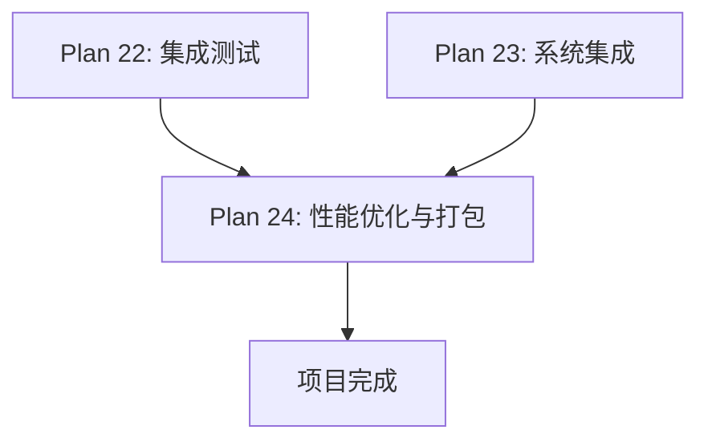

# Plan 24 - 性能优化与打包

## 1. 目标

**目标：** 对系统进行全面的性能优化，确保游戏流畅运行，然后使用 PyInstaller 将项目打包为独立可执行文件，可在无 Python 环境的 Windows 机器上运行。

**背景：** 游戏需要维持 60 FPS 的流畅体验，同时人脸处理不能引入明显延迟。打包发布是让普通用户使用的最后一步。

---

## 2. 性能优化

### 2.1 优化目标

| 指标 | 目标值 | 当前值（预估） |
|------|--------|----------------|
| 游戏帧率 | >= 60 FPS | 待测 |
| 人脸检测耗时 | < 200ms | ~150ms |
| 风格转换耗时 | < 500ms | ~300ms |
| 精灵重建耗时 | < 100ms | ~50ms |
| 启动时间 | < 3s | 待测 |
| 内存占用 | < 500MB | 待测 |

### 2.2 缓存优化

```python
# cache/sprite_cache.py
import pygame
import hashlib
import os
import pickle
from typing import Dict, Optional

class SpriteCache:
    """精灵缓存系统"""

    def __init__(self, cache_dir: str = 'cache/sprites'):
        self.cache_dir = cache_dir
        self.memory_cache: Dict[str, pygame.Surface] = {}
        self.max_memory_items = 200  # 最大内存缓存项数

        os.makedirs(cache_dir, exist_ok=True)

    def _make_key(self, state: str, action: str,
                  frame_idx: int, facing: str,
                  face_hash: str) -> str:
        """生成缓存键"""
        return f"{face_hash}_{state}_{action}_{frame_idx}_{facing}"

    def get(self, key: str) -> Optional[pygame.Surface]:
        """从缓存获取"""
        # 先查内存缓存
        if key in self.memory_cache:
            return self.memory_cache[key]

        # 再查磁盘缓存
        disk_path = os.path.join(self.cache_dir, f"{key}.png")
        if os.path.exists(disk_path):
            surface = pygame.image.load(disk_path).convert_alpha()
            self.memory_cache[key] = surface
            return surface

        return None

    def put(self, key: str, surface: pygame.Surface):
        """存入缓存"""
        # 内存缓存
        self.memory_cache[key] = surface

        # 磁盘缓存
        disk_path = os.path.join(self.cache_dir, f"{key}.png")
        pygame.image.save(surface, disk_path)

        # LRU 清理
        if len(self.memory_cache) > self.max_memory_items:
            oldest_key = next(iter(self.memory_cache))
            del self.memory_cache[oldest_key]

    def clear(self):
        """清空所有缓存"""
        self.memory_cache.clear()
        import shutil
        if os.path.exists(self.cache_dir):
            shutil.rmtree(self.cache_dir)
            os.makedirs(self.cache_dir)

    @staticmethod
    def hash_face(face_data: bytes) -> str:
        """计算人脸数据的哈希值"""
        return hashlib.md5(face_data).hexdigest()[:12]
```

### 2.3 延迟加载与预计算

```python
class LazyLoader:
    """延迟加载器 - 仅在需要时加载模块"""

    def __init__(self):
        self._mediapipe = None
        self._face_detector = None

    @property
    def mediapipe(self):
        """延迟导入 MediaPipe"""
        if self._mediapipe is None:
            import mediapipe
            self._mediapipe = mediapipe
        return self._mediapipe

    @property
    def face_detector(self):
        """延迟初始化人脸检测器"""
        if self._face_detector is None:
            from face_system.detector import FaceDetector
            self._face_detector = FaceDetector()
        return self._face_detector
```

### 2.4 渲染优化

```python
# 优化建议清单
OPTIMIZATION_CHECKLIST = {
    '精灵缓存': {
        '描述': '所有替换精灵预计算并缓存到内存',
        '方法': '在 set_face() 时一次性生成所有帧',
        '收益': '运行时 0 计算开销',
    },
    'Surface 格式优化': {
        '描述': '使用 convert_alpha() 优化 Surface 格式',
        '方法': 'surface = surface.convert_alpha()',
        '收益': 'blit 速度提升 2-5x',
    },
    'Dirty Rect 渲染': {
        '描述': '只重绘变化的区域',
        '方法': 'pygame.display.update(dirty_rects)',
        '收益': '减少 GPU 负载',
    },
    '图像尺寸最小化': {
        '描述': '风格转换在目标尺寸下进行，不处理大图',
        '方法': '先缩小到 32x32 再做风格转换',
        '收益': '转换速度提升 10x+',
    },
}
```

### 2.5 内存优化

```python
def optimize_memory():
    """内存优化措施"""

    # 1. 及时释放大型临时数组
    import gc
    gc.collect()

    # 2. 使用弱引用缓存
    import weakref
    surface_cache = weakref.WeakValueDictionary()

    # 3. 限制缓存大小
    from functools import lru_cache

    @lru_cache(maxsize=64)
    def get_styled_face(face_hash, style_name):
        """带 LRU 缓存的风格转换"""
        pass

    # 4. 精灵表共享（避免重复加载）
    # 所有精灵帧引用同一张精灵表 Surface

    # 5. MediaPipe 模型按需加载，用完释放
    # detector.close() 在不需要时调用
```

---

## 3. PyInstaller 打包

### 3.1 打包配置

```python
# mario_face.spec
# -*- mode: python ; coding: utf-8 -*-

block_cipher = None

a = Analysis(
    ['main.py'],
    pathex=['D:\\Document\\GitHub\\Mario'],
    binaries=[],
    datas=[
        # 游戏资源
        ('mario_level_1/resources', 'mario_level_1/resources'),
        # MediaPipe 模型文件
        ('venv/Lib/site-packages/mediapipe/modules', 'mediapipe/modules'),
    ],
    hiddenimports=[
        'mediapipe',
        'mediapipe.python',
        'mediapipe.python.solutions',
        'cv2',
        'numpy',
        'PIL',
        'pygame',
    ],
    hookspath=[],
    hooksconfig={},
    runtime_hooks=[],
    excludes=[
        'tkinter',  # 如果不用 tkinter 可以排除
        'matplotlib',
        'scipy.spatial.ckdtree',  # 如果不用 KD-Tree
    ],
    win_no_prefer_redirects=False,
    win_private_assemblies=False,
    cipher=block_cipher,
    noarchive=False,
)

pyz = PYZ(a.pure, a.zipped_data, cipher=block_cipher)

exe = EXE(
    pyz,
    a.scripts,
    [],
    exclude_binaries=True,
    name='MarioFace',
    debug=False,
    bootloader_ignore_signals=False,
    strip=False,
    upx=True,
    console=False,  # 不显示控制台
    disable_windowed_traceback=False,
    argv_emulation=False,
    target_arch=None,
    codesign_identity=None,
    entitlements_file=None,
    icon='resources/icon.ico',  # 游戏图标
)

coll = COLLECT(
    exe,
    a.binaries,
    a.zipfiles,
    a.datas,
    strip=False,
    upx=True,
    upx_exclude=[],
    name='MarioFace',
)
```

### 3.2 打包命令

```bash
# 安装 PyInstaller
pip install pyinstaller>=6.0.0

# 使用 spec 文件打包
pyinstaller mario_face.spec

# 或使用命令行（简单版）
pyinstaller --onedir --windowed --name MarioFace --icon resources/icon.ico main.py

# 打包结果在 dist/MarioFace/ 目录下
```

### 3.3 资源路径处理

```python
# config.py - 处理打包后的资源路径
import sys
import os

def get_resource_path(relative_path: str) -> str:
    """
    获取资源文件的绝对路径
    兼容开发环境和 PyInstaller 打包环境
    """
    if getattr(sys, 'frozen', False):
        # PyInstaller 打包后的路径
        base_path = sys._MEIPASS
    else:
        # 开发环境
        base_path = os.path.dirname(os.path.abspath(__file__))

    return os.path.join(base_path, relative_path)

# 使用示例
GAME_RESOURCES = get_resource_path('mario_level_1/resources')
GRAPHICS_DIR = get_resource_path('mario_level_1/resources/graphics')
```

### 3.4 打包验证

```python
# tests/test_package.py
def test_packaged_executable():
    """打包后验证清单"""
    checks = [
        "exe 文件存在",
        "双击可启动",
        "主菜单正常显示",
        "中文字体正常渲染",
        "摄像头功能正常",
        "文件选择对话框正常",
        "游戏可正常运行",
        "精灵替换功能正常",
        "退出时不残留进程",
    ]
    for check in checks:
        print(f"[ ] {check}")
```

### 3.5 打包后体积优化

```bash
# 排除不需要的包以减小体积
# 使用 UPX 压缩
# 预期打包体积：
#   - Pygame: ~10MB
#   - MediaPipe: ~30MB
#   - OpenCV: ~40MB
#   - Python 运行时: ~30MB
#   - 游戏资源: ~5MB
#   - 总计: ~115MB (UPX 压缩后 ~80MB)
```

---

## 4. 发布清单

```
dist/MarioFace/
├── MarioFace.exe              # 主程序
├── mario_level_1/
│   └── resources/             # 游戏资源
├── mediapipe/
│   └── modules/               # AI 模型
├── cv2/                       # OpenCV 库
├── pygame/                    # Pygame 库
├── _internal/                 # Python 运行时
└── README.txt                 # 使用说明
```

---

## 5. 输入/输出说明

| 项目 | 说明 |
|------|------|
| 输入 | 完整的项目源代码和资源 |
| 输出 | `dist/MarioFace/` 打包目录 |
| 输出 | `MarioFace.exe` 可执行文件 |
| 输出 | 性能优化报告 |

---

## 6. 依赖关系



- **前置依赖：** Plan 22/23（测试和集成全部通过）
- **后续依赖：** 无（最终阶段）

---

## 7. 验收标准

### 性能优化

- [ ] 游戏帧率稳定 >= 60 FPS
- [ ] 精灵缓存命中率 > 99%
- [ ] 风格转换耗时 < 500ms
- [ ] 内存占用 < 500MB
- [ ] 无内存泄漏（连续运行 30 分钟内存稳定）
- [ ] 启动时间 < 3 秒
- [ ] Surface 使用 convert_alpha() 优化

### 打包发布

- [ ] PyInstaller 打包无错误
- [ ] exe 文件可在无 Python 的 Windows 10/11 机器上运行
- [ ] 所有游戏资源正确包含在打包中
- [ ] MediaPipe 模型文件正确打包
- [ ] 中文字体在打包后正常显示
- [ ] 摄像头功能在打包后正常工作
- [ ] 文件选择对话框在打包后正常弹出
- [ ] 打包体积 < 150MB
- [ ] 退出程序后无残留进程
- [ ] 无 console 窗口弹出（windowed 模式）
